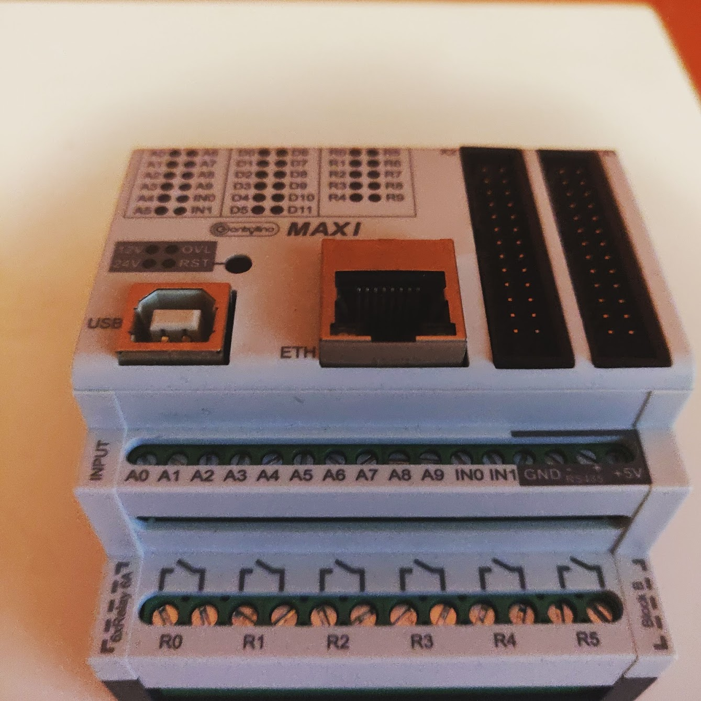

Je to neuvěřitelné! Přesně před rokem, v pátek 21. prosince 2018, jsem napsal svůj [rozlučkový dopis][goodbye-letter] a rozloučil se se svými kolegy. Čas letí! Rozhodnutí opustit záchytnou síť, kterou mi poskytovala firma, nebylo unáhlené. Myslel jsem na to aspoň rok. S hypotékou a půjčkami jsem to musel celé promyslet, ale s poctivým plánováním je všechno možné.

## Moje kariéra zaměstnance byla turbulentní
Když jsem šel na univerzitu, neměl jsem podnikatelské ambice. Těšil jsem se na to, že budu telekomunikační inženýr. Fascinovala mě všechna ta technologie, kterou máme na přenos signálu, aby mohli lidé sledovat televizi nebo videotelefonovat s lidmi po celém světě. Dodnes chodím rád na turistiku na místa, kde mohu vidět vysílací věže v lese a zblízka si je ohlédnout.

  
  <figcaption>Televizní a rozhlasový vysílač Dubník, Prešov</figcaption>

Svou první práci síťového inženýra jsem dostal v AT&T. S překvapením jsem zjistil, že všechny mé znalosti z univerzity jsou nepotřebné. Stačilo mít středoškolský diplom, umět anglicky a mít online kurzy Cisco síťové akademie. Avšak ve firmě jsem zůstal více než dva roky a jsem rád, že se za ten čas výrazně zlepšila moje angličtina.

> Firma je pro zaměstnance záchytná síť. Mají stabilní mzdu a pracovní dobu.

Kdybych byl v takovém zaměstnání déle, bylo by to mrhání mým potenciálem. Rozhodl jsem se jít napříč celou zemí, abych pracoval jako testovací inženýr pro Alcatel-Lucent (dnes Nokia), kde jsem měl příležitost aplikovat své znalosti z univerzity. Navíc jsem měl možnost získat mnohem hlubší pochopení zásadních technologií. Práce se mi líbila, časté cestování domů jednou týdně už méně. Rozhodl jsem se vrátit zpět do Prešova. Firma neměla zájem vybudovat napříč republikou pobočku a práce z domova nebyla možná. Proto jsem odešel.

  
  <figcaption>Zdroj: Thomas Ulrich, Pixabay</figcaption>

Hledání si práce na druhém konci republiky nebylo jednoduché. Vzal jsem první práci, která mi v té době přišla rozumná, Java backendový vývojář pro Software AG. Upřímně, byl to krok vedle. Kolegy jsem měl rád, ale práci už ne. Krátce poté jsem nastoupil do GlobalLogicu. Pohovorovali mě na pozici telekomunikačního inženýra.

  
  <figcaption>Můj kancelářský stůl</figcaption>

Pomyslel jsem si, že konečně budu mít šanci pracovat v mém oboru blízko bydliště. Dokonce se ukázalo, že jsem na tu práci překvalifikován. Odmítl jsem ji, součástí práce bylo časté cestování do center napříč celým světem, a to nebyla představa toho, co chci. No zeptali se mě, jestli není něco jiného, co bych chtěl dělat, a já jsem zmínil Android. Android jsem se sám učil rok a půl a pomyslel jsem si, že by mohlo být zajímavé zkusit si ho jako zaměstnání. Přijal jsem juniorskou pozici a ve firmě jsem zůstal téměř tři roky.

## Nespecializovaný pro jednu práci
Když se podíváte na mou kariéru, uvidíte, že pokaždé jsem pracoval v jiných oblastech IT. Testování, vývoj, DevOps, síťové technologie.

> Všechny poznatky z různých oblastí jsou ideální na budování MVP

Sedm let na pracovním trhu a stále jen na nástupních pozicích. Uvědomoval jsem si své klady a zápory. Mezi mé výhody patří, že se dokážu velmi rychle přizpůsobit téměř jakékoliv práci a že jsem univerzální zaměstnanec, který dokáže sám řešit problémy. Mým největším záporem je to, že univerzálnost je opakem specializace. Dokážu pracovat téměř na čemkoli, ale dokončit práci mi trvá déle než někomu, kdo je expertem v jedné oblasti.

  
<iframe src="https://giphy.com/embed/3ohze2m5cNyumzUMp2" width="100%" height="100%" style="position:absolute" frameBorder="0" class="giphy-embed" allowFullScreen></iframe>

<a href="https://giphy.com/gifs/season-3-trailer-amc-3ohze2m5cNyumzUMp2">via GIPHY</a>

V mé poslední práci jsem si začal uvědomovat, jak mě práce omezuje. Pokud pracuji jako vývojář Androidu, nikoho nezajímá, že ovládám i techniky softwarového testování nebo DevOps. Firma mě nemohla dostatečně využít jako aktivum. Jistě, pro mé kolegy jsem se stal respektovanou autoritou, někým, koho žádali o radu, ale na papíře jsem řešil jen Android.

> Jako podnikatel beru za sebe plnou odpovědnost. Všechny úspěchy jsou mé, všechny nezdary jsou také mé.

Přemýšlel jsem, že možná jednoho dne bych mohl být softwarovým architektem — konečně pozice, kde musíte mít slušný přehled ve více oblastech. Nebo bych snad mohl podnikat. Moje znalosti jsou ideální na vybudování minimálního životaschopného produktu (minimum viable product, MVP). Později mohu najmout další lidi, aby produkt rozšiřovali za mě!

## Nestvořený pro korporátní svět
V GlobalLogicu jsem si uvědomil, že nevím, jak lézt po korporátním žebříčku. Začal jsem na juniorské Android pozici a rychle jsem se před jménem zbavil titulu „junior.“ Odpovědnost a kompetence se nabalovali, ale na mé výplatě se to neodráželo. Místo toho jsem viděl, jak ve firmě povyšují druhé.

  
<iframe src="https://giphy.com/embed/10adIhttJ9ovYc" width="100%" height="100%" style="position:absolute" frameBorder="0" class="giphy-embed" allowFullScreen></iframe>

<a href="https://giphy.com/gifs/10adIhttJ9ovYc">via GIPHY</a>

Hádanku jsem ještě úplně nerozluštil. No myslím, že ti lidé nebyli povyšování čistě jen pro jejich úspěchy a schopnosti. Když jsem žádal o zpětnou vazbu, v čem se mám zlepšit a jak být lepší, moji nadřízení mi neřekli nic konkrétního. Tím, že jsem neuměl říct, co po mně moji manažeři čekají, měl jsem toho už dost.

> S velkou mocí přichází velká zodpovědnost
> — <cite>strýc Ben, Spider-Man</cite>

Tím, že podnikám na volné noze, jenom já jsem zodpovědný za moje úspěchy. Za mými zády není žádná firma. Všechny úspěchy jsou mé, všechny nezdary jsou také mé.

## Práce s bratrancem
Během mé kariéry jsem potkal pár lidí, kteří znali můj potenciál, a měl jsem od nich několik nabídek, abych pro ně pracoval jako kontraktor. Mít svobodu vybírat si projekty, na kterých budu pracovat. Byla to pro mě perfektní startovací pozice. No rozhodl jsem se spolupracovat s mým bratrancem.

Měl menší firmičku a dodával řešení postavené hlavně na Arduinu. Přestože byla malá, byznys rostl. Dal mi pomocnou ruku. Velmi dobře věděl, jak těžké je jít sám za sebe, získat kontakty a zajistit si projekty, které zaplatí za živobytí.

  
  <figcaption>Controllino Maxi</figcaption>

Byl už ve šťastné pozici, kdy dostával více žádostí na projekty jako stíhal řešit. Žáci se učí pracovat s Arduinem na středních školách, to by pro mě nemělo být těžké. A skutečně, základy jsem zvládl za týden a byl jsem připraven pracovat.

## Potenciál naší spolupráce byl velký
Tehdy jsme si ještě neuvedomovovali, jaká plodná může být naše spolupráce. Můj bratranec Aleš byl vynikající v embedded vývoji a návrhu hardwaru. Já zvládám embedded vývoj a občas to i dělám, ale mým hlavním přínosem je, že dokážu také vytvořit Android aplikaci, jednoduchou webstránku, napsat aplikaci pro Raspberry Pi a upravit jeho operační systém.

Vím spoustu věcí! Navíc znám standardní způsoby vývoje a nejlepší praktiky používané ve velkých projektech, a ty ho můžu naučit. On zase může učit mě! Konečně je tu pro mě způsob, jak aplikovat všechny své znalosti a pokračovat v učení.

Aleš se najednou ocitl v pozici, že mohl přijmout projekty, které by sám nikdy neudělal. Byli byste překvapeni, jaké běžné je mít Arduino hardware, který chtějí uživatelé ovládat přes aplikaci.

  
<iframe src="https://giphy.com/embed/IsntdMsM28R1e" width="100%" height="100%" style="position:absolute" frameBorder="0" class="giphy-embed" allowFullScreen></iframe>

<a href="https://giphy.com/gifs/IsntdMsM28R1e">via GIPHY</a>

Během jednoho roku:
- Jsme vyvinuli prezentační řešení na zobrazování informací v kostelích během bohoslužeb. Uživatel může ovládat obsah přes naši Android aplikaci. Raspberry Pi řeší zobrazování obsahu na připojených televizorech.
- Jsme vyvinuli aplikaci pro Android TV, která ve smyčce přehrává reklamní videa a zobrazuje informace o telefonech, které si uživatel vybírá z panelu před televizorem. Moje volba Android TV se ukázala být pro tuto práci jako dokonalá.
- Jsme vyvinuli řešení pro [hasičské soutěže][firefighters].
- Jsme vytvořili několik open-source Arduino a Android knihoven.
- A pracovali jsme i na dalších menších projektech.

  <YouTube videoId="X6_AZqeNXzk" />

Ve všech projektech jsme měli plnou kontrolu nad řešeními. Mohli jsme si vybrat technologie, které jsme poznali, nebo na kterých jsme již pracovali. Také jsme občas upravili frameworky nebo knihovny, které jsme sice neznali, ale u kterých to vypadalo, že mají potenciál do budoucna. Za rok jsem získal zkušenosti s více technologiemi a vyzkoušel jsem si více přístupů než za celé tři roky ve firmě.

Od začátku jsme věděli, že zaměření na zákazníka je jen začátek. Věděli jsme, že chceme pracovat na našich vlastních produktech. Naše první větší spolupráce byla na Adeonu. Šlo o jednoduché řešení, které vám umožní posílat příkazy do embedded platforem přes SMS zprávy. Přichází ve dvou částech — v podobě Arduino knihovny, která je open-source, a [Android klienta][adeon], který je zdarma.

## Adeon
Nebudu zacházet do podrobností, co Adeon dělá nebo na jaké účely byste ho mohli použít. Namísto toho budu mluvit o tom, jaké zkušenosti jsem získal za krátký čas. Když jsem pracoval ve firmě jako Android vývojář, designéři pro nás připravovali všechny návrhy UI (grafického prostředí). Naši kolegové v USA zase definovali většinu chování. Všechno jsem dostal předem připravené. Mým cílem bylo pomoci s návrhem architektury Android aplikace a naprogramovat potřebné části.

  
  <figcaption>Adeon</figcaption>

Práce na Adeonu byla jiná. Najednou za všechno odpovídají dva lidé! Řešili jsme UI, diskutovali UX, také to, jak bude fungovat náš komunikační protokol, které funkce dávají smysl a které ne, co implementujeme v prvním vydání a co může počkat na později. Díky tomu, že máme nad věcmi takovou míru kontroly, vidíme věci ve zcela odlišné perspektivě. Jako zvyknu říkat, představte si bílé plátno na obrazovce vašeho telefonu. Co na něj nakreslíte? Jak navrhnete okno? Úplná svoboda, žádný projektový manažer nad námi.

  
  <figcaption>Prázdná aplikace Adeon. Probuďte vaší kreativitu!</figcaption>

Naše první vydání jsme udělali na moje narozeniny. Když už jsme si určili termín a já věděl, jak blízko je k mým narozeninám, tvrdě jsem pracoval na tom, abych aplikaci vydal týž den. Bylo to jen symbolické, ale pro nás dvou to byl velký úspěch.

V dalším kroku jsme museli řešit s Googlem, aby byla aplikace ve shodě s jejich pravidly v obchodě Google Play, museli jsme řešit marketing, říkat lidem o tom, že náš produkt existuje, integrovat podporu pro reklamy, atd. Stále jsme v tom noví a učíme se neskutečně hodně! To že o tom bloguju je jen jedním z mnoha důsledků.

## Dlouhodobá spolupráce na dálku je možná
Jen nedávno jsem zjistil, že všichni zaměstnanci GitLabu pracují na dálku. Nemají ústřední pracoviště. Tak jsme začali i my dva a jsem rád, že to funguje i při větším počtu lidí. Práce na dálku není pro každého. Máme spolu videohovory, asi tak jednou nebo dvakrát týdně. Většinou abychom probrali, co nám říkají klienti, když s řešením postupujeme. Pokud čekám na informace v jedné oblasti, stále mohu pracovat na něčem jiném. Vytvářím si svůj vlastní plán, abych maximalizoval časovou efektivitu.

Kdybychom si jen povídali přes kameru, časem to může působit chladně. Snažíme se vidět osobně alespoň jednou za tři měsíce. V roce 2019 jsme měli několik interních workshopů, kde jsem učil základy Androidu, aby moji kolegové uměli udržovat naše aplikace, a oni mě naučili embedded věci. Byla to také příležitost poznat se ještě lépe a přemýšlet nad nápady do budoucna.

## Jít do coworkingu nebo ne?
Přemýšlel jsem nad tím, že bych šel do coworkingu, ale velmi rychle jsem se rozhodl tam nejít. Dokážu pracovat z mého bytu, i když je moje postel v téže místnosti jako moje kancelář. Vím, že to není pro každého, ale šetří to spoustu času.

  
  <figcaption>Moje domácí kancelář</figcaption>

Tou nejvýraznější výhodou coworkingu jsou kontakty a možnost klást dotazy a dostávat okamžité odpovědi. Já se musím lidí ptát online.

## Zaměstnanec nebo podnikatel?
Já mám odpověď jasnou i bez přemýšlení. Jediná věc, která mi chybí na tom být zaměstnanec, jsou moji kolegové. Jako podnikatel jsem získal větší svobodu. Plánuji si, kdy budu na něčem pracovat, kdy budu někam cestovat, nemusím si od mého šéfa ptát povolení. Jak jsem už na začátku zmínil, přišel jsem o záchytnou síť, ale mně to nevadí. To, že budete mít nepravidelný příjem je něco, na co si musíte zvyknout, ale také vidím obrovský potenciál, kam až mě mé podnikání v budoucnu může dostat.

## Sociální kontakty?
Je to pravda. Pokud pracujete z domu, nepotkáte mnoho lidí. Rozhodl jsem se ostatní aktivně navštěvovat a udržovat sociální vazby.

  
  <figcaption>Coworking HubHub, Budapešť</figcaption>

Pravidelně chodím na místní meetupy, dokonce se snažím navštěvovat své bývalé kolegy. Kdykoli je to možné, se snažím jít s nimi na oběd, ideálně jednou týdně. Vše je o prioritách a u mě jsou sociální vazby velmi vysoko. Jsou součástí mé dlouhodobé duševní pohody.

## Budoucnost
Za mě osobně hodnotím rok 2019 jako velmi úspěšný. Ukázalo se, že být podnikatelem byla pro mě správná volba. Zvládám tlak, pracuji efektivně a vyhrazuji si dostatek času na mé další podnikatelské projekty. Kdybych měl denně dojíždět z a do práce tři hodiny denně, bylo by to mnohem složitější.

Už teď se těším na rok 2020 a na úspěchy, které s pomocí dalších dokážu. Všechny důležité věci, které se během toho naučím, zdokumentuji v příspěvcích jako je tento. Sledujte mě na mé cestě, bude mi ctí být vám průvodcem.

[//]: # (Used references)
[goodbye-letter]: https://www.zahradnik.io/rozluckovy-dopis
[firefighters]: https://www.zahradnik.io/stopky-pro-hasicske-souteze
[adeon]: https://play.google.com/store/apps/details?id=cz.jscelectronics.adeon