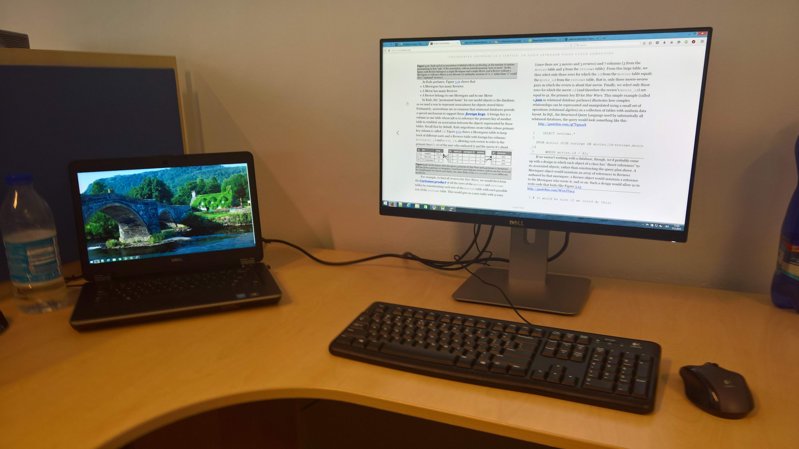
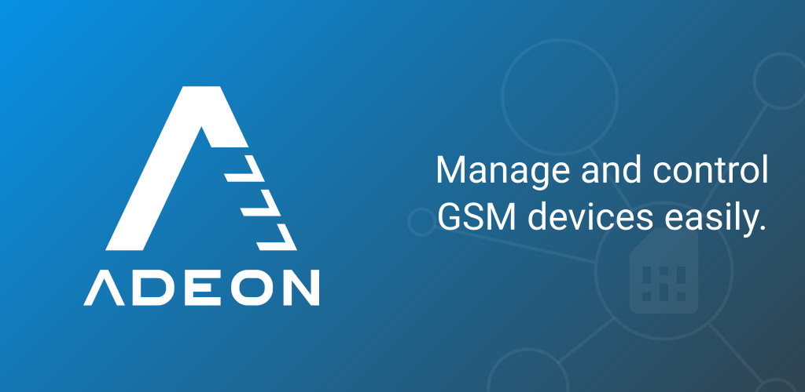
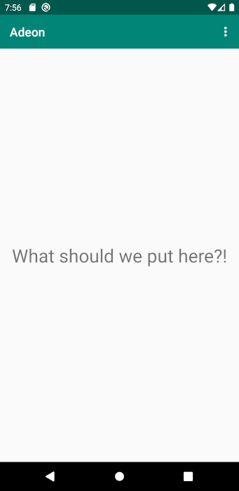
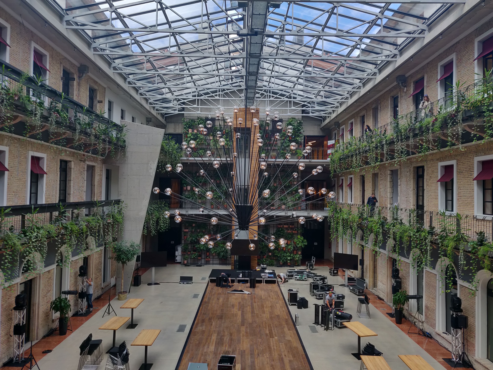

It's unbelievable! Exactly one year ago, on Friday 21st, 2018, I wrote my goodbye letter and gave a farewell to my colleagues. Time flies! The decision to leave the safety net of the company wasn't rash. I thought of it for at least a year. With a mortgage and loans, I had to think it through, but with careful planning, everything is possible.

## My career as an employee was turbulent
When I went to university, I had no entrepreneurial ambitions. I was looking forward to being a Telecommunications engineer. I was fascinated with all the technology we had to transmit the signal so that people can watch TV or have video calls from people across the world. To this day, I love to hike to places where I can see transmission towers in the woods and look at them closely.

  
  <figcaption>Dubník TV/Radio Transmitter, Prešov, Slovakia</figcaption>

I got my first job at AT&T as a networking engineer. To my surprise, all the knowledge from my university was unnecessary. A high-school diploma, English, and Cisco Networking Academy online courses were more than enough. However, I stayed there for more than two years, and I'm grateful for significantly improving my English there.

> The company is a safety net for the employees. They have a stable wage and working hours.

Being in such a job longer would be a waste of my potential. I decided to go across the country to work as a test engineer for Alcatel-Lucent (currently Nokia), where I had the opportunity to apply my university knowledge. Moreover, to gain a much deeper understanding of the underlying technologies. I liked the job, but not the frequent travels to my home once per week, which I later reduced to once per two weeks. I decided to go back to my hometown. The company had no intention to build its branch office across the country, and remote office work was not possible. Therefore I left.

  
  <figcaption>Image by Thomas Ulrich from Pixabay</figcaption>

Searching for a job across the country wasn't easy. I took the first job, which seemed reasonable at that time, a Java backend engineer for Software AG. Frankly, it was a misstep. I liked my colleagues, but not the work. Soon after, I landed a job in GlobalLogic. They interviewed me for the position of Telecommunications engineer.

  
  <figcaption>My office desk</figcaption>

I thought that I would have a chance to work in my field near my hometown. It even turned out I was overqualified for the job. I turned it down, part of the work was to travel frequently to sites across the world, and that wasn't my idea of what I want. However, they asked if there's anything else I would like to do, and I mentioned Android. I self-studied Android for half a year and thought this could be interesting to try as a job. I accepted a junior position and stayed at the company for almost three years.

## Not specialized for one job
If you look at my career, you'll see that each time I worked on different areas of IT. Testing, development, DevOps, networking.

> All the knowledge from different areas is ideal for building MVP

Seven years on the job market and still merely on entry-level positions. I realized my pros and cons. My advantages are that I can adapt to almost any job very quickly, and I'm a universal employee, able to tackle the problems by himself. My biggest con was that being universal is the opposite of being specialized. I can work on almost anything, but it takes me longer to finish a task than to somebody who is an expert in one area.

`oembed: https://giphy.com/gifs/season-3-trailer-amc-3ohze2m5cNyumzUMp2`

In my last job, I started to realize the limiting job constraints. If I work as an Android developer, nobody gives a damn if I also know software testing or DevOps, and the company wasn't able to fully utilize me as an asset. Sure, for my colleagues, I became a respected authority, somebody, whom they asked for advice, but on paper, I dealt with Android only.

> As an entrepreneur, I take full responsibility for myself. All achievements are mine; all mishaps are mine.

I thought that maybe I could become a software architect one day — finally, a position where you need to have a solid overview of multiple areas. Or perhaps I could become an entrepreneur. My knowledge is ideal for building a minimum viable product (MVP) by myself. Later I can hire others to extend the product for me!

## Not made for the corporate world
In GlobalLogic, I realized that I don't know how to climb the corporate ladder. I started at a junior Android position and quickly got rid of the "junior" from the title. The responsibility and competencies were piling up, but my paycheck didn't reflect that. Instead, I saw the company to promote others.

`oembed: https://giphy.com/gifs/10adIhttJ9ovYc`

I didn't solve the puzzle completely; however, I think that they weren't promoted entirely due to their achievements and capabilities. When I asked for feedback on what to improve, how to get better, I got nothing specific from my superiors. Unable to tell what my managers expect from me, I had enough.

> With great power comes great responsibility
> -- <cite>uncle Ben, Spider-Man</cite>

Being a freelancer or entrepreneur, I am the sole responsible for my achievements. I have no company behind my back. All accomplishments are mine; all mishaps are mine.

## Working with my cousin
During my career, I met a few people who knew my potential, and I had a few offers to work for them as a contractor. Free to choose the projects on which I will work. It was a perfect starting position for me. However, I decided to collaborate with my cousin.

He had a small company and was delivering mainly Arduino-based solutions. Albeit small, the business was growing. He offered me a helping hand. He knew very well how hard it is to be on your own, to acquire contacts and secure projects, which will pay for the living.

`oembed: https://www.instagram.com/p/B6As28JhDh8`

He was in a lucky position where he had more project offers than he could handle. Students learn to work with Arduino in high schools; this shouldn't be difficult to learn for me. Indeed, I mastered the basics within a week and was ready to work.

## The potential of our collaboration was huge
We didn't realize it back then how fruitful our cooperation could be. My cousin, Aleš, was great at embedded development and hardware design. I could do embedded development, and sometimes I do, but my main asset was that I could also build an Android app, a simple webpage, write an app for Raspberry PI and customize its operating system.

I know a lot of things! Furthermore, I knew development workflows and best practices used on large projects, which I could teach him. And he can teach me! Finally, a way for me to apply all my knowledge and keep learning.

Aleš was suddenly in a position where he could accept projects, which he would never accomplish by himself. You'll be surprised how common it is to have an Arduino hardware which the users want to control via an app.

`oembed: https://giphy.com/gifs/IsntdMsM28R1e`

During just one year:
- We developed a presentation solution to display information on screens in church during the masses. A user could control the content through our Android app. Raspberry PIs handled showing content on connected TVs.
- We developed an Android TV app, which plays promotional videos in a loop and shows information about phones, which the user picks up from the panel in front of a TV. My choice of Android TV proved to be just perfect for the job.
- We developed a solution for [firefighter competitions][firefighters].
- We made few open-source Arduino and Android libraries
- And we worked on a few other smaller projects.

`oembed: https://youtu.be/X6_AZqeNXzk`

In all the projects, we were in full control of the solutions. We could pick up the technologies we knew or on which we've worked before. Also, sometimes we adapted frameworks or libraries that we didn't know but which seemed to have a potential for the future. In a year, I gained experience with more technologies and tried more approaches than during my three years in a company.

We knew from the start that being customer-focused is just a start. We knew that we want to work on our products. Our first significant collaboration was Adeon. An easy-to-use solution to allow sending commands to the embedded platforms via SMS messages. It comes in two parts - an Arduino library, which is open-source, and an [Android client][adeon], which is free-to-use.

## Adeon
I won't go much into detail what Adeon does or for what purpose you could use it. Instead, I will talk about what kind of experience we gained in a short time. When I worked as an Android developer in a company, designers prepared all the UI designs; our peers in the US defined most of the behavior. I got everything prepared for me. My task was to help with the design of Android app architecture and code the necessary parts.

  
  <figcaption>Adeon</figcaption>

Working on Adeon was different. Suddenly, two guys were in charge of everything! We handled UI, discussed the UX, how our communication protocol will work, which features make sense and which don't, what we implement in our first release, and what can wait till later. Having this much control will put things into a different perspective. As I use to say, imagine a white canvas on the display of your phone. What you'll draw there? How would you design the window? Complete freedom, no project manager above our heads.

  
  <figcaption>Empty Adeon app. Unleash your creativity!</figcaption>

We've made our first release on my birthday. Once we set the deadline, and I knew how close it is to my birthday, I worked hard to release the app on the same day. It was just symbolic, but for us, it was a great achievement.

As a next step we had to deal with Google to be compliant with their Google Play Store, we had to deal with marketing, tell people about the existence of our product, integrate Ad support, etc. We're still new to this, and we're learning a ton! Me, blogging about it, is just one of many consequences.

## Long-term remote collaboration is possible
Just recently, I found out that all employees of GitLab work remotely; they don't have a central office. That's how we two worked, and I was encouraged to see it working on a larger scale. Remote work is not for everyone. We have video meetups, perhaps once or twice a week. Mostly to follow up on what our clients say as we progress. If I await an input in one area, I still can work on something else. I create my schedule to maximize time efficiency.

Just talking over the webcam may become distant over time. We try to see each other personally at least once per 3 months. In 2019 we did several internal workshops, where I taught the basics of Android to maintain our apps and where my peers taught me embedded stuff. It was also an opportunity to know each other even better and brainstorm ideas for the future.

## Coworking space or not?
I thought about going into coworking space, but I decided not to go very quickly. I'm capable of working from my flat, with my bed being in the same room as my office. I know it's not for everyone, but it saves a lot of time.

  
  <figcaption>My home office</figcaption>

The most significant benefit of being in a coworking space is the contacts and the possibility to ask questions and get instant feedback. I have to ask people online.

## Employee or entrepreneur?
For me, it's a no brainer. The only thing I miss as an employee is my colleagues. As an entrepreneur, I gained more freedom. I schedule when to work on something, when to travel somewhere, I don't have to ask for permission from my boss. Like I mentioned in the beginning, I lost the safety net, but I can manage. Having an irregular income is a thing that you need to get used to, but I also see a vast potential where my endeavor will lead to in the future.

## Social contacts?
It's true. If you work from your home, you won't meet many people. I decided to visit others actively and to maintain social relationships.

  
  <figcaption>HubHub Coworking Space, Budapest</figcaption>

I regularly visit local meetups; I even try to visit my former colleagues. Whenever possible, I try to go to lunch with them, ideally once per week. Everything is about priorities, and I set social connections very high. They are part of my long-term wellbeing.

## Future
I find the year 2019 very successful for me personally. It turned out that being an entrepreneur was the right choice for me. I manage the pressure, work efficiently, and allocate enough time for my other entrepreneurial projects. If I had to commute from/to work 3 hours a day, it would be much more difficult.

I already look forward to the year 2020 and to the accomplishments I'll manage with the help of others. All the important things I will learn in the process, I will document in posts like this one. Follow me on my way; it will be my pleasure to be a guide.

[//]: # (Used references)
[firefighters]: https://zahradnik.io/2019/06/17/stopwatch-for-firefighter-competitions.html
[adeon]: https://play.google.com/store/apps/details?id=cz.jscelectronics.adeon