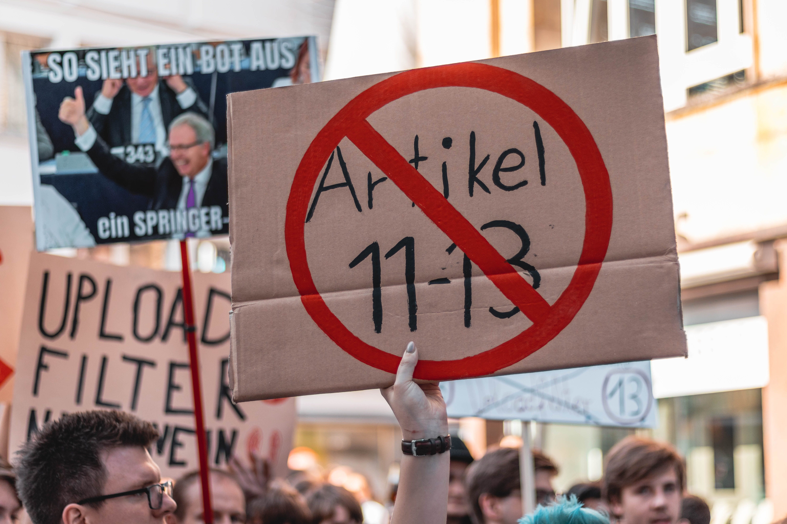

Na konci novembra 2019 sa dostal do mojej pozornosti tweet z Mozilla Festivalu. Žiadali ľudí, aby napísali esej na 750 slov na jednu z troch tém.

  <Tweet tweetId="1197869086778286080" />

Ten tweet som našiel iba pár hodín pred uplynutím termínu. Avšak obsah bol pre mňa natoľko lákavý, že som sa rozhodol napísať jeden z mojich príbehov, Môj príbeh k zdraviu Internetu. V prípade, že môj príspevok nebude vybraný do ich knihy (pravdepodobné), rozhodol som sa dať moje myšlienky aj sem. Pretože prečo nie?

> Ako sa identifikujete s hnutím za zdravie Internetu? Prečo je to pre vás dôležité? Čo budete robiť v nasledujúcich desiatich rokoch, aby ste sa zapojili do tohto hnutia?

## Môj príbeh
Pamätám si na ten deň, keď sme dostali internetové pripojenie, mal som osem rokov. Používali sme vytáčané pripojenie cez telefónnu linku. Zvuk vytáčania je legendárny dodnes.

Moji bratia a ja sme nemohli ostať pripojení počas celého dňa, ako je bežné dnes. Telefónne spoločnosti nás fakturovali ako za bežný telefónny hovor. Oceňovali sme to, čo máme. Nebolo to samozrejmé. Pamätám si, ako som chcel stiahnuť 30 MB súbor. Trvalo mi to hodinu a pol. Len nedávno sme si spomenuli na hranie Warcraftu 3 online cez vytáčané pripojenie. Viete si predstaviť ten lag? Boli to zábavné časy!

Na jednej strane bol Internet pomalý, na strane druhej bol otvorený a slobodný. Pretože ešte nebol tak široko rozšírený, vlády ho veľmi neregulovali. Politici ešte úplne nepochopili jeho moc, internetové spoločnosti boli v plienkach a reklamný trh na Internete neexistoval. Som navždy vďačný za to, že som žil v tej dobe.

Ako roky plynuli a Internet dospel a dostal sa medzi masy, všimol som si, ako sa začína meniť. Kým naši rodičia stále sledovali televíziu, moja generácia trávila čas na nete. Internetové spoločnosti boli čoraz prominentnejšie ako každým dňom získavali vplyv. Zrazu si už boli politici vedomí sily, akú má Internet — otvorený priestor, kde môže každý povedať čokoľvek a ľudia počúvajú.

Za tie roky som sa pozeral na zmeny ako variaca sa žaba. Zmeny prichádzali pomaly, pokojne. Nikto si nevšimol, ako sa všetko zhoršovalo. Občas som začul o tom, ako sa politici v Spojených štátoch amerických snažia zrušiť sieťovú neutralitu. Niekedy som začul o nových obmedzeniach aplikovaných austrálskou vládou. Avšak jedného dňa prišli zmeny do Európy.

  
  <figcaption>Zdroj: Chickenonline, Pixabay</figcaption>

Keď som sa dopočul o novej smernici EÚ, vrátane [článkov 11 a 13][article-13], bol som zarazený. Dovtedy boli nariadenia iba nepríjemnosť, ako napríklad transparent s GDPR na všetkých webstránkach v EÚ. Avšak navrhované nariadenie útočí na základné myšlienky Internetu — kreativitu a slobodu vyjadriť sa. Podľa nariadenia je všetok publikovaný obsah predmetom automatických kontrol robených algoritmami umelej inteligencie. Nazývajú to „upload filtre.“

Upload filtre považujem tak, ako ich zavádza smernica, za odrazový mostík k väčším veciam, ktoré len prídu. Snahy viac obmedziť a cenzúrovať internetových používateľov porastú. Ako niekto, kto by raz chcel mať vlastnú firmu, si uvedomujem, aké ťažké je pre malú firmu implementovať automatické hodnotenie obsahu na báze strojového učenia. Malé firmy nemajú rozpočet, aby robili takýto zložitý úkon. V dôsledku je tak reálna šanca, že v budúcnosti bude mať nad Internetom moc iba hŕstka firiem. 

Napísal som svojim europoslancom. Hlasovali v prospech smernice, ktorá napokon prešla. Avšak ich rozhodnutie tiež naštartovalo moju cestu. Začal som o problémoch hovoriť verejne. Možno že moje úsilie prebudí iných, ktorí súčasnú situáciu nevnímajú.

  
  <figcaption>Zdroj: Christian Wiediger, Unsplash</figcaption>

Uvedomil som si dôležitosť slobody prejavu. Verím, že každý by mal mať právo vyjadriť sa za predpokladu, že jeho slová nespôsobia fyzickú ujmu iným ľuďom.

> Kto sme my, aby sme rozhodovali, ktoré myšlienky sú prijateľné a ktoré nie?

Aké mám plány na najbližších desať rokov? Budem písať o problémoch, ktorým Internet čelí každý deň. Plánujem o nich hovoriť, písať blogové príspevky, možno publikovať videá.

Taktiež si uvedomujem, aký je dnes Internet centralizovaný. Ľudia menej čítajú. Namiesto toho sledujú videá distribuované sieťami na distribúciu obsahu (content delivery networks, CDN), ktoré vlastní len niekoľko firiem. Väčšina webových prehliadačov používa to isté vykresľovacie jadro. Dominantné sociálne siete ako Facebook a Twitter aplikujú na svojich používateľov ich vlastné pravidlá.

  
  <figcaption>Zdroj: Gerd Altmann, Pixabay</figcaption>

Potrebujeme prelomiť tento trend a vytvoriť alternatívy. Protiváhu k smeru, akým smerujeme. Ako vývojár plánujem prispievať do aplikácií a platforiem, ktoré poskytujú rovnaké alebo lepšie služby k tým aktuálnym a ktoré fungujú decentralizovane. Možno prídem aj so svojimi riešeniami.

Taktiež budem šíriť povedomie o tom, ako byť menej závislý na všetkých tých službách, ktoré berieme za samozrejmé. Budem navrhovať alternatívy, ktoré sa dajú namiesto nich použiť. Všetko moje úsilie za to stojí. Pamätajte, internetové služby, ktoré používate každý deň, nevlastníte. Jedného dňa vám vaša služba môže zablokovať prístup, pretože sa tak niekto rozhodol. Pripravte sa na to!

Pokiaľ budeme šíriť tieto myšlienky, pridajú sa ďalší a pomôžu nám. Internet je ešte stále v plienkach a stále máme šancu tvarovať ho.

[//]: # (Used references)
[article-13]: https://www.article13.org/