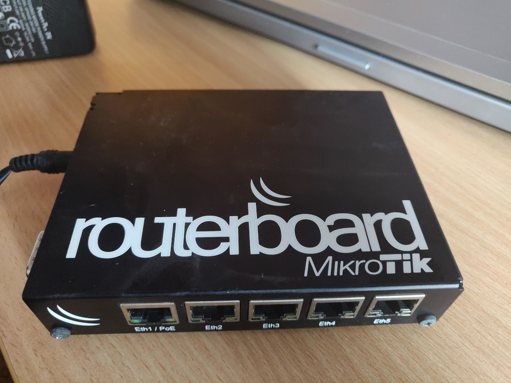
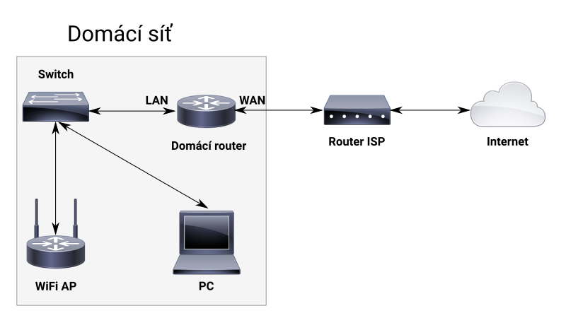
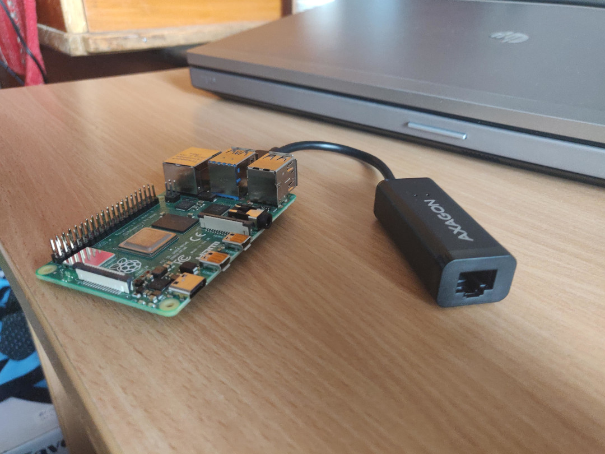
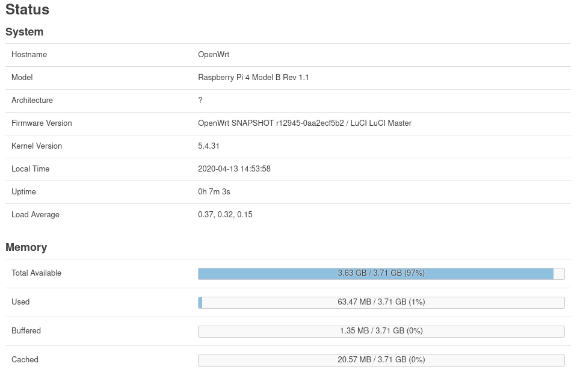

Nedávno jsem nahradil můj domácí router za [Raspberry Pi 4][rpi4-specs]. Mým hlavním cílem bylo zvýšit propustnost na mé VPN. A když už jsem to dělal, také jsem zmigroval z [OpenVPN][openvpn] na [WireGuard][wireguard] a přečetl si celý technický [dokument][wg-whitepaper]. Tento příspěvek shrnuje dohromady moje poznatky z toho, jak jsem změnil účel mého [Raspberry Pi][raspberrypi] na síťové zařízení.

## Proč je dobré mít domácí router v první řadě?
Když podepíšete smlouvu s vaším poskytovatelem Internetu, kromě internetové služby si obvykle pronajímáte i router. Je certifikován pro síť poskytovatele a poskytuje drátové a bezdrátové připojení pro všechna zařízení u vás doma. Ve většině případů se tohoto routeru nemůžete zbavit a většina lidí to ani neřeší. Já přemýšlím jinak a věřím, že je důležité mluvit o jeho bezpečnostních rizicích.

Routery poskytnuté vaším poskytovatelem Internetu mají několik nevýhod:
- Jejich hardware je často podřadný, s nedostatečnou pamětí RAM a flashovým úložištěm
- Jako důsledek je jejich software omezen ve funkčnosti
- Občas mají takové routery hardwarové úpravy od variant určených pro spotřebitelský trh a často obsahují upravený firmware vyrobený výhradně pro poskytovatele
- Vy jako zákazník máte omezený přístup do takových zařízení. Na druhé straně, váš poskytovatel má často vzdálený přístup a plnou kontrolu nad tímto zařízením
- V minulosti našli bezpečnostní experti [několik zadních vrátek][asus-vulnerability], které umožnily vzdálený přístup komukoliv, kdo byl dostatečně motivován
- Takové routery obvykle nedostávají aktualizace firmwaru nebo je dostávají jen velmi zřídka a jen na omezenou dobu
- Jako důsledek, pokud najdou bezpečnostní experti chyby v softwarových knihovnách použitých v takových routerech, tyto chyby v nich nejsou nikdy opraveny
- Takové routery používáte denně mnoho let. Obvykle, dokud vám váš poskytovatel nedá novější model, což se stává zřídka

Pro mě je to, že mám vlastní router připojen za routerem mého poskytovatele samozřejmost. Rád mám věci pod kontrolou a také používám nestandardní služby jako VPN, která propojuje dům u mých rodičů a byt tak, abych mohl k mým věcem přistupovat odkudkoliv.

## Od Mikrotiku k Raspberry
Za ty roky jsem vyzkoušel několik značek routerů, ale u jedné jsem zůstal velmi dlouho — u Mikrotiku. Doporučil mi ho přítel a od té doby jsem tuto radu prodal dále s tím, že už mám vlastní zkušenosti.

<div className="Image__Small">
  
  <figcaption>Mikrotik RB450G, můj hlavní router před výměnou za RPi4</figcaption>
</div>

U mě doma jsem používal model [RB450G][mikrotik-rb450g], který má jednojádrový MIPS procesor taktovaný na 680 MHz, 256 MB RAM a 512 MB flashového úložiště. Oproti routeru mého poskytovatele bylo už i toto značné zlepšení. V té době měl typický router od poskytovatele Internetu, resp. levný domácí router, zhruba 32 MB RAM a 4 MB úložiště. Nebylo téměř možné dostat tam nějaký slušný software, protože prostě nebylo místo.

Připojovali jsme se prostřednictvím ADSL. Abych tento nový router zapojil do mé sítě, připojil jsem ho na LAN port ADSL modemu jako jediného klienta. Také jsem vypnul DHCP, nastavil statickou IP adresu a vypnul všechny „inteligentní“ funkce, čímž jsem udělal z modemu jen hloupý bridge, který přeposílal data z mého routeru k mému poskytovateli Internetu, tam a zpět.

<div className="Image__Medium">
  
  <figcaption>Domácí router připojen za routerem poskytovatele</figcaption>
</div>

Každý router poskytovatele je jiný, ale měli byste ho umět nastavit obdobně. Také zkuste najít možnost DMZ a nastavit ji na IP adresu vašeho domácího routeru. Takto budou všechna data přeposílány na váš domácí router a nebudou se aplikovat žádné speciální pravidla. A ještě jedna věc. Pokud má router od vašeho poskytovatele WiFi, vypněte ji. WiFi potřebujete nastavit na vašem domácím směrovači nebo na zařízení, které je za ním. Jinak budou všechna data z bezdrátové sítě obcházet váš domácí router a to zřejmě nechcete.

### OpenWrt
Zařízení od MikroTiku používají jako jejich systém [RouterOS][routeros]. Dává uživatelům funkce, které se nacházejí v mnohem dražších síťových produktech. Obzvláště zbožňuji jejich Winbox aplikaci, která mi pomáhá spravovat mé zařízení přes jednoduché UI. Nicméně, jak jsem to používal, našel jsem několik chyb a také mi chyběly některé funkce. Například RouterOS podporuje OpenVPN pouze přes TCP, čímž stoupá provozní režie. Také, když můj poskytovatel zavedl IPv6 v konfiguraci DS-Lite, podpora v RouterOS byla omezena a měl jsem problém přistupovat k nativní IPv6 síti. Proto jsem se rozhodl zmigrovat na [OpenWrt][openwrt], což je open-source linuxová distribuce zaměřená na routery. Díky tomu bylo mnoho funkcí přímo tam, včetně OpenVPN na UDP a dobrá podpora DSLite.

OpenWrt měl k dispozici mnoho softwarových balíčků. Pokud mi něco chybělo, mohl jsem připravit balíček sám (a i jsem to udělal). A pokud jsem našel chybu, mohl jsem ji nahlásit a poskytnout patch (i to jsem udělal). No jednoho dne v linuxovém jádře zahodili podporu pro mé flashové úložiště. Najednou nejnovější verze OpenWrt nefungovaly s mým routerem správně a já musel zůstat u staré verze systému. Šlo o problém z pohledu bezpečnosti, jakož i použitelnosti. Už jsem více nemohl používat nejnovější software. Jelikož šlo o můj hlavní router, nemohl jsem s ním experimentovat a připravovat patche. Testování změn nebylo možné. Tuto starou OpenWrt distribuci jsem nechal na mém routru běžet přes rok. Během této doby jsem hledal alternativní řešení, které je dostatečně výkonné, aby zvýšilo výkon mé VPN a které by mi umožnilo rozběhat upravitelný firmware.

### Hledání alternativního hardwaru
V mé druhé lokalitě používám [Turris Omnii][turris], která používá forknutý kód OpenWrt. Napadlo mi, že bych Omnii nahradil síťovou vývojovou deskou jako [MACCHIATObin Double Shot][macchiatobin] a že bych nahradil můj Mikrotik za Omnii. Nakonec jsem od této myšlenky upustil kvůli vyšší cenne a horší dostupnosti desky MACCHIATObin. Z praktického úhlu pohledu nepotřebuji hardware schopný uroutovať 10 Gbit/sekundu, pokud můj poskytovatel Internetu mi dává pouze jeden gigabit, ale musím přiznat, že by se mi to líbilo. Později jsem přesunul svou pozornost na hardware, na kterém běží [pfSense][pfsense] nebo [OPNSense][opnsense]. Tyto distribuce mají slabou podporu desek postavených na ARM architektuře a najít x86 hardware s nízkou spotřebou, rozumnou cenou a slušným výkonem není tak jednoduché.

Pak jsem si vzpomněl na můj [Odroid C2][odroid-c2]. Je to vývojová deska s jedním ethernetovým portem a několika USB2 porty. Co je však důležité, že dokáže utáhnout Ethernet přes její RJ45 port v plné rychlosti jednoho gigabitu. Pokud byste chtěli použít jako router takové zařízení, potřebujete alespoň dvě rozhraní — jedno směřující k routeru od poskytovatele (WAN) a jedno, které směřuje k vašim zařízením (LAN). Přemýšlel jsem, že použiji tento interní ethernetový port pro LAN, protože nejvyšší rychlost je na lokální síti zásadní. Ovšem u WAN mi stačila mnohem menší propustnost, protože rychlost mého Internetu byla jen okolo 100 Mbit/sekundu. Pro tento účel jsem našel velmi slušné adaptéry z USB3 na Ethernet. Odroid C2 podporuje několik linuxových distribucí, včetně Ubuntu a [Arch Linux ARM][archlinuxarm]. Proto je jistě možné vyrobit z něj router a rozhodně bych to udělal, kdyby nevyšla nová revize Raspberry Pi. Hlavním problémem Odroidu C2 je, že nemá přímou podporu v linuxovém jádře a to jádro, které je upravené, aby jeho podporu mělo, je už dost staré. Také distribuce Arch Linux ARM, kterou jsem se chystal použít, není vysloveně navržena pro routery. Toto řešení by mohlo fungovat, ale s vysokou pravděpodobností by zabralo mnohem více času nastavit ho.

V poslední víkend jsem už byl rozhodnut jít cestou s Odroidom C2. Ale v tom jsem se podíval na mé krásné nové Raspberry Pi 4 a rozmyslel jsem si to. Vlastním téměř všechny revize Raspberry Pi a používám je v mých IoT projektech. I to byl důvod, proč jsem si koupil Raspberry Pi 4. Předcházející generace RPi nebyly pro použití jako routeru až tak vhodné, protože jejich ethernetové rozhraní bylo interně směrováno přes USB2 rozbočovač, čímž se účinně omezuje propustnost na [zhruba 200 Mbit/sekundu]rpi-throughput]. Ovšem RPi4 konečně dokáže naplno zahltit celou gigabitovou linku, protože má novou I/O architekturu. A také konečně poskytuje USB3 porty, které s mým externím adaptérem z USB3 na Ethernet fungují skvěle. Hlavní výhodou RPi4 nad Odroidom C2 je, že má přímou podporu v jádru. Proto je jednoduché použít téměř nejaktuálnější linuxové jádro. Kvůli jeho popularitě je i podpora komunity lepší. A jako bonus přidalo pro něj OpenWrt podporu ve vývojových sestavách. Proto by měla být migrace z mého stávajícího routeru na Raspberry Pi relativně bezbolestná. Pojďme se nyní podívat na tento proces.

## Měníme Raspberry Pi na router
Jak jsem již zmínil, potřeboval jsem mít dvě ethernetové rozhraní, přičemž mi Raspberry poskytuje pouze jedno. Rozhodl jsem se použít interní ethernetový port pro mou lokální LAN a adaptér z USB na Ethernet pro WAN. Samozřejmě, toto přiřazení není podmínkou. Pokud použijete USB adaptér pro LAN, i takto by vám to mělo fungovat. V mém případě je LAN port na RPi připojený k 24-portovému gigabitovému ethernetovému switchi, abych mohl poskytovat konektivitu pro více než jedno zařízení. Můžete si koupit jakýkoliv levný switch s gigabitovými porty.

<div className="Image__Large">
  
  <figcaption>Raspberry Pi 4 s adaptérem z USB na Ethernet</figcaption>
</div>

Aniž bych zajel do přílišných detailů jak funguje Ethernet, router slouží ke dvěma účelům — překládá IP adresu na MAC adresu prostřednictvím [ARP][arp] protokolu a směřuje datový provoz do vnějších sítí jako je Internet. Když chtějí dvě vaše zařízení komunikovat v rámci téže LAN sítě, jejich provoz přes router vůbec neprochází, pouze přes switch. A proto, když si koupíte levný switch s gigabitovými porty, budete mít slušně výkonnou síť a vůbec nezáleží na tom, jaký router používáte.

Proto pokud máte nějaké zbývající Raspberry Pi 3, stále vám může dobře sloužit jako router, jen za něj připojte nějaký switch a ujistěte se, že vaše internetová linka je pomalejší než 200 Mbit/sekundu. Jinak bude vaše rychlost omezena. Raspberry Pi 3 nezvládne větší datovou provoz kvůli internímu USB2 rozbočovači, který jsem již zmiňoval. RPi4 je v tomto případě lepší volba. Nemám přesné statistiky, ale [propustnost USB 3.0 je 5 Gbit/s][usb-wiki], takže si myslím, že nejnovější RPi by nemělo mít problém zahltit odchozí linku.

### Instalace OpenWrt
Instalace systému byla dost přímočará. Řídil jsem se [oficiálními instrukcemi][openwrt-rpi-guide]. Vězte však, že pokud máte Raspberry Pi 4, jeho podpora ještě není v stabilních sestavách OpenWrt a musíte si stáhnout [nejnovější vývojovou sestavu][openwrt-rpi4-snapshot]. Tento image je komprimován gzipem, nejprve ho tedy musíte rozbalit. Potřebné kroky vysvětlím pomocí linuxového příkazového řádku:

```bash
gunzip rpi-4-ext4-factory.img.gz
```

Ve výsledku dostanete soubor bez přípony `*.gz`. Tento soubor můžete naflashovať na MicroSDXC kartu. Já používám nástroj `dd`:

```bash
dd if=rpi-4-ext4-factory.img of=/dev/mmcblk0 bs=4096
sync
```

Zdrojový soubor určíte v parametru `if` a cílovou paměťovou kartu v parametru `of`. Velikost bloku, `bs`, je volitelná, abychom věci urychlili a příkaz `sync` nás ujistí, že všechno bylo na kartu zapsáno.

Na rozdíl od distribucí jako Raspberry Pi OS, OpenWrt nezvětší váš systémový diskový oddíl, aby zabral všechno dostupné místo. Typicky tak dostanete pouze asi 100 MB místa pro vaše aplikace, i když má vaše karta 64 GB místa. Já jsem si změnil velikost diskového oddílu ručně na mém počítači. Nejprve jsem upravil tabulku diskových oddílů nástrojem `fdisk` a potom jsem použil příkaz `resize2fs`. Animace níže ilustruje všechny tyto kroky:

<div className="Image__Medium">
  
  <figcaption>Změna velikosti systémového diskového oddílu</figcaption>
</div>

Nejprve potřebujete změnit tabulku diskových oddílů, aby zabíral druhý oddíl, `rootfs`, vše dostupné místo. Diskový oddíl musíte nejprve smazat a pak vytvořit nový. Klíčové je ujistit se, že nový, větší oddíl začíná na stejném offsetu. Možná vám tato operace přijde nebezpečná, ale ve skutečnosti není. Samozřejmě, musíte se ujistit, že jste si vybrali správné zařízení. Když změníte tabulku diskových oddílů, vyberte a znovu zasuňte paměťovou kartu, aby Linux použil aktualizovanou tabulku. V dalším kroku zkontrolujte chyby v souborovém systému a nakonec spusťte příkaz `resize2fs`.

### První spuštění
Raspberry Pi má přidělenou IP adresu `192.168.1.1`. Abyste se na něj připojili, připojte váš počítač na ethernetový port RPi a nastavte jeho adresu na `192.168.1.2`. Pak byste měli být schopni přistupovat k OpenWrt přes SSH:

```bash
[vzahradnik@EliteBook ~]$ ssh root@192.168.1.1


BusyBox v1.31.1 () built-in shell (ash)

  _______                     ________        __
 |       |.-----.-----.-----.|  |  |  |.----.|  |_
 |   -   ||  _  |  -__|     ||  |  |  ||   _||   _|
 |_______||   __|_____|__|__||________||__|  |____|
          |__| W I R E L E S S   F R E E D O M
 -----------------------------------------------------
 OpenWrt SNAPSHOT, r12945-0aa2ecf5b2
 -----------------------------------------------------
root@OpenWrt:~#
```

V dalším kroku je dobrým zvykem nastavit si heslo:

```bash
passwd <vaše-nové-heslo>
```

Abychom mohli pokračovat, potřebujeme v OpenWrt mít internetovou konektivitu. V mém případě jsem změnil IP adresu Raspberry Pi v souboru `/etc/config/network`. Pokud staticky přiřadíte IP adresu z rozsahu odpovídajícímu vaší LAN, můžete připojit vaše Raspberry jako obyčejného klienta za váš stávající router. Další kroky si tím zjednodušíte.

Abyste mohli upravit soubor `network`, můžete použít předinstalovaný textový editor `vi`. Pokud jste `vi` nebo `vim` nikdy předtím nepoužívali, zde je stručný přehled. Když otevřete soubor, nacházíte se v příkazovém režimu. Použijte šipky na klávesnici na přesunutí kurzoru na místo, které chcete změnit. Poté stiskněte „i“ na přepnutí do režimu úprav, ve kterém můžete psát text a mazat existující text pomocí klávesy `Delete`. Když vaše změny dokončíte, stiskněte `Escape` pro návrat zpět do příkazového režimu, a uložte soubor napsáním `:wq <Enter>` (t.j. příkaz: zapsat a skončit).

Začněte upravovat soubor `network`:

```bash
root@OpenWrt:~# vim /etc/config/network
```

Upravte sekci `wan`, aby odpovídala vaší aktuální konfiguraci LAN, t.j. přiřaďte RPi statickou IP, která se ve vaší síti nepoužívá, nastavte správnou adresu výchozí brány, která směřuje na váš aktuální router, a nastavte DNS. Zde je příklad z mé konfigurace:

```bash
config interface 'wan'                
        option ifname 'eth1' 
        option proto 'static'   
        option ipaddr '192.168.0.2'   
        option netmask '255.255.255.0'
        option gateway '192.168.0.1'  
        option ipv6 'auto'         
        option peerdns '0'            
        option dns '193.17.47.1 185.43.135.1'
```

Když vaše změny uložíte, aplikujte novou konfiguraci buď tím, že restartujete RPi nebo napsáním příkazu:

```
root@OpenWrt:~# /etc/init.d/network restart
'radio0' is disabled
```

Nyní by mělo být vaše RPi připojeno k Internetu, co můžete potvrdit příkazem `ping`. Nejprve pingněte dobře známou veřejnou IP adresu:

```bash
root@OpenWrt:~# ping 8.8.8.8
PING 8.8.8.8 (8.8.8.8): 56 data bytes
64 bytes from 8.8.8.8: seq=0 ttl=118 time=35.707 ms
64 bytes from 8.8.8.8: seq=1 ttl=118 time=35.544 ms
^C
--- 8.8.8.8 ping statistics ---
2 packets transmitted, 2 packets received, 0% packet loss
```

Pokud tento příkaz fungoval, vaše RPi je připojeno. Ověřme si také, zda funguje překlad jmen z DNS a zda se umíte připojit ke službám pomocí názvů jejich domén:

```bash
root@OpenWrt:~# ping www.google.com
PING www.google.com (172.217.23.228): 56 data bytes
64 bytes from 172.217.23.228: seq=0 ttl=118 time=33.452 ms
64 bytes from 172.217.23.228: seq=1 ttl=118 time=33.279 ms
^C
--- www.google.com ping statistics ---
2 packets transmitted, 2 packets received, 0% packet loss
```

Poté co už máte fungující internetové připojení, klidně si nainstalujte kterýkoli textový editor, který vám vyhovuje více než `vi`, případně jakýkoliv balíček, který potřebujete. Doporučuji `nano`. Nejprve aktualizujte seznam balíčků:

```bash
opkg update
Downloading http://downloads.openwrt.org/snapshots/targets/bcm27xx/bcm2711/packages/Packages.gz
...
```

A poté nainstalujte `nano`:

```bash
root@OpenWrt:~# opkg install nano
Installing nano (5.2-1) to root...
...
```

Odteď můžete soubory upravovat takto:

```bash
nano /etc/config/network
```

V této chvíli byste měli být připraveni pokračovat v dalších krocích. Pokud se na nějakém bodě zaseknete, napište mi komentář pod tímto příspěvkem.

### Rozběhání adaptéru z USB na Ethernet
Když si prohlédnete vaše dostupné rozhraní, s největší pravděpodobností uvidíte pouze interní rozhraní `eth0`, i když je váš USB adaptér připojen. V mém případě jsem si musel zjistit, jakou čipovou sadu můj adaptér používá, a nainstalovat příslušný modul jádra.

```bash
root@OpenWrt:~# opkg list kmod-usb-net*

# Instalace modulu Realtek
root@OpenWrt:~# opkg install kmod-usb-net-rtl8152
root@OpenWrt:~# reboot
```

Po nejbližším restartu byste již měli vidět vaše rozhraní USB Ethernetu inicializováno:

```bash
...
[    7.159985] usbcore: registered new interface driver r8152
[    7.370114] r8152 2-2:1.0 eth1: v1.10.11
[   10.665622] IPv6: ADDRCONF(NETDEV_CHANGE): eth1: link becomes ready
[   10.673312] r8152 2-2:1.0 eth1: carrier on
...
```

### Aktualizace síťové konfigurace
Jak jsem již zmínil, rozhodl jsem se použít USB adaptér pro datový provoz, který jde ven do Internetu. Raspberry Pi používá pro tento účel standardně interní port `eth0`. Potřebujeme v souboru `/etc/config/network` udělat změny. No tentokrát už můžeme aplikovat cílovou konfiguraci, včetně cílové IP adresy zařízení. Jen se ujistěte, že tuto konfiguraci neaplikujete například tím, že restartujete zařízení.

Můj soubor vypadá nějak takto:

```bash
...
# Moje LAN síť, kde Raspberry Pi slouží jako router.
# Používá interní ethernetový port na Raspberry Pi.
config interface 'lan'
    option type 'bridge'
    option ifname 'eth0'
    option proto 'static'
    # Statická IP adresa vašeho routeru.
    # Musí být ve vaší LAN síti jedinečná.
    option ipaddr '10.0.0.1'
    option netmask '255.255.255.0'
    option ip6assign '60'

# Konfigurácia WAN sítě, např. na připojení
# k routeru poskytovatele Internetu.
# Používá adaptér z USB na Ethernet.
config interface 'wan'
    option ifname 'eth1'
    option proto 'static'
    # Předpokládáme, že IP adresa routeru od
    # vašeho poskytovatele je 192.168.1.1
    option ipaddr '192.168.1.2'
    option netmask '255.255.255.0'
    option gateway '192.168.1.1'
    option ipv6 'auto'
    option peerdns '0'
    # Můžete sem zadat vlastní servery DNS
    option dns '217.31.204.130 193.29.206.206'
...
```

### Instalace webového serveru a grafického prostředí
OpenWRT poskytuje pro webové UI balíček [LuCI][luci]. Umožňuje spravovat všechny tyto nastavení přes jednoduchou webstránku. Na levných a nevýkonných OpenWrt routerech obvykle používá jako webserver `uhttpd`. Ovšem Raspberry Pi je dostatečně výkonné, aby zvládlo plnohodnotný [Nginx][nginx] server.

UI si můžete nainstalovat těmito příkazy:

```bash
opkg update
opkg install luci-ssl-nginx
```

Volitelně si můžete nainstalovat jazykové balíčky, aby se UI přepnulo do vámi požadovaného jazyka. Instrukce najdete v oficiální dokumentaci.

Abyste zapnuli UI, musíte udělat následující:

```bash
root@OpenWrt:~# /etc/init.d/nginx enable
```

### Závěrečné kroky
A to je v podstatě všechno. Nyní je Raspberry Pi připraveno sloužit jako router. Pokud máte další domácí router s OpenWrt (jako v mém případě Mikrotik), můžete z něj přenést zbývající konfiguraci jako pravidla firewallu, DHCP a DNS záznamy, a pak můžete Raspberry Pi vypnout. Je připraveno a můžete jej nyní umístit jako váš router.

Po restartu můžete přistupovat k webovému rozhraní v prohlížeči pomocí statické IP adresy nastavené v konfiguraci sítě.

<div className="Image__Medium">
  
  <figcaption>LuCI webové rozhraní</figcaption>
</div>

## Závěr
V mém případě byl experiment s použitím Raspberry Pi jako mého nového routeru úspěšný a rozhodl jsem se udělat z toho moje trvalé řešení. Po dlouhém čase mám OpenWrt s nejnovějšími opravami. Výkon mé VPN je značně vyšší a to ještě nevzpomínám, že mi toto řešení dává 4 GB RAM a téměř 60 GB úložiště, čímž získávám nové možnosti, jak provozování vlastního proxy serveru nebo nastavení pravidel ve firewallu, které jsou náročnější na výkon. Těší mě, že máme konečně vývojové desky, které jsou schopny nahradit síťový hardware. Takové desky možná výrazně ovlivní segment síťových produktů pro domácnosti v následujících letech. Pokud máte zbylé Raspberry Pi, povzbuzuji vás k tomu, abyste ho také zkusili použít jako router. Je to zajímavý zážitek.

*Aktualizace 1.11.2020: Nedávno Nadace Raspberry Pi uvedla [nový výpočtový modul][rpi4-compute] postaven na Raspberry Pi 4. Má stejný procesor a většinu funkcí RPi4, ale také nabízí věci navíc, hlavně port PCIe x1. Před pár dny jsem na Hacker News četl [příspěvek podobný tomu mému][rpi4-intel-nic]. Ovšem namísto použití externího adaptéru z USB na Ethernet použil autor síťovou kartu od Intelu. Dokázal dosáhnout propustnost 3 Gbit/s, což je maximum sběrnice PCIe x1. Rozběhání síťové karty nebylo vůbec složité. Použil levný adaptér na PCIe x16 a ze zdrojových kódů si sestavil ovladač. Myslím, že stojí za to si to přečíst a je to slušná alternativa k mému přístupu, pokud chcete z vašeho RPi vyždímat ještě více výkonu.*

[//]: # (Used references)
[rpi4-specs]: https://www.raspberrypi.org/products/raspberry-pi-4-model-b/
[openvpn]: https://openvpn.net/
[wireguard]: https://www.wireguard.com/
[wg-whitepaper]: https://www.wireguard.com/papers/wireguard.pdf
[asus-vulnerability]: https://www.bleepingcomputer.com/news/security/40-asus-rt-router-models-are-vulnerable-to-simple-hacks/
[raspberrypi]: https://www.raspberrypi.org/
[mikrotik-rb450g]: https://mikrotik.com/product/RB450G
[routeros]: https://mikrotik.com/software
[openwrt]: https://openwrt.org/
[turris]: https://www.turris.cz/cs/omnia/predstaveni/
[macchiatobin]: http://macchiatobin.net/product/macchiatobin-double-shot/
[pfsense]: https://www.pfsense.org/
[opnsense]: https://opnsense.org/
[odroid-c2]: https://wiki.odroid.com/odroid-c2/odroid-c2
[archlinuxarm]: https://archlinuxarm.org/platforms/armv8/amlogic/odroid-c2
[rpi-throughput]: https://www.jeffgeerling.com/blogs/jeff-geerling/getting-gigabit-networking
[arp]: https://sk.wikipedia.org/wiki/Protokol_rozli%C5%A1ovania_adries
[usb-wiki]: https://sk.wikipedia.org/wiki/Univerz%C3%A1lna_s%C3%A9riov%C3%A1_zbernica
[openwrt-rpi-guide]: https://openwrt.org/toh/raspberry_pi_foundation/raspberry_pi
[openwrt-rpi4-snapshot]: https://downloads.openwrt.org/snapshots/targets/bcm27xx/bcm2711/
[luci]: https://openwrt.org/docs/guide-user/luci/luci.essentials
[nginx]: https://nginx.org/
[rpi4-compute]: https://hackaday.com/2020/10/19/new-raspberry-pi-4-compute-module-so-long-so-dimm-hello-pcie/
[rpi4-intel-nic]: https://www.jeffgeerling.com/blog/2020/5-gbps-ethernet-on-raspberry-pi-compute-module-4