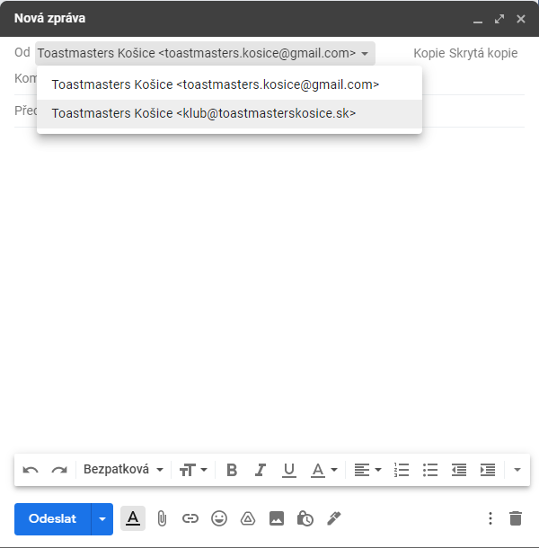
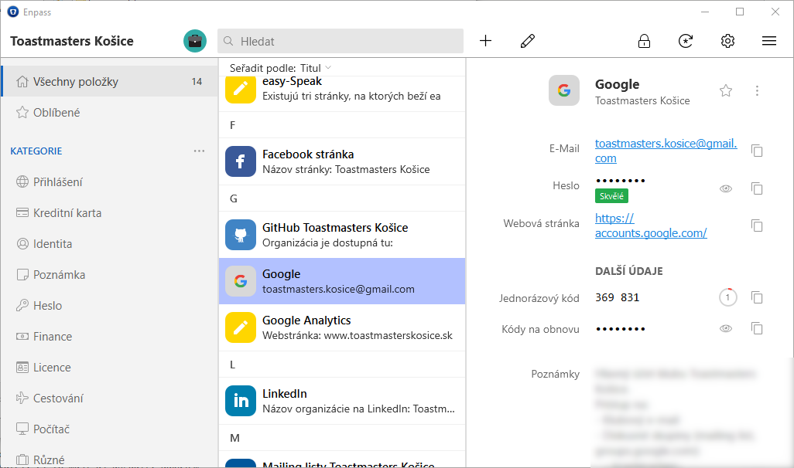

Přes rok pomáhám řídit místní neziskový klub [Toastmasters][toastmasters]. Téměř po celou dobu jsem cítil, že bezpečnostní standardy v naší organizaci jsou slabé. Nicméně zavést změny není jednoduché — ne všichni moji kolegové jsou technicky zdatní. Proto jsem musel najít způsob, jak lépe zabezpečit naše účty, aniž by to bylo pro ostatní příliš komplikované. Byl to otevřený problém a nikdo mi nevěděl dát odpověď. Mluvil jsem s jinými komunitními kluby a jejich standardy byly podobně nízké. Nikoho bezpečnost nezajímá, pokud klub funguje. Prošly měsíce bez jakékoli změny na naší straně. Najednou, koncem dubna byla naše sdílená [stránka na Facebooku][fb-tmke] kompromitována a musel jsem rychle jednat. Za poslední dva týdny jsem konečně přišel na způsob, jak zvýšit bezpečnost, aniž bychom zvýšil složitost.

## Co je to Toastmasters? Stručná verze
Toastmasters je komunita nezávislých řečnických klubů pod záštitou Toastmasters International. Historie sahá až do roku 1924, kdy Ralph Smedley založil úplně první klub. Každý klub vede běžné setkání, na kterých si mohou členové trénovat řečnění na veřejnosti v přátelském prostředí. Přestože my všichni jsme kluby Toastmasters, každý klub je jiný, protože komunita okolo klubu je jiná.

Kromě řečnění na veřejnosti mají členové možnost zlepšit se v jejich vůdčích dovednostech. A co je lepší způsob, jak praktikovat vůdčí dovednosti, než vést váš klub? Je to neziskovka, za naši práci nám nikdo neplatí. Právě naopak, platíme si členské poplatky jako kdokoliv jiný. Pro mě znamená vést klub Toastmasters totéž jako kdybych vedl vlastní firmu s připojenými tréninkovými kolečky. Můžete věci podělat, ale lidé i tak přijdou. Na druhé straně, můžete experimentovat, přicházet s nápady a pracovat v prostředí připomínajícím startup. Vaše aktivita má vážný dopad na budoucnost klubu.

## Všude sdílené účty
Když jsem byl zvolen do jedné z vůdčích pozic, můj předchůdce mi dal instrukce k přihlášení do sdíleného klubového emailového účtu. Používáme obyčejný Gmail, který je dostupný každému vedoucímu klubu. Naše emailová adresa (přihlašovací jméno) je dobře známa a naše heslo bylo velmi slabé. Bylo krátké, nemělo žádné speciální znaky, ani jen čísla. Osobně věřím, že kdyby vyzkoušel hacker slovníkový útok, uspěl by. A co je horší, toto heslo s vysokou pravděpodobností nebylo nikdy měněno.

V naší organizaci se vedoucí mění jednou ročně. Nicméně bývalí vedoucí mají stále přístupové údaje a kdykoliv mohou získat neoprávněný přístup. Je nepravděpodobné, že se někdo z těchto lidí pokusí klubu uškodit, ale čím déle náš klub existuje, tím více lidí má přístupy. A tedy, bezpečnostní rizika dramaticky rostou. Úniky hesel se dějí každý den, takto pracovat není udržitelné. Uvědomil jsem si, že naše organizace je v mnohém jedinečná. Nemůžeme aplikovat principy, které používají organizace, v nichž manažeři slouží dlouhé období a opouštějí jejich pozice postupně, ne ve stejném čase.

### Bezpečnostní výzvy
Než vysvětlím, jak jsem vyřešil naši situaci, shrňme si všechny problémy na jednom místě:
- Sdílený Google účet (přístup do klubového Gmailu, Disku Google, Dokumentů Google, Formulářů Google, Skupin Google a YouTubu)
- Slabé heslo sdílené s každým
- Hesla nebyly nikdy měněny. Bývalí členové měli stále přístup k našim datům
- Stejné heslo se používalo téměř ve všech klubových účtech
- Mnohé účty používají k přihlášení stejnou kombinaci emailu/hesla
- Žádný z účtů nepoužívá [dvoufaktorovou autentizaci][2fa]
- Neexistuje jedno centrální místo s informacemi o všech účtech spravovaných v našem klubu
- Nejasné vlastnictví stávajících služeb, jako naší stránky. Často neví nikdo říci, kdo je správcem
- U účtů jako je naše stránka na Facebooku, kde dáváte oprávnění účtům jednotlivců, aby měli práva správce, nikdo neodstraňuje bývalých vedoucích. Často mají plná práva správce

## Vytvoření pořádku z chaosu
Uvedené výzvy jsou stále zjednodušené oproti skutečnosti, jaké jsem čelil.

  
  <figcaption>Zdroj: Peter H, Pixabay</figcaption>

### Zbavení se zastaralé webstránky
Poprvé, když jsem začal řešit tyto problémy, to bylo tehdy, když jsem se rozhodl aktualizovat naši webovou stránku. V té době běžela naše webstránka na doméně `toastmasterskosice.eu`. Byla dost zastaralá, vložené promo videa už ani neexistovaly. Požádal jsem své kolegy (někteří z nich byli vedoucími i v předešlých obdobích) o související podrobnosti, ale hodně jsem se nedozvěděl. Náš vedoucí odpovědný za finance prostě zaplatil faktury, které jednou za rok přišli na email klubu. Nikdo nevěděl nic o tom, jak tato webstránka fungovala. Dobrou zprávou je, že dokážete získávat informace z veřejných zdrojů.

Naši webstránku hostoval [WebSupport][websupport], i doména byla registrována přes ně. Požádal jsem našeho prezidenta klubu, zda by se nepokusil získat informace, jak přistupovat k webhostingovému účtu z našich klubových dokumentů. Také jsem kontaktoval několik aktuálních i bývalých vedoucích a členů v naději, že někdo z nich bude něco vědět. Chvíli to trvalo, ale získal jsem informace ne o jednom, ale o dvou webhostingových účtech. Jeden se jmenoval `ToastmastersKE` a ten druhý byl `ToastmastersKE1`. Ne dokonalé, ale alespoň jsem už mohl spravovat naši webstránku.

První účet, ToastmastersKE, neměl žádnou aktivní službu. Jelikož bylo mým cílem také zjednodušit správu účtů, řešil jsem i tento bordel. Kontaktoval jsem WebSupport a požádal jsem je o uzavření a vymazání `ToastmastersKE` a o přejmenování` ToastmastersKE1` na `ToastmastersKE`. Veškerá tato snaha byla kvůli tomu, abychom měli na starost o jeden účet méně. Byli byste překvapeni, kolik dní trvalo dokončit tuto jednoduchou změnu. Komunikoval jsem s podporou přes týden. Tipuji, že se více soustředí na to, jak se jeví vůči veřejnosti, než na jejich interní nástroje. Například, nebyli schopni vymazat účet, pouze ho zakázat. Konečně, když už náš účet přejmenovali, přihlásil jsem se jako `ToastmastersKE`. A přivítala mě zpráva *Ahoj, ToastmastersKE1*. Trochu to zkrátím, nyní máme už jen jeden účet a funguje bez problémů.

Zjistil jsem, že naše webstránka používá [WordPress][wordpress], který vyžaduje další přihlašovací údaj pro přístup do jeho správcovské stránky. Nejprve jsem si myslel, že odtud použiji některé části v naší nové webstránce a tak jsem se pokusil získat heslo. Nikdo o tom nic nevěděl. Pokusil jsem se kontaktovat některé bývalé členy (praxe, která se v tomto příběhu opakuje jaksi příliš často). Naštěstí jeden z nich heslo měl a občas dokonce pro nás aktualizoval WordPress pluginy. Nakonec jsem se rozhodl zcela WordPress stránku vymazat a začít s čistým štítem. Potom, jak jsem vymazal záznam ze správcovské stránky našeho webhostingu, zbavil jsem se dalšího účtu.

### Sjednocování emailů
Ukázalo se, že pod naší doménou jsme měli další email, který spravovala hostingová společnost. Email `ahoj@toastmasterskosice.eu` se používal ke komunikaci s perspektivními novými členy. Myslím si, že tento webmail měl ještě další přístupové údaje, a co je horší, zprávy byly rozděleny na dvě místa — náš Gmail a tento webmail.

Na nejbližší poradě jsem navrhl následující:
- Zbavit se .EU domény a získat ekvivalentní .SK doménu
- Sloučit dva emailové účty do jednoho a zmigrovat emaily z webmailu

Uživatelé v naší zemi mnohem více znají naši národní .SK doménu. Proto všichni souhlasili s tím, aby se naše nová webstránka hostovala na `toastmasterskosice.sk`. Nicméně obávali se, že někteří lidé mají tuto starou webstránku uloženou mezi záložkami a že nám může uškodit, pokud ji přestaneme používat. Přesvědčil jsem je, že tam nemáme žádný reálný provoz a že by to bylo mrhání penězi klubu, pokud se rozhodneme držet dvě domény. Datum obnovy pro naši .EU doménu se rapidně blížil a musel jsem rychle jednat. Migrace emailů mi zabrala asi dvě hodiny, přičemž jsem všechny emaily z tohoto webmailu označil jako `toastmasterskosice.eu`, abyste je v Gmailu rozlišili už na první pohled. Také jsem importoval kontakty z tohoto webmailu do Gmailu.

### Vytváření emailových aliasů
Jak jsem již zmínil, webmail jsme používali na přímou komunikaci s novými a stávajícími členy. Používaní naši gmailové adresy by bylo neprofesionální. Když vidím někoho používat email jako *jmenomojifirmy@gmail.com*, říká mi to, že jednám s amatérem, který své podnikání nekonzultuje s odborníky na marketing. Pro mě to představuje červenou zástavu — co ještě majitel zanedbává? V takových případech pozorně sleduji další aspekty jeho firmy, dokud se rozhodnu k němu přistoupit.

Rozhodl jsem se vytvořit v Gmailu alias:
- ahoj@toastmasterskosice.sk (zastaralý email, ale nyní pod .SK doménou. Poznámka: Už jej nepoužíváme.)
- klub@toastmasterskosice.sk (nový, preferovaný email, používaný při vší komunikaci)

Používání aliasu z Gmailu by mělo být snadné pro všechny. Normálně nabízí Google aliasy v rámci [G Suite][gsuite], ale my nemáme rozpočet, abychom jen kvůli tomu G Suite platili. Místo toho jsem našel [ImprovMX][improvmx]. Služba je zdarma, nevyžaduje žádnou registraci a umožňuje přeposílat emaily pod aliasy. Stačilo mi jen nastavit nové [MX záznamy][mx-record]:

| Adresa                | Poštový server   | Priorita | TTL |
|-----------------------|------------------|----------|-----|
| toastmasterskosice.sk | mx1.improvmx.com | 10       | 600 |
| toastmasterskosice.sk | mx2.improvmx.com | 20       | 600 |

Celý návod pro Gmail naleznete [zde][improvmx-gmail]. Pokud se podíváte na jednotlivé kroky, zjistíte, že tato integrace vyžaduje v Gmailu povolenou [dvoufaktorovou autentizaci][2fa]. Toto byl další problém, který jsem musel řešit. Pokud nastavím autentizaci pomocí [2FA][2fa] tokenu, jak rozdistribuovat token všem oprávněným členem? Jak jim jednoduše vysvětlím, co je to 2FA, proč to potřebujeme a jak si to nastaví? Ukázalo se, že existuje ještě jeden méně bezpečný způsob. Google účet má volbu nazvanou [„Méně zabezpečené aplikace“][google-less-secure-apps]. Pokud je zapnuta, náš účet je podle Googlu více zranitelný. Nicméně umožňuje nám to použít přeposílání pošty bez zapnutého 2FA.

  
  <figcaption>Aliasy v Gmailu</figcaption>

Takové nastavení jsme používali ještě do minulého týdne (do 4. května 2020). Problémem bylo, že Google po nějakém čase tuto možnost automaticky vypnul. Pokud účty spravuji já, dokážu na to přijít a přeposílání pošty opravit. Ale nejde o dlouhodobé řešení. Někdo, kdo přijde po mně, potřebuje mít stabilní a předvídatelné prostředí.

### Vytvoření organizace Toastmasters Košice na GitHubu
Tento krok se týká správy účtů pouze částečně, ale je stále podstatný. Nastavil jsem [náš účet na GitHubu][github-tmke], abychom mohli zdarma hostovat naši novou webstránku na [GitHub Pages][github-pages]. Od té doby jsem začal vytvářet další repozitáře, abych udělal náš klub vůči veřejnosti více transparentním. Nyní si jen stručně zapamatujte, že tam máme účet. Později vysvětlím, proč je to důležité.

### Vytvoření Toastmasters mailing listu
Rozhodl jsem se vytvořit diskusní skupinu jako mailing list. Procházel jsem si několik řešení, ale nakonec jsem se rozhodl použít [Skupiny Google][google-groups], protože můžeme členy spravovat z našeho klubového Google účtu. Mým cílem bylo zredukovat počet aktivních účtů na minimum. Po téměř roce mohu říci, že vedoucí si na tento mailing list zvykli a pro nás funguje dokonale. Nedávno jsem přidal další, stále spravován z jednoho centrálního účtu.

### Co se dělo po dokončení webstránky?
[Naši webstránku][web-tmke] jsme měli zdarma hostovanou na GitHubu a organizaci jsem spravoval pomocí mého [osobního GitHub][personal-github] účtu. Také jsem delegoval dalšího člena jako záložního správce. Emailové aliasy do Gmailu byly také nastaveny. Mezitím jsem se rozhodl dále nepokračovat. Už i takto byla situace v mnohem lepším stavu, než když jsem na tom začal pracovat. Je tu však ještě jedna věc, kterou jsem udělal — zmapoval jsem všechny účty používané v našem klubu, včetně jejich přístupových údajů.

  
  <figcaption>Naše už bývalá webstránka. Děkujeme Lukáši Bičušovi za její naprogramování.</figcaption>

Ne všechny naše účty mají přístupové údaje — některé z nich, jako naše [stránka na Facebooku][fb-tmke], vyžadují schválení našich osobních účtů jako správců stránky. V takových případech jsem si pro referenci poznamenal aktuální správce.

Také jsem ve všech účtech, kde jsem měl přístup, aktualizoval veřejné informace, jako adresu nové stránky. Tyto informace o účtech nebyly úplné, ale byli tím nejucelenějším zdrojem, jaký jsem měl.

V takovém stavu jsem účty zanechal do konce dubna. Tehdy někdo kompromitoval naši stránku na Facebooku a musel jsem rychle jednat, abych omezil škody.

## Po průniku
Nebudu zacházet do podrobností. No po měsících nečinnosti jsem musel urychleně zajistit naše účty. Když máte motivaci, všechno jde rychleji. V mém případě jsem dal dohromady robustní řešení pouze za dva týdny.

Jako první krok jsem zapnul dvoufaktorovou autentizaci v našem Google účtu. Také jsem nastavil nové bezpečné heslo. Toto heslo jsem preventivně poslal všem svým kolegům na jejich osobní email. Dokonce jsem jim poslal mailem QR kód s 2FA tokenem a instrukcemi, jak to nastavit. Moji kolegové nebyli z tohoto nového břemene nadšení, ale uvědomovali si, proč to dělám a moje změny akceptovali.

Prošel jsem si všechny naše spravované účty a odstranil jsem roli správce u každého, kdo už není naším členem. Také jsem v mnoha případech změnil typy rolí na více omezené. Například na naší stránce na Facebooku, jsem snížil oprávnění našim vedoucím z administrátorů na redaktory. Práva administrátora jsem ponechal sobě a naší vtedejší prezidentce.

Zatímco jsem na tom dělal, navrhl jsem dlouhodobé řešení, aby se tyto aspekty zachovaly:
- Odstranění přístupových práv pro bývalé vedoucí
- Přidání přístupových práv pro nové vedoucí
- Změna hesel po tom, jak novým vedoucím začne jejich období
- Aktualizace členů v mailing listu

V našem klubu máme pozici tajemníka klubu. K jeho povinnostem patří i správa klubových dokumentů. A tak jsem si pomyslel, že bychom snad mohli napsat seznam účtů a jejich hesel na papír a uložit je na jednom místě, které je přístupné pouze na to určené osobě. U účtů, které se řídí přes role správců, by tento seznam obsahoval kontakty na poslední známé správce.

Takový seznam zajistí, že budou noví vedoucí vědět, jak se do účtu dostat a koho mají kontaktovat, pokud to bude nutné. Situace, kde jsem musel náhodně psát členem dávno minulým a doufat, že budou něco vědět *SE NESMÍ OPAKOVAT, NIKDY*!

Jak dny plynuly, stále jsem se tohoto konceptu držel, ale místo papíru jsem navrhl koupit USB klíč. Aktualizovat tištěný seznam není praktické. Tento USB klíč by obsahoval něco jako excelovský dokument se všemi našimi hesly a odpovědnými osobami.

> Jediné bezpečné heslo je takové, které si nepamatujete
> — <cite>[Troy Hunt][troy-hunt]</cite>

Kromě bezpečnosti klubových účtů jsem se také snažil o náhradu mého správce hesel. Rozhodl jsem se [zmigrovat z LastPassu a našel jsem Enpass][lastpass-enpass-post]. Poskytuje zabezpečený trezor a je zdarma do 25 položek. Aplikace jsou široce dostupné, lokalizované a snadno použitelné pro každého. Rozhodl jsem se použít [Enpass][enpass] jako bezpečnou alternativu k USB klíči.

## Migrace účtů do Enpassu
Účel Enpassu byl jednoduchý — měl by ukládat všechny naše účty a jejich hesla. Účty spravované přes role správců by měly uvádět kontakty na aktuální správce a instrukce, jak požádat o správcovské přístupy a jak zrušit přístupy bývalým správcům. Enpass naše položky chrání jedním hlavním heslem. Pokud vedoucí znají toto heslo, nemusejí si pamatovat hesla pro jednotlivé účty.

  
  <figcaption>Trezor v Enpassu se všemi našimi přístupovými údaji.</figcaption>

Do trezoru jsem přidal všechny naše účty. U každého účtu chráněného heslem jsem heslo změnil. Kdyby nyní došlo ke kompromitaci hesla, ovlivní to jen jeden účet. Také jsem tam, kde to bylo možné, nastavil dvoufaktorovou autentizaci. Enpass umožňuje ukládat 2FA tokeny a hesla v téže položce, spolu s dalšími informacemi. Podpora pro 2FA byla přidána teprve nedávno, ale načasování bylo dokonalé. Teď už nemusím zatěžovat mé kolegy s tím, jak si mají naskenovat QR kódy. Jakmile trezor otevřou, vše potřebné pro přístup k účtu je tam.

### Sdílení trezoru
Nyní se vraťme zpět k naší [organizaci na GitHubu][github-tmke]. Jednou ze skvělých funkcí, které nám GitHub nabízí, je podpora vydání. Softwaroví vývojáři používají vydání (releases), aby mohli zveřejňovat stabilní verze jejich softwaru. Typicky přidají ke konkrétnímu commitu tag. GitHub vytvoří zdrojový archiv připraven ke stažení, který se později použije k vytvoření distribučních balíků.

Máme repozitář, do kterého ukládám dokumenty pro vedoucí. Tam jsem se rozhodl vytvořit nové vydání „softwaru.“ Do poznámek k vydání obvykle dáte název a komentář. V našem případě jsem tam napsal instrukce, jak nainstalovat Enpass. Také jsem tam jako přílohu v tomto vydání přidal náš šifrovaný trezor.

  
  <figcaption>Záloha trezoru Enpassu na GitHubu</figcaption>

Náš repozitář je veřejný. Lidé na to, aby si mohli přečíst instrukce nebo stáhnout trezor, dokonce nepotřebují ani účet. Hlavní heslo pro odemknutí trezoru jsem poslal v samostatném mailu a pouze těm vedoucím, kteří přístup skutečně potřebují. Odteď jsem dramaticky omezil působnost účtů. Všichni bývalí vedoucí a většina těch aktuálních přišla o přístupy k účtům, protože je ve skutečnosti vůbec nepotřebují. Toto je naše nejaktuálnější řešení, které v této chvíli používáme v klubu.

### Přenos účtů na nové vedoucí
Zatímco se o účty starám já, můžu zaručit, že se dané bezpečnostní standardy budou dodržovat. Ovšem jak udržovat pravidla, když už nebudu vedoucím?

Dokud se noví vedoucí chopí své role, je tam přechodové období, během kterého současní vedoucí mentorují ty nové. Teoreticky bych mohl natrénovat mého nástupce, aby zvládl všechny důležité úkony. Nicméně v praxi je velmi jednoduché na něco zapomenout, pokud koncepty dobře neznáte.

Nový tajemník by měl:
- Změnit hlavní heslo k trezoru
- Změnit hesla do všech existujících účtů
- Odebrat role správců všem bývalým vedoucím
- Odebrat bývalé vedoucí z mailing listu
- Delegovat za správce nové vedoucí
- Přidat nové vedoucí do mailing listu

Proč nestačí změnit hlavní heslo k trezoru? Inu, protože jeho záloha je veřejně přístupná a může si ji kdokoliv stáhnout. Bývalí vedoucí mají stále přístup ke starší revizi trezoru. Pokud se hesla k účtům uloženým v trezoru nezmění, stále tam k nim mají přístup. Je to skoro jako v tom případě se sdíleným heslem na začátku. A proto musí nový tajemník změnit každé heslo, aby se zajistily vysoké bezpečnostní standardy. I kdybych natrénoval mého svěřence, aby tento úkol zvládl, časem, kdy se vedoucí poněkolikáté vymění, informace se může zkreslit. A možná po pár letech nový tajemník neudělá všechny potřebné kroky.

## Jaké je řešení?
Nikdy bych si nebyl pomyslel, že to řeknu, ale řešením je napsat klubové procesy (jako v korporátním světě). Klíčové je všechno zautomatizovat. Například, bude existovat procesní dokument nazvaný *Přenos účtů* s vysvětlením, proč je to nutné a s požadovanými kroky. Tento dokument se bude odkazovat na návody, kde bude postup krok za krokem, včetně obrázků, jak se má konkrétní úkon provést. V této chvíli přemýšlím nad způsobem, jak takové procesní dokumenty psát. Rozhodně to zabere hodně času. Nicméně pevně věřím, že je to správný způsob, pokud chceme zajistit vysoké standardy klubu navzdory lidem ve vedení.

## Závěr
Věci, které se zdají být jednoduché, mají obvykle skrytou složitost. V našem případě je tato složitost skrytá v mých myšlenkách a moderních šifrovacích technikách. Používáme silná hesla a dvoufaktorovou autentizaci a přece je přihlašování stále pohodlné. Doufám, že se standardy, které jsem zde definoval, budou používat mnoho let od nynějška.

Řídíte podobnou organizaci? Řešíte v ní bezpečnost? Jaké máte řešení? Napište mi to do komentáře.

[//]: # (Used references)
[toastmasters]: http://www.toastmasters.org/
[websupport]: https://www.websupport.sk/
[wordpress]: https://wordpress.org/
[gsuite]: https://gsuite.google.com/
[improvmx]: https://improvmx.com/
[improvmx-gmail]: https://improvmx.com/guides/send-emails-using-gmail/
[mx-record]: https://cs.wikipedia.org/wiki/MX_z%C3%A1znam
[google-less-secure-apps]: https://support.google.com/accounts/answer/6010255?hl=sk
[2fa]: https://en.wikipedia.org/wiki/Multi-factor_authentication
[github-tmke]: https://github.com/toastmasters-kosice/
[github-pages]: https://pages.github.com/
[google-groups]: https://groups.google.com/
[personal-github]: https://github.com/vzahradnik/
[fb-tmke]: https://www.facebook.com/toastmasters.kosice
[web-tmke]: https://toastmasterskosice.sk/
[lastpass-enpass-post]: https://www.zahradnik.io/migrace-z-lastpass-do-enpass
[enpass]: https://www.enpass.io/
[troy-hunt]: https://www.troyhunt.com/only-secure-password-is-one-you-cant/