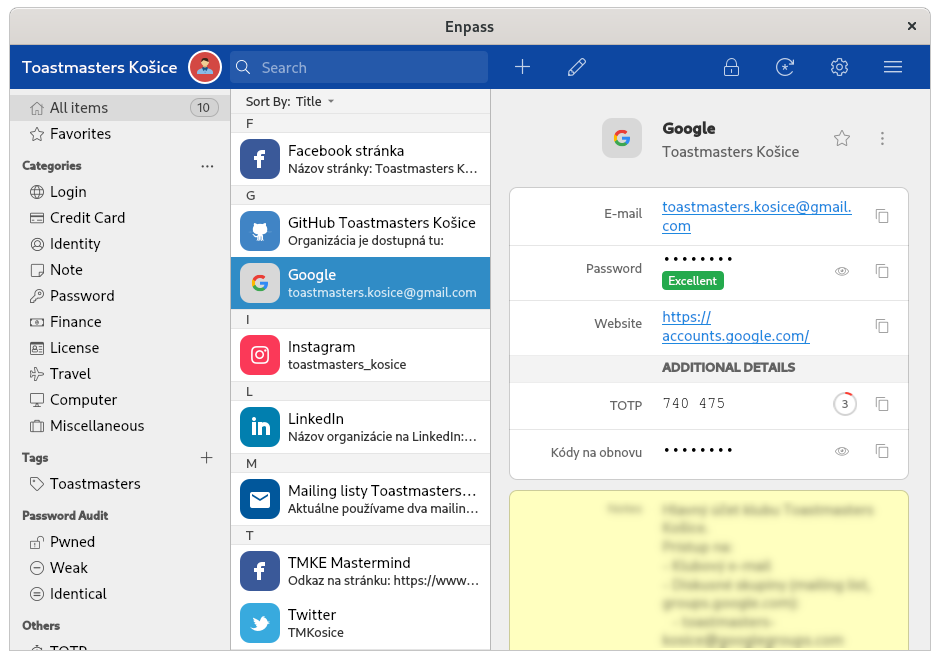

For over a year, I help run a local non-profit [Toastmasters][toastmasters] club. Almost the entire time, I felt that security standards in our organization were weak. However, introducing changes is not easy — not all my peers are technically-skilled. Therefore, I had to find a way how to better secure our accounts without making it too complicated for others. It was an open problem, and nobody could give me an answer. I talked with other community clubs, and their standards were similarly low. Nobody cares for security as long as the club operates. Months passed by without any change on our end. Suddenly, at the end of April, our shared [Facebook page][fb-tmke] was compromised, and I had to act quickly. In the past two weeks, I finally came with a way how to increase security without increasing complexity.

## What is Toastmasters? A short story
Toastmasters is a community of independent speech clubs under the umbrella of Toastmasters International. History goes back into 1924 when Ralph Smedley founded the very first club. Each club conducts regular meetings where members can practice public speaking in a friendly environment. Albeit we all are Toastmasters clubs, every club is different because the community around the club is different.

Besides public speaking, members have a chance to get better at their leadership skills. And what's the best way to practice leadership skills than to run your club? It's a non-profit, we don't get paid for our work. On the contrary, we pay the club membership fees like anyone else. For me, running a Toastmasters club is like running my company with training wheels attached. You can screw things up, but people will still come. On the other hand, you can experiment, bring ideas, and work in a startup-like environment. Your activity has a severe impact on the club's future.

## Shared accounts everywhere
When I got elected to one of the leadership positions, my predecessor gave me login instructions to get into the shared club email account. We use regular Gmail accessible by every club officer. Our email address (login) is well known, and our password was very weak. It was short, it had no special characters, not even numbers. I'm confident that a hacker trying dictionary attack would succeed. What's even worse, this password was most likely never changed.

In our organization, officers change once a year. However, past officers still have the credentials, and they can gain unauthorized access anytime. It's unlikely someone from these people intends to do any harm to the club, but the longer our club exists, the more people have access. Hence, security risks raise dramatically. Password leaks happen every day, working like this is not sustainable. I realized our organization is, in many ways, unique. We can't apply principles used in organizations where managers serve for the long term and leave their position gradually, not at the same time.

### Security challenges
Before I explain how I solved our situation, let's list all the issues in one place:
- Shared Google account (access to club's Gmail, Google Drive, Google Docs, Google Forms, Google Groups, and YouTube)
- Weak password shared to everyone
- Passwords were never changed; past members still had access to our data
- The same password used almost in all club's accounts
- Many accounts use the same email/password combination for login
- None of the accounts uses a [two-factor authentication][2fa]
- There is no central information about all accounts managed in our club
- Unclear ownership of existing services, like our webpage. Often, nobody can tell who's an admin
- On accounts like Facebook Page, where you authorize an individual's account to have admin rights, nobody removes past officers. Often, they have full admin rights

## Creating order from the chaos
The listed challenges are still simplified compared to the reality I dealt with.

  
  <figcaption>Image by Peter H from Pixabay</figcaption>

### Getting rid of an outdated website
The first time I started dealing with those issues was when I decided to update our website. At the time, our website was running on a domain `toastmasterskosice.eu`. It was heavily outdated; embedded promo videos didn't exist anymore. I asked my peers (some were officers also in previous terms) for related details, but I didn't gather much information. Our officer responsible for finances simply paid the invoices, which came into the club's email once a year; nobody knew anything about how this website worked. The good news is that you can gather information from public resources.

Our website was hosted in [WebSupport][websupport] (largest hosting service in Slovakia), the domain was also registered through them. I asked our club's president if he can try to find some information about how to access our Web Hosting account from our club's documents. I also contacted several current and past officers and members in the hope that somebody of them knows something. It took some time, but I got information about not one, but two Web Hosting accounts; one was called `ToastmastersKE`, the other one was `ToastmastersKE1`. Not perfect, but at least I could manage our webpage now.

The first account, ToastmastersKE, had no active service. Because my goal was also to simplify account management, I dealt with this mess too. I contacted WebSupport and asked to close and remove `ToastmastersKE`, and to rename `ToastmastersKE1` to `ToastmastersKE`. All this effort so that we have one account less to care about. You'd be surprised how many days it took to accomplish this simple change. I communicated with the support for over a week. I guess they pay more attention to their public appearance than to their internal tools. For example, they couldn't delete an account, just disable it. Finally, after they renamed our account, I logged in as `ToastmastersKE`. I was prompted with *Hello, ToastmastersKE1*. Long story short, now we have only one account, and it works OK.

I found out our website is using [WordPress][wordpress], which required yet another credential to access its admin page. First, I thought that I will use some parts of it on our new website, so I tried to get the password. Nobody knew anything about it. I tried to contact some past members (a practice repeated dangerously often in this story). Luckily, one of them had the password, and sometimes he even updated WordPress plugins for us. Ultimately, I decided to remove the WordPress page entirely and start with a clean slate. After I deleted the entry from our Web Hosting admin page, I got rid of yet another account.

### Unifying emails
It turned out that under our domain, we had another email that managed the hosting company. The email `hello@toastmasterskosice.eu` was used for communicating with prospective new members. I think this webmail had yet another credential, and what's worse, messages were split into two places — our Gmail and this webmail.

On the next staff meeting I suggested the following:
- Get rid of the .EU domain and acquire an equivalent .SK domain
- Merge two email accounts into one; migrate emails from the webmail

Users in our country are more familiar with our national .SK domain. Hence, all agreed to host our new webpage at `toastmasterskosice.sk`. However, they were concerned that some people have this old webpage bookmarked and that it does harm if we stop using it. I convinced them we have no real traffic there, and it would be a waste of the club's money if we decide to keep two domains. The renewal date for our .EU domain was rapidly approaching, and I had to act fast. Migration of emails took me about two hours, and I tagged all emails from this webmail as `toastmasterskosice.eu`, so in Gmail, you could see at first glance the source. I also imported contacts from this webmail into Gmail.

### Creating email aliases
As I mentioned, we used the webmail for direct communication with new and existing members. Exposing our Gmail address would be unprofessional. When I see someone using an email like *nameofmycompany@gmail.com*, it tells me I'm dealing with an amateur who doesn't consult his business with marketing specialists. For me, it's a red flag — what else does the owner neglect? In such cases, I pay close attention to other aspects of his company before I decide to approach him.

I decided to create an alias in Gmail:
- hello@toastmasterskosice.sk (legacy email, but now under .SK domain)
- club@toastmasterskosice.sk (new, preferred email, used in all communication)

Using an alias from Gmail should be easy for everyone. Normally, Google offers aliases under [G Suite][gsuite], but we don't have a budget to pay G Suite just for that. Instead, I found [ImprovMX][improvmx]; it's free, requires no account registration, and allows forwarding emails under aliases. All I had to do was to set up new [MX records][mx-record]:

| Address               | Mail server      | Priority | TTL |
|-----------------------|------------------|----------|-----|
| toastmasterskosice.sk | mx1.improvmx.com | 10       | 600 |
| toastmasterskosice.sk | mx2.improvmx.com | 20       | 600 |

You can find their full guide for Gmail [here][improvmx-gmail]. If you look at the steps, you'll see that this integration requires [two-factor authentication][2fa] enabled in Gmail. This was another problem I had to deal with. If I set up [2FA][2fa] token authentication, how do I distribute token to all authorized members? How do I explain in simple terms what is 2FA, why we need it, and how to set it up? It turned out there's another less secure way. Google account has an option called ["Less secure apps"][google-less-secure-apps]. If it's on, our account is, according to Google, more vulnerable. However, it allows using mail forwarding without 2FA enabled.

  
  <figcaption>Aliases in Gmail</figcaption>

We used such a setup until last week (until May 4th, 2020). The problem was that Google, after some time, automatically turned this option off. While I manage the accounts, I can figure it out and fix mail forwarding. But it's not a long-term solution. Someone who comes after me needs to have a stable and predictable environment.

### Creating Toastmasters Košice organization on GitHub
This step is related to account management only partially, but it's still relevant. I set up [our account on GitHub][github-tmke] to host our new webpage on [GitHub Pages][github-pages] for free. Since then, I started creating other repositories to make our club more transparent to the public. Just briefly remember that we have an account there; I'll explain why it's important later in this post.

### Creating Toastmasters mailing list
I decided to create a discussion group as a mailing list. I went through several solutions, but ultimately I decided to use [Google Groups][google-groups] because we can manage members from our club Google account. My goal was to reduce active accounts to a minimum. After almost a year, I can say, officers got used to this mailing list, and it works perfectly for us. Recently, I added another one, still managed from one central account.

### What happened after the webpage was completed?
We had [our webpage][web-tmke] hosted for free on GitHub, and I managed our organization through my [personal GitHub][personal-github] account. I also delegated another member as a backup admin. Email aliases to Gmail were also set up. For the time being, I decided not to proceed further. Even then, the situation was in much better shape than before I started working on it. There is, however, one more thing I did — I mapped all accounts used in our club, including their credentials.

  
  <figcaption>Our current website. Thanks to Lukáš Bičuš for the coding part.</figcaption>

Not all our accounts have credentials — some of them, like our [Facebook Page][fb-tmke], require approving our personal accounts as page admins. In such cases, I noted current administrators as a reference.

Also, in all accounts where I had access, I updated public information, like a new webpage address. This account information was not complete, but it was the most comprehensive resource I had.

In such a state, I left the accounts until the end of April. Then, our Facebook page got compromised, and I had to act quickly to mitigate the damage.

## After the breach
I won't go into details here. However, after months of inactivity, I had to secure our accounts quickly. When you're motivated, everything goes faster. In my case, I put together a robust solution in just two weeks.

As a first step, I turned on two-factor authentication in our Google account. Also, I set a new secure password. For the time being, I sent this password to all my peers to their personal email, and I even emailed QR code with a 2FA token along with instructions on how to set it up. Fellow officers weren't happy with this new burden, but they realized why I do this and accepted my changes.

I went through all our managed accounts and removed admin roles to everyone who's not our member anymore. Also, in many cases, I changed role types to more restricted. For example, on our Facebook page, I demoted some of our officers from admins to editors. I kept admin rights to myself and our current president.

While doing that, I proposed a long-term solution to maintain these aspects:
- Removal of access rights for past officers
- Adding access rights for new officers
- Change of passwords when new officers start their term
- Updating mailing list members

In our club, we have the position of a club's secretary. His duties include managing club documents. So I thought maybe we could write a list of accounts and their passwords into a paper, and store it in one place, accessible only to a dedicated person. For accounts managed with admin roles, this list will contain contacts to last known administrators.

Such a list ensures new officers will know how to access an account, and whom they should contact if needed. A situation where I had to randomly write to long-past members, and hope they will know something, *MUST NOT REPEAT, EVER*!

As days went by, I held by that concept, but instead of paper, I suggested buying a USB stick. Updating a printed list is not practical. This USB stick would contain something like an Excel document with all our accounts and responsible persons.

> The only secure password is the one you can’t remember
> — <cite>[Troy Hunt][troy-hunt]</cite>

Besides club account security, I was also trying to find a replacement for my password manager. I decided to [migrate away from LastPass, and I found Enpass][lastpass-enpass-post]. It provides a secure vault, and it's free for up to 25 entries. Applications are widely available, and they are localized and easy-to-use for everyone. I decided to use [Enpass][enpass] as a secure alternative to the USB stick.

## Migrating accounts to Enpass
The purpose of Enpass was simple — it should store all our accounts and their passwords. Accounts managed through admin roles should list contacts to current administrators and instructions on how to request admin access and revoke access for past admins. Enpass protects our entries with a single master password. So long as officers know this password, they don't need to remember passwords for individual accounts.

  
  <figcaption>Enpass vault with all our credentials.</figcaption>

I added all our accounts into the vault. For each password-protected account, I changed the password. Now, if a password gets compromised, it affects only one account. Also, wherever possible, I set up 2FA authentication. Enpass allows storing 2FA tokens and passwords in the same entry, along with additional information. Support for 2FA was added only recently, but the timing was perfect. Now I don't need to bother my peers with scanning QR codes. Once they open the vault, everything to access the account is there.

### Sharing the vault
Now let's get back to our [organization's GitHub][github-tmke]. One of the great features GitHub offers is the support for releases. Software developers use releases to publish stable versions of their software. Typically, they add a tag to a particular commit. GitHub creates a ready-to-download source archive used to create distribution packages along the road.

We have a repository where I store documents for officers. There I decided to create a new "software" release. In release notes, you usually put a title and a comment. In our case, I wrote there instructions to get Enpass installed. I also attached our encrypted vault as an attachment in this release.

  
  <figcaption>Enpass vault backup on GitHub</figcaption>

Our repository is public; people don't even need an account to read the instructions or download the vault. I sent the master password to unlock the trunk in a separate email and only to officers who really need the access. From now on, I limited the scope of accounts dramatically. All past officers and most of the current ones lost access to accounts because they don't really need it. This is our most current solution used in our club at the moment.

### Transfer of accounts to new officers
While I take care of the accounts, I can guarantee that given security standards will be held. However, how to maintain the guidelines when I become a past officer?

Before new officers take their role, there is a transition period where current officers give mentorship to new ones. In theory, I could train my mentee to handle all necessary tasks. However, it's easy to forget something in practice if you're not familiar with the concepts.

A new secretary should:
- Change master password to the vault
- Change passwords to all existing accounts
- Remove admin roles from past officers
- Remove past officers from the mailing list
- Delegate new officers as admins
- Add new officers into mailing list

Why it's not enough to change the master password for the vault? Well, because its backup is stored publicly, anyone can download it. Past officers still have access to the older vault's revision. If the passwords for the accounts inside the vault are not changed, they still have access. That is almost like the case with the shared password in the beginning. Hence, a new secretary needs to change every password to maintain high-security standards. Even if I trained my mentee to handle this task, over time, as officers change several times, the information might get distorted. Perhaps, after a few years, a new secretary won't do all the required steps.

## What's the solution?
I would never think to ever say this, but the solution is to write the club's processes (as in a corporate world). The key is to automate everything. For example, there will be a process document labeled *Transfer of accounts* with the rationale behind it, and required steps. This document will be linked to guides, where is a step-by-step procedure, including pictures, how to do a specific action. At the moment, I'm thinking of a way how to write the process documents. It will definitely take a severe amount of time. However, I firmly believe it's the right way to do if we want to ensure high club standards despite people in charge.

## Conclusion
Things that seem easy usually have a hidden complexity. In our case, this complexity is hidden in my thoughts and modern encryption techniques. We use strong passwords and two-factor authentication, yet logging in is still comfortable and convenient to use. I hope that the standards I defined here will be used for years to come.

Do you run a similar organization? Do you care about security? What's your solution? Leave me a comment.

[//]: # (Used references)
[toastmasters]: http://www.toastmasters.org/
[websupport]: https://www.websupport.sk/
[wordpress]: https://wordpress.org/
[gsuite]: https://gsuite.google.com/
[improvmx]: https://improvmx.com/
[improvmx-gmail]: https://improvmx.com/guides/send-emails-using-gmail/
[mx-record]: https://en.wikipedia.org/wiki/MX_record
[google-less-secure-apps]: https://support.google.com/accounts/answer/6010255?hl=en
[2fa]: https://en.wikipedia.org/wiki/Multi-factor_authentication
[github-tmke]: https://github.com/toastmasters-kosice/
[github-pages]: https://pages.github.com/
[google-groups]: https://groups.google.com/
[personal-github]: https://github.com/vzahradnik/
[fb-tmke]: https://www.facebook.com/toastmasters.kosice
[web-tmke]: https://toastmasterskosice.sk/
[lastpass-enpass-post]: https://www.zahradnik.io/migrating-from-lastpass-to-enpass
[enpass]: https://www.enpass.io/
[troy-hunt]: https://www.troyhunt.com/only-secure-password-is-one-you-cant/