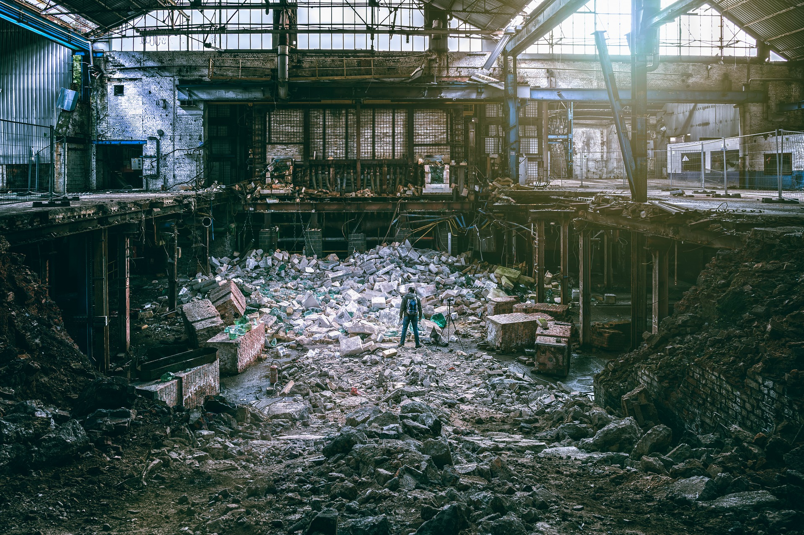
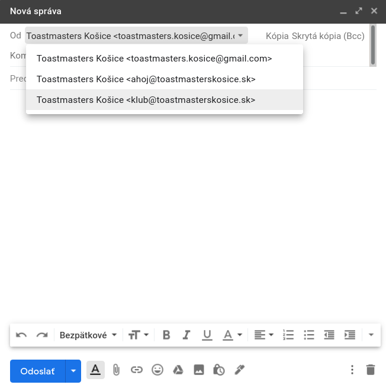
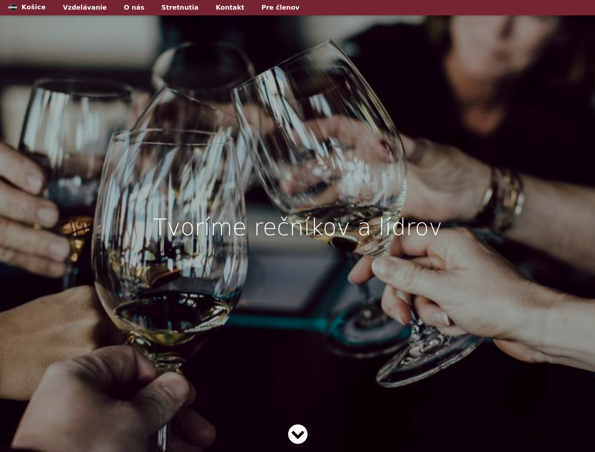
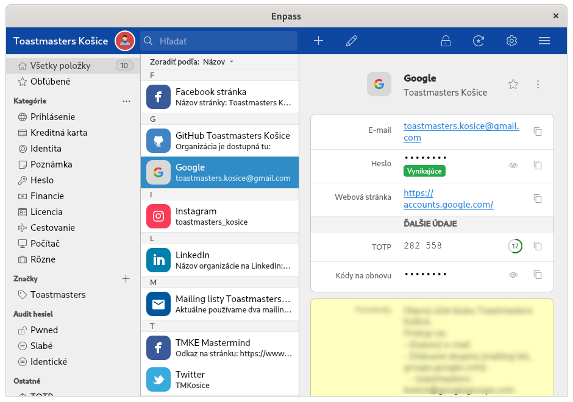
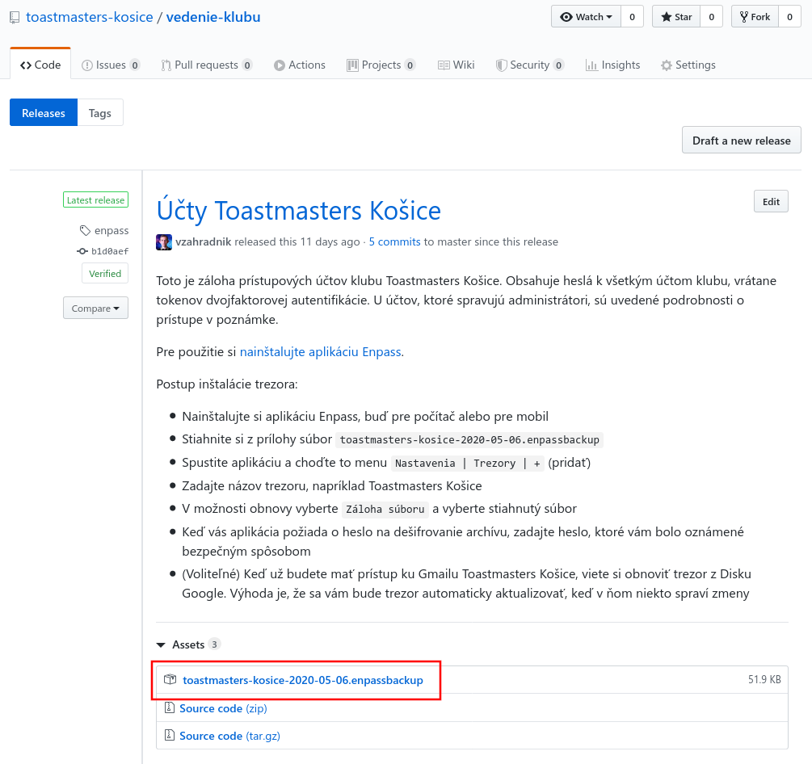

Vyše roka pomáham riadiť miestny neziskový klub [Toastmasters][toastmasters]. Takmer po celý čas som cítil, že bezpečnostné štandardy v našej organizácii sú slabé. Avšak zaviesť zmeny nie je jednoduché — nie všetci moji kolegovia sú technicky zdatní. Preto som musel nájsť spôsob, ako lepšie zabezpečiť naše účty bez toho, aby to bolo pre ostatných príliš komplikované. Bol to otvorený problém a nikto mi nevedel dať odpoveď. Rozprával som sa s inými komunitnými klubmi a ich štandardy boli podobne nízke. Nikoho bezpečnosť nezaujíma, pokiaľ klub funguje. Prešli mesiace bez akejkoľvek zmeny na našej strane. Zrazu, koncom apríla bola naša zdieľaná [stránka na Facebooku][fb-tmke] kompromitovaná a musel som rýchlo konať. Za posledné dva týždne som konečne prišiel na spôsob, ako zvýšiť bezpečnosť bez toho, aby som zvýšil zložitosť.

---

## Čo je to Toastmasters? Stručná verzia
Toastmasters je komunita nezávislých rečníckych klubov pod záštitou Toastmasters International. História siaha až do roku 1924, keď Ralph Smedley založil úplne prvý klub. Každý klub vedie bežné stretnutia, na ktorých si môžu členovia trénovať rečnenie na verejnosti v priateľskom prostredí. Hoci my všetci sme kluby Toastmasters, každý klub je iný, pretože komunita okolo klubu je iná.

Okrem rečnenia na verejnosti majú členovia možnosť zlepšiť sa v ich líderských zručnostiach. A čo je lepší spôsob, ako praktizovať líderské zručnosti, než viesť váš klub? Je to neziskovka, za našu prácu nám nikto neplatí. Práve naopak, platíme si členské poplatky ako ktokoľvek iný. Pre mňa znamená viesť klub Toastmasters club ako keby som viedol vlastnú firmu s pripojenými tréningovými kolieskami. Môžete veci pokašľať, ale ľudia aj tak prídu. Na druhej strane, môžete experimentovať, prichádzať s nápadmi a pracovať v prostredí pripomínajúcom startup. Vaša aktivita má vážny dopad na budúcnosť klubu.

---

## Všade zdieľané účty
Keď som bol zvolený do jednej z líderských pozícií, môj predchodca mi dal inštrukcie na prihlásenie do zdieľaného klubového emailového účtu. Používame obyčajný Gmail, ktorý je dostupný každému vedúcemu klubu. Naša emailová adresa (prihlasovacie meno) je dobre známa a naše heslo bolo veľmi slabé. Bolo krátke, nemalo žiadne špeciálne znaky, ani len čísla. Osobne verím, že keby vyskúšal hacker slovníkový útok, uspel by. A čo je horšie, toto heslo s vysokou pravdepodobnosťou nebolo nikdy menené.

V našej organizácii sa vedúci menia raz ročne. Avšak bývalí vedúci majú stále prístupové údaje a kedykoľvek môžu získať neoprávnený prístup. Je nepravdepodobné, že sa niekto z týchto ľudí pokúsi klubu uškodiť, ale čím dlhšie náš klub existuje, tým viac ľudí má prístupy. A teda, bezpečnostné riziká dramaticky rastú. Úniky hesiel sa dejú každý deň, takto pracovať nie je udržateľné. Uvedomil som si, že naša organizácia je v mnohom jedinečná. Nemôžeme aplikovať princípy, ktoré používajú organizácie, v ktorých manažéri slúžia dlhé obdobie a opúšťajú ich pozície postupne, nie v tom istom čase.

### Bezpečnostné výzvy
Kým vysvetlím, ako som vyriešil našu situáciu, zhrňme si všetky problémy na jednom mieste:
- Zdieľaný Google účet (prístup do klubového Gmailu, Disku Google, Dokumentov Google, Formulárov Google, Skupín Google a YouTubu)
- Slabé heslo zdieľané s každým
- Heslá neboli nikdy menené. Bývalí členovia mali stále prístup k našim dátam
- Rovnaké heslo sa používalo takmer vo všetkých klubových účtoch
- Mnohé účty používajú na prihlásenie rovnakú kombináciu emailu/hesla
- Žiadny z účtov nepoužíva [dvojfaktorovú autentifikáciu][2fa]
- Neexistuje jedno centrálne miesto s informáciami o všetkých účtoch spravovaných v našom klube
- Nejasné vlastníctvo existujúcich služieb, ako našej webstránky. Často nevie nikto povedať, kto je správcom
- Pri účtoch ako je naša stránka na Facebooku, kde dávate oprávnenia účtom jednotlivcov, aby mali práva správcu, nikto neodstraňuje bývalých vedúcich. Často majú plné práva správcu

---

## Vytvorenie poriadku z chaosu
Uvedené výzvy sú ešte stále zjednodušené oproti skutočnosti, akej som čelil.

  
  <figcaption>Zdroj: Peter H, Pixabay</figcaption>

### Zbavenie sa zastaralej webstránky
Prvýkrát, keď som začal riešiť tieto problémy, to bolo vtedy, keď som sa rozhodol aktualizovať našu webovú stránku. V tom čase bežala naša webstránka na doméne `toastmasterskosice.eu`. Bola dosť zastaralá, vložené promo videá už ani neexistovali. Požiadal som svojich kolegov (niektorí z nich boli vedúcimi aj v predošlých obdobiach) o súvisiace podrobnosti, ale veľa som sa nedozvedel. Náš vedúci zodpovedný za financie jednoducho zaplatil faktúry, ktoré raz za rok prišli na email klubu. Nikto nevedel nič o tom, ako táto webstránka fungovala. Dobrou správou je, že viete získavať informácie z verejných zdrojov.

Našu webstránku hostoval [WebSupport][websupport], aj doména bola registrovaná cez nich. Požiadal som nášho prezidenta klubu, či by sa nepokúsil získať informácie, ako pristupovať k webhostingovému účtu z našich klubových dokumentov. Tiež som kontaktoval niekoľkých aktuálnych aj bývalých vedúcich a členov v nádeji, že niekto z nich bude niečo vedieť. Chvíľu to trvalo, ale získal som informácie nie o jednom, ale o dvoch webhostingových účtoch. Jeden sa volal `ToastmastersKE` a ten druhý bol `ToastmastersKE1`. Nie dokonalé, ale aspoň som už mohol spravovať našu webstránku.

Prvý účet, ToastmastersKE, nemal žiadnu aktívnu službu. Keďže bolo mojím cieľom taktiež zjednodušiť správu účtov, riešil som aj tento bordel. Kontaktoval som WebSupport a požiadal som ich o uzavretie a vymazanie `ToastmastersKE` a o premenovanie `ToastmastersKE1` na `ToastmastersKE`. Všetka táto snaha bola kvôli tomu, aby sme mali na starosť o jeden účet menej. Boli by ste prekvapení, koľko dní trvalo dokončiť túto jednoduchú zmenu. Komunikoval som s podporou vyše týždňa. Tipujem, že sa viac sústredia na to, ako sa javia voči verejnosti, ako na ich interné nástroje. Napríklad, neboli schopní vymazať účet, iba ho zakázať. Konečne, keď už náš účet premenovali, prihlásil som sa ako `ToastmastersKE`. A privítala ma správa *Ahoj, ToastmastersKE1*. Trochu to skrátim, teraz máme už len jeden účet a funguje bez problémov.

Zistil som, že naša webstránka používa [WordPress][wordpress], ktorý vyžaduje ďalší prihlasovací údaj na prístup do jeho správcovskej stránky. Najprv som si myslel, že odtiaľ použijem niektoré časti v našej novej webstránke a tak som sa pokúsil získať heslo. Nikto o tom nič nevedel. Pokúsil som sa kontaktovať niektorých bývalých členov (prax, ktorá sa v tomto príbehu opakuje akosi pričasto). Našťastie, jeden z nich heslo mal a občas dokonca pre nás aktualizoval WordPress pluginy. Nakoniec som sa rozhodol úplne WordPress stránku vymazať a začať s čistým štítom. Potom, ako som vymazal záznam zo správcovskej stránky nášho webhostingu, zbavil som sa ďalšieho účtu.

### Zjednocovanie emailov
Ukázalo sa, že pod našou doménou sme mali ďalší email, ktorý spravovala hostingová spoločnosť. Email `ahoj@toastmasterskosice.eu` sa používal na komunikáciu s perspektívnymi novými členmi. Myslím si, že tento webmail mal ešte ďalšie prístupové údaje, a čo je horšie, správy boli rozdelené na dve miesta — náš Gmail a tento webmail.

Na najbližšej porade som navrhol následovné:
- Zbaviť sa .EU domény a získať ekvivalentnú .SK doménu
- Zlúčiť dva emailové účty do jedného a zmigrovať emaily z webmailu

Používatelia v našej krajine oveľa viac poznajú našu národnú .SK doménu. Preto všetci súhlasili s tým, aby sa naša nová webstránka hostovala na `toastmasterskosice.sk`. Avšak obávali sa, že niektorí ľudia majú túto starú webstránku uloženú medzi záložkami a že nám môže uškodiť, ak ju prestaneme používať. Presvedčil som ich, že tam nemáme žiadnu reálnu prevádzku a že by to bolo mrhanie peniazmi klubu, ak sa rozhodneme držať dve domény. Dátum obnovy pre našu .EU doménu sa rapídne blížil a musel som rýchlo konať. Migrácia emailov mi zabrala asi dve hodiny, pričom som všetky emaily z tohto webmailu označil ako `toastmasterskosice.eu`, aby ste ich v Gmaile rozlíšili už na prvý pohľad. Taktiež som importoval kontakty z tohto webmailu do Gmailu.

### Vytváranie emailových aliasov
Ako som už spomenul, webmail sme používali na priamu komunikáciu s novými a existujúcimi členmi. Použíať našu gmailovú adresu by bolo neprofesionálne. Keď vidím niekoho používať email ako *menomojejfirmy@gmail.com*, vraví mi to, že jednám s amatérom, ktorý svoje podnikanie nekonzultuje s odborníkmi na marketing. Pre mňa to predstavuje červenú zástavu — čo ešte majiteľ zanedbáva? V takýchto prípadoch pozorne sledujem ďalšie aspekty jeho firmy, kým sa rozhodnem k nemu pristúpiť.

Rozhodol som sa vytvoriť v Gmaile alias:
- ahoj@toastmasterskosice.sk (zastaralý email, ale teraz pod .SK doménou)
- klub@toastmasterskosice.sk (nový, preferovaný email, používaný pri všetkej komunikácii)

Používanie aliasu z Gmailu by malo byť jednoduché pre všetkých. Normálne ponúka Google aliasy v rámci [G Suite][gsuite], ale my nemáme rozpočet, aby sme len kvôli tomu G Suite platili. Namiesto toho som našiel [ImprovMX][improvmx]. Služba je zadarmo, nevyžaduje žiadnu registráciu a umožňuje preposielať emaily pod aliasmi. Stačilo mi len nastaviť nové [MX záznamy][mx-record]:

| Adresa                | Poštový server   | Priorita | TTL |
|-----------------------|------------------|----------|-----|
| toastmasterskosice.sk | mx1.improvmx.com | 10       | 600 |
| toastmasterskosice.sk | mx2.improvmx.com | 20       | 600 |

Celý návod pre Gmail nájdete [tu][improvmx-gmail]. Ak sa pozriete na jednotlivé kroky, zistíte, že táto integrácia vyžaduje v Gmaile povolenú [dvojfaktorovú autentifikáciu][2fa]. Toto bol ďalší problém, ktorý som musel riešiť. Ak nastavím autentifikáciu pomocou [2FA][2fa] tokenu, ako rozdistribuujem token všetkým oprávneným členom? Ako im jednoducho vysvetlím, čo je to 2FA, prečo to potrebujeme a ako si to nastavia? Ukázalo sa, že existuje ešte jeden menej bezpečný spôsob. Google účet má možnosť nazvanú ["Menej zabezpečené aplikácie"][google-less-secure-apps]. Pokiaľ je zapnutá, náš účet je podľa Googlu viac zraniteľný. Avšak umožňuje nám to použiť preposielanie pošty bez zapnutého 2FA.

  
  <figcaption>Aliasy v Gmaile</figcaption>

Takéto nastavenie sme používali ešte do minulého týždňa (do 4. mája 2020). Problémom bolo, že Google po nejakom čase túto možnosť automaticky vypol. Pokiaľ účty spravujem ja, dokážem na to prísť a preposielanie pošty opraviť. Ale nejde o dlhodobé riešenie. Niekto, kto príde po mne, potrebuje mať stabilné a predvídateľné prostredie.

### Vytvorenie organizácie Toastmasters Košice na GitHube
Tento krok sa týka správy účtov iba čiastočne, ale je stále podstatný. Nastavil som [náš účet na GitHube][github-tmke], aby sme mohli zadarmo hostovať našu novú webstránku na [GitHub Pages][github-pages]. Odvtedy som začal vytvárať ďalšie repozitáre, aby som spravil náš klub voči verejnosti viac transparentným. Teraz si len stručne zapamätajte, že tam máme účet. Neskôr vysvetlím, prečo je to dôležité.

### Vytvorenie Toastmasters mailing listu
Rozhodol som sa vytvoriť diskusnú skupinu ako mailing list. Prechádzal som si viacero riešení, ale nakoniec som sa rozhodol použiť [Skupiny Google][google-groups], pretože môžeme členov spravovať z nášho klubového Google účtu. Mojím cieľom bolo zredukovať počet aktívnych účtov na minimum. Po takmer roku môžem povedať, že vedúci si na tento mailing list zvykli a pre nás funguje dokonales. Nedávno som pridal ďalší, stále spravovaný z jedného centrálneho účtu.

### Čo sa dialo po dokončení webstránky?
[Našu webstránku][web-tmke] sme mali zadarmo hostovanú na GitHube a organizáciu som spravoval pomocou môjho [osobného GitHub][personal-github] účtu. Taktiež som delegoval ďalšieho člena ako záložného správcu. Emailové aliasy do Gmailu boli tiež nastavené. Medzičasom som sa rozhodol ďalej nepokračovať. Už aj takto bola situácia v oveľa lepšom stave, ako keď som na tom začal pracovať. Je tu však ešte jedna vec, ktorú som spravil — zmapoval som si všetky účty používané v našom klube, vrátane ich prístupových údajov.

  
  <figcaption>Naša aktuálna webstránka. Ďakujeme Lukášovi Bičušovi za jej naprogramovanie.</figcaption>

Nie všetky naše účty majú prístupové údaje — niektoré z nich, ako naša [stránka na Facebooku][fb-tmke], vyžadujú schválenie našich osobných účtov ako správcov stránky. V takýchto prípadoch som si pre referenciu poznamenal aktuálnych správcov.

Taktiež som vo všetkých účtoch, kde som mal prístup, aktualizoval verejné informácie, ako adresu novej webstránky. Tieto informácie o účtoch neboli úplné, ale boli tým najucelenejším zdrojom, aký som mal.

V takomto stave som účty zanechal do konca apríla. Vtedy niekto kompromitoval našu stránku na Facebooku a musel som rýchlo konať, aby som obmedzil škody.

---

## Po prieniku
Nebudem zachádzať do podrobností. No po mesiacoch nečinnosti som musel urýchlene zabezpečiť naše účty. Keď máte motiváciu, všetko ide rýchlejšie. V mojom prípade som dal dokopy robustné riešenie len za dva týždne.

Ako prvý krok som zapol dvojfaktorovú autentifikáciu v našom Google účte. Taktiež som nastavil nové bezpečné heslo. Toto heslo som preventívne poslal všetkým svojim kolegom na ich osobný email. Dokonca som im poslal mailom QR kód s 2FA tokenom a inštrukciami, ako to nastaviť. Moji kolegovia neboli z tohto nového bremena nadšení, ale uvedomovali si, prečo to robím a moje zmeny akceptovali.

Prešiel som si všetky naše spravované účty a odstránil som rolu správcu u každého, kto už nie je našim členom. Taktiež som v mnohých prípadoch zmenil typy rolí na viac obmedzené. Napríklad, na našej stránke na Facebooku, som znížil oprávnenie našim vedúcim z administrátorov na redaktorov. Práva administrátora som ponechal sebe a našej aktuálnej prezidentke.

Kým som na tom robil, navrhol som dlhodobé riešenie, aby sa tieto aspekty zachovali:
- Odstránenie prístupových práv pre bývalých vedúcich
- Pridanie prístupových práv pre nových vedúcich
- Zmena hesiel po tom, ako novým vedúcim začne ich obdobie
- Aktualizácia členov v mailing liste

V našom klube máme pozíciu tajomníka klubu. K jeho povinnostiam patrí aj spravovanie klubových dokumentov. A tak som si pomyslel, že by sme snáď mohli napísať zoznam účtov a ich hesiel na papier a uložiť ich na jednom mieste, ktoré je prístupné iba na to určenej osobe. Pri účtoch, ktoré sa spravujú cez role správcov, by tento zoznam obsahoval kontakty na posledných známych správcov.

Takýto zoznam zabezpečí, že budú noví vedúci vedieť, ako sa do účtu dostať a koho majú kontaktovať, ak to bude potrebné. Situácia, kde som musel náhodne písať členom dávno minulým a dúfať, že budú niečo vedieť *SA NESMIE ZOPAKOVAŤ, NIKDY*!

Ako dni plynuli, stále som sa tohto konceptu držal, ale namiesto papiera som navrhol kúpiť USB kľúč. Aktualizovať tlačený zoznam nie je praktické. Tento USB kľúč by obsahoval niečo ako excelovský dokument so všetkými našimi heslami a zodpovednými osobami.

> Jediné bezpečné heslo je také, ktoré si nepamätáte
> — <cite>[Troy Hunt][troy-hunt]</cite>

Okrem bezpečnosti klubových účtov som sa tiež snažil o náhradu môjho správcu hesiel. Rozhodol som sa [zmigrovať z LastPassu a našiel som Enpass][lastpass-enpass-post]. Poskytuje zabezpečený trezor a je zadarmo do 25 položiek. Aplikácie sú široko dostupné, lokalizované a jednoducho použiteľné pre každého. Rozhodol som sa použiť [Enpass][enpass] ako bezpečnú alternatívu k USB kľúču.

---

## Migrovanie účtov do Enpassu
Účel Enpassu bol jednoduchý — mal by ukladať všetky naše účty a ich heslá. Účty spravované cez roly správcov by mali uvádzať kontakty na aktuálnych správcov a inštrukcie, ako požiadať o správcovské prístupy a ako zrušiť prístupy bývalým správcom. Enpass naše položky chráni jedným hlavným heslom. Pokiaľ vedúci poznajú toto heslo, nemusia si pamätať heslá pre jednotlivé účty.

  
  <figcaption>Trezor v Enpasse so všetkými našimi prístupovými údajmi.</figcaption>

Do trezora som pridal všetky naše účty. U každého účtu chráneného heslom som heslo zmenil. Keby teraz došlo ku kompromitácii hesla, ovplyvní to len jeden účet. Taktiež som tam, kde to bolo možné, nastavil dvojfaktorovú autentifikáciu. Enpass umožňuje ukladať 2FA tokeny a heslá v tej istej položke, spolu s ďalšími informáciami. Podpora pre 2FA bola pridaná iba nedávno, ale načasovanie bolo dokonalé. Teraz už nemusím zaťažovať mojich kolegov s tým, ako si majú naskenovať QR kódy. Akonáhle trezor otvoria, všetko potrebné na prístup k účtu je tam.

### Zdieľanie trezora
Teraz sa vráťme späť k našej [organizácii na GitHube][github-tmke]. Jednou zo skvelých funkcií, ktoré nám GitHub ponúka, je podpora vydaní. Softvéroví vývojári používajú vydania (releases), aby mohli zverejňovať stabilné verzie ich softvéru. Typicky pridajú ku konkrétnemu commitu tag. GitHub vytvorí zdrojový archív pripravený na stiahnutie, ktorý sa neskôr použije na vytvorenie distribučných balíkov.

Máme repozitár, do ktorého ukladám dokumenty pre vedúcich. Tam som sa rozhodol vytvoriť nové vydanie "softvéru". Do poznámok k vydaniu zvyčajne dáte názov a komentár. V našom prípade som tam napísal inštrukcie, ako nainštalovať Enpass. Taktiež som tam ako prílohu v tom to vydaní pridal náš šifrovaný trezor.

  
  <figcaption>Záloha trezora Enpassu na GitHube</figcaption>

Náš repozitár je verejný. Ľudia na to, aby si mohli prečítať inštrukcie alebo stiahnuť trezor, dokonca nepotrebujú ani účet. Hlavné heslo na odomknutie trezora som poslal v samostatnom maile a iba tým vedúcim, ktorí prístup skutočne potrebujú. Odteraz som dramaticky obmedzil pôsobnosť účtov. Všetci bývalí vedúci a väčšina tých aktuálnych prišla o prístupy k účtom, pretože ich v skutočnosti vôbec nepotrebujú. Toto je naše najaktuálnejšie riešenie, ktoré v tejto chvíli používame v klube.

### Prenos účtov na nových vedúcich
Kým sa o účty starám ja, viem zaručiť, že dané bezpečnostné štandardy sa budú dodržiavať. Avšak ako udržiavať pravidlá, keď už nebudem vedúcim?

Kým sa noví vedúci ujmu svojej roly, je tam prechodové obdobie, počas ktorého aktuálni vedúci mentorujú tých nových. Teoreticky by som mohol natrénovať môjho nástupcu, aby zvládol všetky dôležité úkony. Avšak v praxi je veľmi jednoduché na niečo zabudnúť, pokiaľ koncepty dobre nepoznáte.

Nový tajomník by mal:
- Zmeniť hlavné heslo k trezoru
- Zmeniť heslá do všetkých existujúcich účtov
- Odobrať roly správcov všetkým bývalým vedúcim
- Odobrať bývalých vedúcich z mailing listu
- Delegovať za správcov nových vedúcich
- Pridať nových vedúcich do mailing listu

Prečo nestačí zmeniť hlavné heslo k trezoru? Nuž, pretože jeho záloha je verejne prístupná a môže si ju ktokoľvek stiahnuť. Bývalí vedúci majú stále prístup k staršej revízii trezora. Pokiaľ sa heslá k účtom uloženým v trezore nezmenia, stále tam nim majú prístup. Je to skoro ako v tom prípade so zdieľaným heslom na začiatku. A preto musí nový tajomník zmeniť každé heslo, aby sa zabezpečili vysoké bezpečnostné štandardy. Aj keby som natrénoval môjho zverenca, aby túto úlohu zvládol, časom, keď sa vedúci po niekoľký krát vymenia, informácia sa môže skresliť. A možno po pár rokoch nový tajomník neurobí všetky potrebné kroky.

---

## Aké je riešenie?
Nikdy by som si nebol pomyslel, že to poviem, ale riešením je napísať klubové procesy (ako v korporátnom svete). Kľúčové je všetko zautomatizovať. Napríklad, bude existovať procesný dokument nazvaný *Prenos účtov* s vysvetlením, prečo je to potrebné a s požadovanými krokmi. Tento dokument sa bude odkazovať na návody, kde bude postup krok za krokom, vrátane obrázkov, ako sa má konkrétny úkon spraviť. V tejto chvíli premýšľam nad spôsobom, ako takéto procesné dokumenty písať. Rozhodne to zaberie veľmi veľa času. Avšak pevne verím, že je to správny spôsob, ak chceme zaistiť vysoké štandardy klubu napriek ľuďom vo velení.

---

## Záver
Veci, ktoré sa zdajú jednoduché, majú zvyčajne skrytú zložitosť. V našom prípade je táto zložitosť skrytá v mojich myšlienkach a moderných šifrovacích technikách. Používame silné heslá a dvojfaktorovú autentifikáciu a predsa je prihlasovanie stále pohodlné. Dúfam, že sa štandardy, ktoré som tu definoval, budú používať mnoho rokov odteraz.

Riadite podobnú organizáciu? Riešite v nej bezpečnosť? Aké máte riešenie? Napíšte mi to do komentára.

[//]: # (Used references)
[toastmasters]: http://www.toastmasters.org/
[websupport]: https://www.websupport.sk/
[wordpress]: https://wordpress.org/
[gsuite]: https://gsuite.google.com/
[improvmx]: https://improvmx.com/
[improvmx-gmail]: https://improvmx.com/guides/send-emails-using-gmail/
[mx-record]: https://en.wikipedia.org/wiki/MX_record
[google-less-secure-apps]: https://support.google.com/accounts/answer/6010255?hl=en
[2fa]: https://en.wikipedia.org/wiki/Multi-factor_authentication
[github-tmke]: https://github.com/toastmasters-kosice/
[github-pages]: https://pages.github.com/
[google-groups]: https://groups.google.com/
[personal-github]: https://github.com/vzahradnik/
[fb-tmke]: https://www.facebook.com/toastmasters.kosice
[web-tmke]: https://toastmasterskosice.sk/
[lastpass-enpass-post]: https://www.zahradnik.io/Migrating-from-LastPass-to-Enpass
[enpass]: https://www.enpass.io/
[troy-hunt]: https://www.troyhunt.com/only-secure-password-is-one-you-cant/