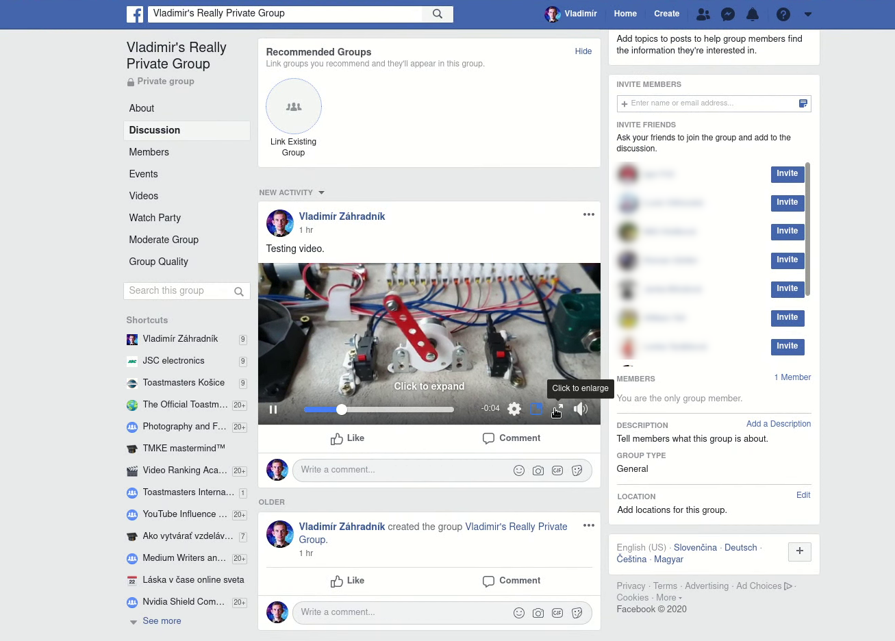
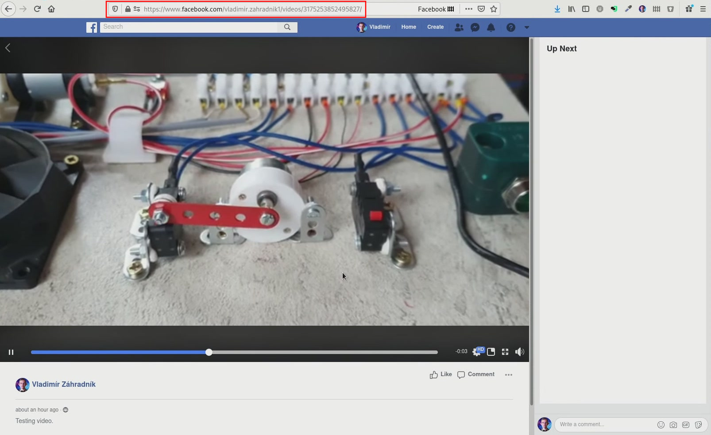
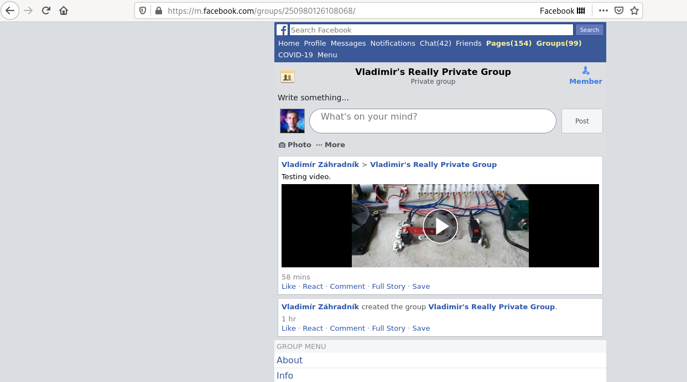
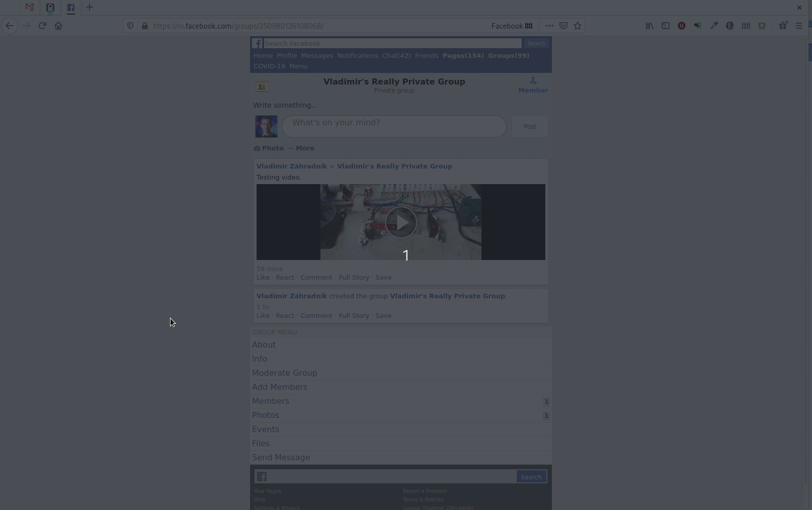
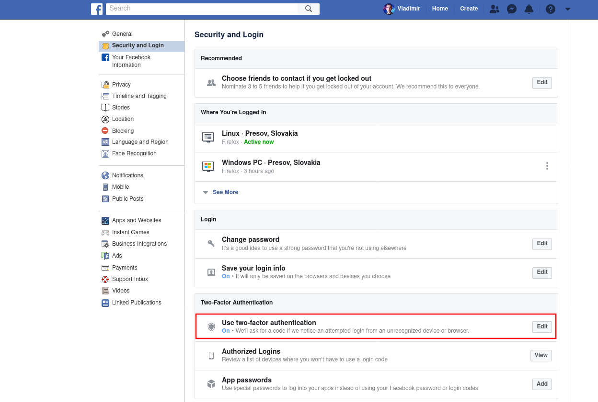

A few days ago, I registered in one of those online challenges. During a week, you had to watch videos and work on daily goals. I knew this challenge brings high-value information, but I had no time to view the content.

Organizers used a private Facebook group in which they live-streamed the sessions, posted updates, and moderated discussions with their audience.

Later, they announced that the group stays, but they will delete all the videos. The challenge was coming to an end, and I had two options — watch all videos in one day, or download them and watch later at my pace. Naturally, I opted for the second choice.

> Disclaimer: I don't endorse piracy in any way. In this post, I show you how to download content to which you were already authorized. I encourage you to download videos only for personal use and not share them with anyone else. Please respect the rights of the original authors.

Figuring out how to download the content took me several hours of trial-and-error. Usually, videos streamed to your phone or PC are [segmented into tiny chunks][mpeg-dash], which are only a couple of seconds long. All these chunks are listed in a Manifest, and if you find this file, you can download all the segments and join them together. I'm familiar with a developer console in my browser. So far, I always found a way to download a video if it's not encrypted. But let me tell you — Facebook is chatty; quite possibly, you'll get lost in the logs even if you know what you're doing. There must be a better way.

<div className="Image__Medium">
  
  <figcaption>Facebook network activity</figcaption>
</div>

I searched for a guide on how to download a video from a private FB group, and I found several of them. Also, I bumped into several online tools, which automate some steps for you. However, all these guides and tools used the same technique, which allows you to download a video only in a blurry SD format, which is suited for small mobile screens.

---

## Method #1: SD download
This method is accessible for everyone, and you find a plethora of online tools that will make the process even more comfortable.

### Step 1: Open a video link
Find a post with the video you want to download and expand the video so that it fits the whole page.

<div className="Image__Medium">
  
  <figcaption>Expand video</figcaption>
</div>

You should see a screen similar to this one:
<div className="Image__Medium">
  
  <figcaption>Full-screen video</figcaption>
</div>

Now, copy the video URL link. It should look like this:
```
https://www.facebook.com/vladimir.zahradnik1/videos/3175253852495827/
```

> Note: Some groups have a video section with all their videos listed in one place. 

### Step 2: Edit the link to point to a mobile version of a web
It's easy — just replace the `www` part with `m` and open the new link instead:
```
https://m.facebook.com/vladimir.zahradnik1/videos/3175253852495827/
```

Now you should see a Facebook page designed for mobile phones.

<div className="Image__Medium">
  
  <figcaption>Facebook page for mobile phones</figcaption>
</div>

### Step 3: Right-click on the video and save it
Mobile version of the web points to a video file in its entirety; there are no chunks. Therefore downloading such a file is straightforward. The downside of this approach is that the downloaded video is low-quality. Still, I prefer to have at least something to watch than nothing at all.

To download the video, right-click on it and then click on the `Save Link As...` menu item.

<div className="Image__Medium">
  
  <figcaption>Save video</figcaption>
</div>

As an alternative, you can display the web page's full source code and search for an "mp4" text. You can save the video the same way as described above.

<div className="Image__Medium">
  
  <figcaption>Page source code with video URL</figcaption>
</div>

---

## Method #2: HD download
Unlike the first method, the procedure I'm about to describe was not covered by anyone, despite much better results. It allows you to download videos in HD, preserving the highest quality possible.

### youtube-dl
Youtube-dl is a tool I sometimes use when I want to download a video from YouTube. But don't get fooled by its name; this tool supports downloading videos out of many websites, including Facebook.

> youtube-dl is a command-line program to download videos from YouTube.com and a few more sites.
> — <cite>official website</cite>

This application is written in Python and runs everywhere; I have it installed on my server just in case. While its main features are well documented, individual extractors like Facebook don't have any documentation besides its [source code][facebook-extractor]. The best way to test if youtube-dl can download a video is to try it out and see yourself.

### Downloading a protected FB video
Under normal circumstances, youtube-dl works perfectly for downloading public videos. However, video from a private Facebook group is a different case. If you try to download it, youtube-dl eventually asks you for login credentials:

```bash
[vzahradnik@Ryzen Downloads]$ youtube-dl https://www.facebook.com/vladimir.zahradnik1/videos/3175253852495827/
[facebook] 3175253852495827: Downloading webpage
[facebook] 3175253852495827: Downloading webpage
ERROR: This video is only available for registered users. Use --username and --password or --netrc to provide account credentials.
```

This time we didn't succeed, but the output looks promising — it shows us that this extractor most likely supports downloading protected content.

> Note: While an extractor works one day, nobody can guarantee it will work on another day. Often, webpages change, and developers need to update this extractor to reflect the changes. If you know Python, even you can help!

### Adding login information
Youtube-dl supports `username` and `password` as optional parameters. These are the credentials used on Facebook login. Let's try to download a video again, but with credentials specified:

```bash
[vzahradnik@Kaveri Downloads]$ youtube-dl --username vladimir.zahradnik1 --password <my-password> https://www.facebook.com/vladimir.zahradnik1/videos/3175253852495827/
[facebook] Downloading login page
[facebook] Logging in
[facebook] 3175253852495827: Downloading webpage
[facebook] 3175253852495827: Downloading webpage
[facebook] 3175253852495827: Downloading webpage
[download] Destination: Facebook video #3175253852495827-3175253852495827.f1470610743121723v.mp4
[download] 100% of 1.58GiB in 00:17
[download] Destination: Facebook video #3175253852495827-3175253852495827.f250546852719691a.m4a
[download] 100% of 80.90MiB in 00:00
[ffmpeg] Merging formats into "Facebook video #3175253852495827-3175253852495827.mp4"
Deleting original file Facebook video #3175253852495827-3175253852495827.f1470610743121723v.mp4 (pass -k to keep)
Deleting original file Facebook video #3175253852495827-3175253852495827.f250546852719691a.m4a (pass -k to keep)
```

Success! Now we have our video finally downloaded and can watch it anytime and anywhere, even without an internet connection.

---

## Caveats
In my case, I downloaded more than 16 videos. During that time, I found several problems. For the first method, it's obvious — downloaded video is low-quality. The second method delivers the best results, but be prepared to deal with authentication and authorization issues:

### Facebook two-factor authentication
If you use two-factor authentication to increase account security further, downloading with youtube-dl won't work. As you may know, two-factor authentication asks for your username and password. Still, you must also confirm your identity by other means. Typically, you enter a 6-digit code from your authentication app. In youtube-dl, there's no way how to supply further information.

### App passwords
Not all applications support two-factor authentication. To cope with that, Facebook allows you to generate an app password. You should be able to log in without entering a password to your account and the additional code.

Typically, you generate an app password in your Facebook account's security settings. However, it looks like this feature doesn't work correctly. When I created a password, Facebook was still asking for an additional code. Maybe it's a bug, or Facebook just implemented this feature differently than anyone else. Also, when I tried to remove the generated entry, I got weird errors (definitely a bug).

<div className="Image__Medium">
  
  <figcaption>Facebook account security page</figcaption>
</div>

So, if you use two-factor authentication and you want to download a private video, there is no other way than turning this feature off temporarily.

## Your FB account may get blocked
Before youtube-dl downloads a video, it always sends your login information. This tool is stateless; it stores no cookie telling Facebook that it's still you. If you download more than a couple of videos, Facebook may notice unusual activity, and to mitigate possible damages, it blocks your account.

To unlock it, you need to change your password and go through several steps before Facebook lets you in again. During the last two days, I got blocked two times. Especially the second time was unexpected. Several hours passed since I downloaded all videos. At the time, I minded my own business, talked with some people over Messenger, and suddenly couldn't deliver my messages. First, I thought it was a strange bug. But after I completely logged out and in again, Facebook told me that they locked my account — again! Worth mentioning the screen to change a password was buggy. Facebook changed my password, but it displayed an error, and I was unable to continue. Ultimately, I made it work through the "I forgot the password" routine.

---

## Conclusion
Despite some caveats, I'm more than happy with the second method. I have the content to watch anytime I want.

Youtube-dl is a handy tool, and if you didn't know about its existence, check it out. I'm thinking of taking a look at its internals. Perhaps I could add support for cookie handling, or other websites.

What's your take on downloading content? I'm on the fence — on the one hand, I download publicly available content. On the other hand, if authors decide to take the content down, is it suddenly illegal to still have a copy? I think it's a grey area, and I don't publish such videos to anyone.

Please let me know your opinions in the comments.


[//]: # (Used references)
[mpeg-dash]: https://en.wikipedia.org/wiki/Dynamic_Adaptive_Streaming_over_HTTP
[youtube-dl]: https://ytdl-org.github.io/youtube-dl/index.html
[facebook-extractor]: https://github.com/ytdl-org/youtube-dl/blob/master/youtube_dl/extractor/facebook.py