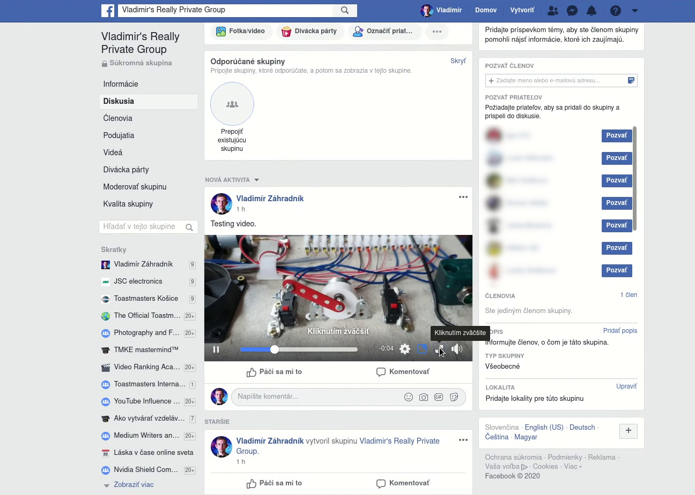
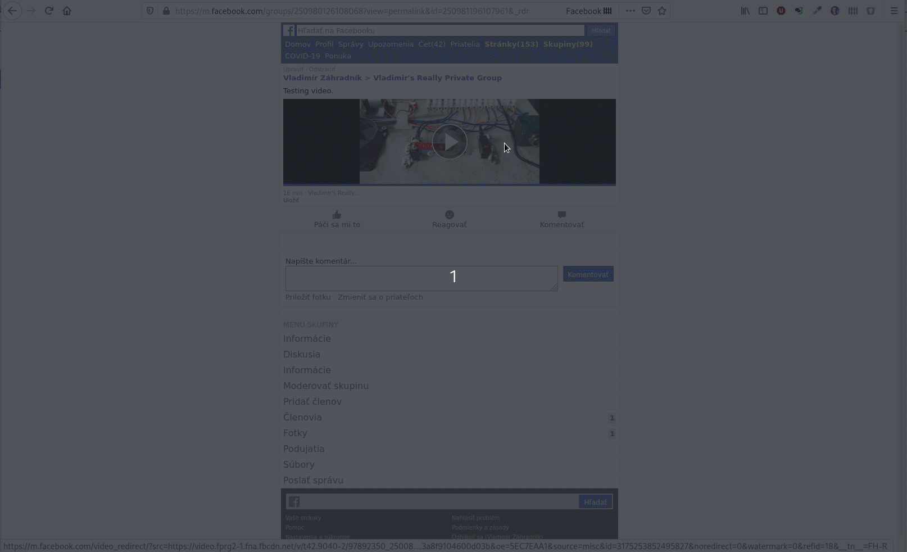

Pred pár dňami som sa zaregistroval do jednej z tých online výziev. Počas týždňa ste museli sledovať videá a pracovať na denných cieľoch. Vedel som, že táto výzva prináša veľmi hodnotné informácie, ale na pozeranie obsahu som nemal čas.

Organizátori používali súkromnú skupinu na Facebooku, v ktorej naživo vysielali ich sústredenia, zverejňovali aktuality a moderovali diskusie s divákmi.

Neskôr oznámili, že skupina ostáva, ale že všetky videá vymažú. Výzva sa chýlila ku koncu a ja som mal dve možnosti — za jeden deň pozrieť všetky videá alebo si ich stiahnuť a pozrieť si ich neskôr svojím tempom. Prirodzene som si vybral druhú možnosť.

> Prehlásenie: Žiadnym spôsobom pirátstvo neschvaľujem. V tomto príspevku vám ukážem, ako stiahnuť obsah, ku ktorému ste mali oprávnenia. Vyzývam vás k tomu, aby ste si videá sťahovali iba na osobnú potrebu a s nikým ich nezdieľali. Rešpektujte, prosím, práva pôvodných autorov.

Prísť na to, ako stiahnuť obsah, mi trvalo niekoľko hodín pokusov a omylov. Zvyčajne sú videá streamované do vášho telefónu alebo počítača [rozdelené na drobné kúsky][mpeg-dash], ktoré majú len zopár sekúnd. Všetky tieto kúsky sú uvedené v manifeste a ak tento súbor nájdete, môžete všetky tieto segmenty stiahnuť a spojiť ich dokopy. Vývojársku konzolu v mojom prehliadači dobre poznám. Doteraz som vždy našiel spôsob, ako si stiahnuť video, pokiaľ nie je šifrované. Ale poviem vám jedno — Facebook je ukecaný. Je dosť možné, že sa v záznamoch stratíte, aj keď viete, čo robíte. Musí existovať lepší spôsob.

<div className="Image__Medium">
  
  <figcaption>Sieťová aktivita Facebooku</figcaption>
</div>

Hľadal som návod, ako stiahnuť video zo súkromnej FB skupiny a našiel som ich niekoľko. Taktiež som narazil na niekoľko online nástrojov, ktoré pre vás niektoré kroky automatizujú. Avšak všetky tieto návody a nástroje používajú tú istú techniku, ktorá vám umožní stiahnuť video iba v rozmazanom SD formáte, ktorý je určený pre malé obrazovky mobilov.

---

## Prvý spôsob: Stiahnutie v SD
Tento spôsob je dostupný každému a nájdete nepreberné množstvo online nástrojov, ktoré vám celý postup ešte viac spríjemnia.

### Prvý krok: Otvorte odkaz s videom
Nájdite si príspevok s videom, ktoré chcete stiahnuť a zväčšite video, aby obsadilo celú stránku.

<div className="Image__Medium">
  
  <figcaption>Zväčšenie videa</figcaption>
</div>

Mali by ste vidieť obrazovku podobnú tejto:
<div className="Image__Medium">
  
  <figcaption>Video na celú obrazovku</figcaption>
</div>

Teraz si skopírujte URL odkaz k videu. Mal by vyzerať nejako takto:
```
https://www.facebook.com/vladimir.zahradnik1/videos/3175253852495827/
```

> Poznámka: Niektoré skupiny majú videosekciu so všetkými videami zobrazenými na jednom mieste. 

### Druhý krok: Upravte odkaz, aby ukazoval na verziu webu pre mobily
Je to jednoduché — jednoducho nahraďte časť `www` za `m` a otvorte namiesto pôvodného odkazu ten nový:
```
https://m.facebook.com/vladimir.zahradnik1/videos/3175253852495827/
```

Teraz by ste mali vidieť stránku na Facebooku navrhnutú pre mobilné telefóny.

<div className="Image__Medium">
  
  <figcaption>Stránka na Facebooku pre mobilné telefóny</figcaption>
</div>

### Tretí krok: Kliknite pravým tlačidlom na video a uložte ho
Verzia webu pre mobily odkazuje na súbor videa, ktorý je už celistvý. Nie je rozdrobený na menšie kúsky. A preto je stiahnutie takéhoto súboru priamočiare. Nevýhodou tohto prístupu je, že je video stiahnuté v nízkej kvalite. Stále však radšej preferujem mať niečo, čo si môžem pozrieť, ako vôbec nič.

Aby ste si video stiahli, kliknite naňho pravým tlačidlom myši a potom kliknite na položku v menu `Uložiť cieľ odkazu ako...`.

<div className="Image__Medium">
  
  <figcaption>Uloženie videa</figcaption>
</div>

Ako alternatívu si môžete zobraziť celý zdrojový kód webovej stránky a hľadať v ňom text "mp4". Video si môžete uložiť rovnakým spôsobom, ako je popísaný vyššie.

<div className="Image__Medium">
  
  <figcaption>Zdrojový kód stránky s URL odkazom na video</figcaption>
</div>

---

## Druhý spôsob: Stiahnutie v HD
Na rozdiel od prvého spôsobu, spôsob, ktorý tu popíšem, ešte nikto nepokryl. A to napriek oveľa lepším výsledkom. Umožňuje vám stiahnuť si videá v HD, čím sa zachová tá najvyššia možná kvalita.

### youtube-dl
Youtube-dl je nástroj, ktorý občas používam, keď si chcem stiahnuť z YouTube video. Ale nech vás názov neoklame. Tento nástroj podporuje sťahovanie videí z mnohých webstránok, vrátane Facebooku.

> youtube-dl je program pre príkazový riadok na sťahovanie videí z YouTube.com a zopár ďalších stránok.
> — <cite>oficiálna webstránka</cite>

Táto aplikácia je napísaná v Pythone a beží všade. Pre prípad ju mám nainštalovanú aj na svojom serveri. Zatiaľ čo sú hlavné funkcie dobre zdokumentované, individuálne extraktory ako Facebook nemajú žiadnu dokumentáciu okrem ich [zdrojového kódu][facebook-extractor]. Najlepší spôsob, ako otestovať, či dokáže youtube-dl stiahnuť video, je to jednoducho vyskúšať.

### Stiahnutie chráneného FB videa
Za normálnych okolností funguje youtube-dl perfektne na sťahovanie verejných videí. Avšak video zo súkromnej skupiny na Facebooku je iný prípad. Pokiaľ sa ho pokúsite stiahnuť, youtube-dl vás nakoniec požiada o prihlasovacie údaje:

```bash
[vzahradnik@Ryzen Stiahnuté]$ youtube-dl https://www.facebook.com/vladimir.zahradnik1/videos/3175253852495827/
[facebook] 3175253852495827: Downloading webpage
[facebook] 3175253852495827: Downloading webpage
ERROR: This video is only available for registered users. Use --username and --password or --netrc to provide account credentials.
```

Tentokrát sme neuspeli, ale výstup vyzerá sľubne — ukazuje nám, že tento extraktor s najväčšou pravdepodobnosťou podporuje sťahovanie chráneného obsahu.

> Poznámka: Kým extraktor jedného dňa funguje, nikto vám nezaručí, že bude fungovať aj ten nasledujúci. Webstránky sa často menia a vývojári musia tento extraktor aktualizovať, aby reagoval na zmeny. Ak poznáte Python, aj vy s tým môžete pomôcť!

### Pridanie informácií pre prihlásenie
Youtube-dl podporuje ako voliteľné parametre `username` (používateľské meno) a `password` (heslo). Toto sú prihlasovacie údaje, ktoré používate pri prihlasovaní do Facebooku. Skúsme stiahnuť video opäť, no tentokrát so zadanými prihlasovacími údajmi:

```bash
[vzahradnik@Kaveri Stiahnuté]$ youtube-dl --username vladimir.zahradnik1 --password <moje-heslo> https://www.facebook.com/vladimir.zahradnik1/videos/3175253852495827/
[facebook] Downloading login page
[facebook] Logging in
[facebook] 3175253852495827: Downloading webpage
[facebook] 3175253852495827: Downloading webpage
[facebook] 3175253852495827: Downloading webpage
[download] Destination: Facebook video #3175253852495827-3175253852495827.f1470610743121723v.mp4
[download] 100% of 1.58GiB in 00:17
[download] Destination: Facebook video #3175253852495827-3175253852495827.f250546852719691a.m4a
[download] 100% of 80.90MiB in 00:00
[ffmpeg] Merging formats into "Facebook video #3175253852495827-3175253852495827.mp4"
Deleting original file Facebook video #3175253852495827-3175253852495827.f1470610743121723v.mp4 (pass -k to keep)
Deleting original file Facebook video #3175253852495827-3175253852495827.f250546852719691a.m4a (pass -k to keep)
```

Úspech! Teraz máme konečne naše video stiahnuté a môžeme si ho kedykoľvek a kdekoľvek pozrieť, dokonca aj bez internetového pripojenia.

---

## Problémy
V mojom prípade som stiahol viac ako 16 videí a počas tejto doby som našiel niekoľko problémov. U prvého spôsobu je to zjavné — stiahnuté video je v nízkej kvalite. Druhý spôsob dáva tie najlepšie výsledky, ale pripravte sa na to, že budete riešiť problémy s autentifikáciou a autorizáciou:

### Dvojfaktorová autentifikácia na Facebooku
Pokiaľ používate dvojfaktorovú autentifikáciu, aby ste ešte viac zvýšili zabezpečenie účtu, sťahovanie s aplikáciou youtube-dl vám nebude fungovať. Ako možno viete, pri dvojfaktorovej autentifikácii ste požiadaní o vaše používateľské meno a heslo. No taktiež musíte potvrdiť vašu identitu aj iným spôsobom. Typicky zadáte 6-miestny kód z vašej autentifikačnej aplikácie. V aplikácii youtube-dl nie je žiadny spôsob, ako zadať ďalšie informácie.

### Heslá aplikácií
Nie všetky aplikácie podporujú dvojfaktorovú autentifikáciu. Aby ste s nimi mohli pracovať, Facebook vám umožňuje vygenerovať heslo aplikácie. Mali by ste sa vedieť prihlásiť bez zadania hesla k vášmu účtu a dodatočného kódu.

Typicky vygenerujete heslo aplikácie v nastaveniach zabezpečenia účtu Facebooku. Avšak zdá sa, že táto funkcia nefunguje správne. Keď som vytvoril heslo, Facebook ma stále zadal o dodatočný kód. Možno, že ide o chybu alebo jednoducho Facebook implementoval túto funkciu inak ako všetci ostatní. Taktiež, keď som sa pokúsil vymazať vygenerovaný záznam, dostával som zvláštne chybové hlášky (rozhodne chyba v kóde).

<div className="Image__Medium">
  
  <figcaption>Stránka zabezpečenia účtu Facebooku</figcaption>
</div>

Takže, ak používate dvojfaktorovú autentifikáciu a chcete si stiahnuť súkromné video, neexistuje iný spôsob ako dočasne túto funkciu vypnúť.

### Váš účet na FB môže byť zablokovaný
Predtým ako youtube-dl stiahne video, zakaždým pošle vaše prihlasovacie informácie. Tento nástroj je bezstavový. Neukladá žiadny cookie záznam, ktorý by povedal Facebooku, že ste to stále vy. Ak stiahnete viac ako pár videí, Facebook si môže všimnúť nezvyčajnú aktivitu a aby zabránil možným škodám, zablokuje váš účet.

Aby ste ho odomkli, potrebujete si zmeniť heslo a prejsť niekoľkými krokmi, kým vás Facebook opäť pustí dnu. Za posledné dva dni ma Facebook zablokoval dvakrát. Hlavne ten druhý raz bol nečakaný. Od stiahnutia všetkých videí prešlo už niekoľko hodín. V tom čase som si riešil svoje veci, rozprával som sa so zopár ľuďmi cez Messenger a zrazu som už nemohol posielať správy. Najprv som si pomyslel, že ide o zvláštnu chybu. No keď som sa úplne odhlásil a opäť prihlásil, Facebook mi povedal, že môj účet uzamkli — opäť! Je fajn tiež spomenúť, že obrazovka na zmenu hesla bola s chybami. Facebook mi zmenil heslo, ale zobrazil chybu a ja som nemohol pokračovať. Nakoniec som to poriešil cez postup "Zabudol som heslo."

---

## Záver
Napriek istým problémom som s druhým spôsobom viac než spokojný. Mám obsah, ktorý môžem sledovať kedykoľvek chcem.

Youtube-dl je šikovný nástroj a ak ste o jeho existencii nevedeli, pozrite si ho. Premýšľam nad tým, že sa pozriem na to, ako funguje. Možno by som mohol pridať podporu pre zaobchádzanie s cookies alebo pre nejaké iné webstránky.

Aký je váš pohľad na sťahovanie obsahu? Som v tomto na vážkach — na jednej strane, sťahujem obsah, ktorý je verejne dostupný. Na druhej strane, ak sa autori rozhodnú obsah vymazať, je zrazu nelegálne vlastniť jeho kópiu? Myslím si, že je to šedá zóna a takéto videá nikomu neposkytujem.

Dajte mi, prosím, vedieť váš názor do komentára.


[//]: # (Used references)
[mpeg-dash]: https://en.wikipedia.org/wiki/Dynamic_Adaptive_Streaming_over_HTTP
[youtube-dl]: https://ytdl-org.github.io/youtube-dl/index.html
[facebook-extractor]: https://github.com/ytdl-org/youtube-dl/blob/master/youtube_dl/extractor/facebook.py