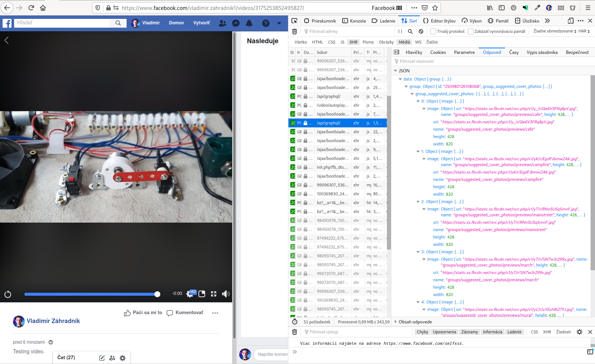
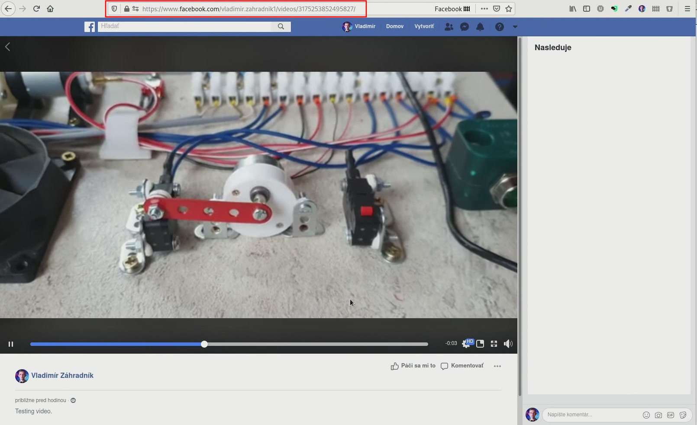
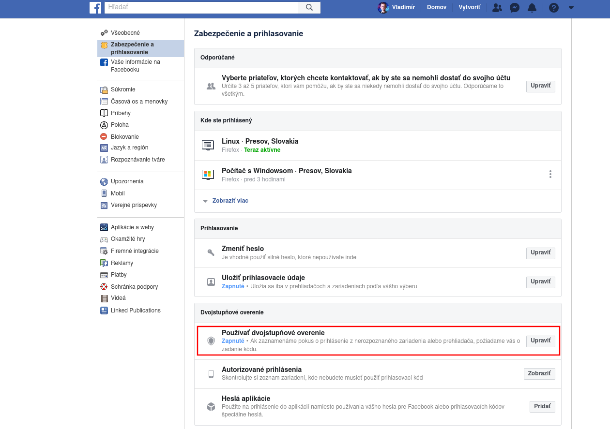

Před pár dny jsem se zaregistroval do jedné z těch online výzev. Během týdne jste museli sledovat videa a pracovat na denních cílech. Věděl jsem, že tato výzva přináší velmi hodnotné informace, ale ke shlédnutí obsahu jsem neměl čas.

Organizátoři používali soukromou skupinu na Facebooku, ve které živě vysílali jejich soustředění, zveřejňovali aktuality a moderovali diskuse s diváky.

Později oznámili, že skupina zůstává, ale že všechna videa vymažou. Výzva se chýlila ke konci a já jsem měl dvě možnosti — za jeden den se podívat na všechna videa nebo si je stáhnout a prohlédnout si je později svým tempem. Přirozeně jsem si vybral druhou možnost.

> Prohlášení: Žádným způsobem pirátství neschvaluji. V tomto příspěvku vám ukážu, jak stáhnout obsah, ke kterému jste měli oprávnění. Vyzývám vás k tomu, abyste si videa stěhovali pouze pro osobní potřebu a s nikým je nesdíleli. Respektujte prosím práva původních autorů.

Přijít na to, jak stáhnout obsah, mi trvalo několik hodin pokusů a omylů. Obvykle jsou videa streamované do vašeho telefonu nebo počítače [rozdělené na drobné kousky][mpeg-dash], které mají jen pár vteřin. Všechny tyto kousky jsou uvedeny v manifestu a pokud tento soubor najdete, můžete všechny tyto segmenty stáhnout a spojit je dohromady. Vývojářskou konzoli v mém prohlížeči dobře znám. Doposud jsem vždy našel způsob, jak si stáhnout video, pokud není šifrována. Ale řeknu vám jedno — Facebook je upovídaný. Je dost možné, že se v záznamech ztratíte, i když víte, co děláte. Musí existovat lepší způsob.

<div className="Image__Medium">
  
  <figcaption>Síťová aktivita Facebooku</figcaption>
</div>

Hledal jsem návod, jak stáhnout video ze soukromé FB skupiny a našel jsem jich několik. Také jsem narazil na několik online nástrojů, které pro vás některé kroky automatizují. Nicméně všechny tyto návody a nástroje používají stejnou techniku, která vám umožní stáhnout video pouze v rozmazaném SD formátu, který je určen pro malé obrazovky mobilů.

## První způsob: Stažení v SD
Tento způsob je dostupný každému a najdete nepřeberné množství online nástrojů, které vám celý postup ještě více zpříjemní.

### První krok: Otevřete odkaz s videem
Najděte si příspěvek s videem, které chcete stáhnout a zvětšete video, aby obsadilo celou stránku.

<div className="Image__Medium">
  
  <figcaption>Zvětšení videa</figcaption>
</div>

Měli byste vidět obrazovku podobnou této:

<div className="Image__Medium">
  
  <figcaption>Video na celou obrazovku</figcaption>
</div>

Nyní si zkopírujte URL odkaz k videu. Měl by vypadat nějak takto:

```
https://www.facebook.com/vladimir.zahradnik1/videos/3175253852495827/
```

> Poznámka: Některé skupiny mají videosekci se všemi videi zobrazenými na jednom místě.

### Druhý krok: Upravte odkaz, aby ukazoval na verzi webu pro mobily
Je to jednoduché - jenom nahraďte část `www` za `m` a otevřete namísto původního odkazu ten nový:

```
https://m.facebook.com/vladimir.zahradnik1/videos/3175253852495827/
```

Nyní byste měli vidět stránku na Facebooku navrženou pro mobilní telefony.

*Aktualizace 1.11.2020: Jak poukázala jedna moje čtenářka, metoda, kterou jsem zde uvedl, už víc nefunguje. Facebook stránku pro mobilní zařízení změnil. Nyní používá pro přehrání videa interní webový přehrávač. Už na video nemůžete kliknout a uložit si ho. Našel jsem však jednoduchý způsob, jak video stáhnout. Dnes jsem udělal rychlý návod a na demonstraci jsem si vybral náhodné video z Facebooku. Postup pro videa v soukromých skupinách by měl být stejný. V tomto návodu používám Firefox, ale postup v Chrome by měl být velmi podobný. Video níže pokračuje z bodu otevření mobilní verze webu.*

<div class="Image__Medium">
  <YouTube videoId="groE04ridXE" />
  <figcaption>První způsob, aktualizovaný</figcaption>
</div>

### Třetí krok: Otevřete kartu Síť z menu pro webové vývojáře
Mobilní verze webu ukazuje na video soubor v jeho celistvosti. Video není rozděleno na menší úseky. Nevýhodou tohoto přístupu je, že stažené video je v nižší kvalitě. Ovšem i přesto upřednostňuji mít alespoň něco, nežli vůbec nic. V mé původní metodě jste si mohli stáhnout video kliknutím na video a následně na položku v menu `Uložit cíl odkazu jako...`. Tento přístup již více nefunguje. Nicméně stále je tu způsob, jak video stáhnout.

Každá stránka má nějaké zdroje, které si prohlížeč potřebuje stáhnout. Vaše video je jedním z nich. Všechny tyto zdroje jsou viditelné na kartě Síť ve vývojářské konzole. Existuje několik způsobů, jak se na tuto kartu dostat:
1. Klepněte na tlačítko menu v pravém horním rohu. Poté klikněte na menu `Webový vývojár` a zvolte položku `Síť`
2. Stiskněte Ctrl+Shift+E
3. Klepněte pravým tlačítkem myši na video, klepněte na položku `Prozkoumat prvek` a potom klikněte na kartu `Síť`

### Čtvrtý krok: Stiskněte F5 pro obnovení webstránky
Obnovení webstránky je volitelný krok, ale zaručuje vám, že všechny zdroje webové stránky se znovu stáhnou, včetně vašeho videa. Jednoduše stiskněte `F5` a měli byste vidět jak prohlížeč stahuje zdroje.

### Pátý krok: Stiskněte tlačítko Přehrát
Poté, co začnete přehrávat video, byste měli vidět vaše video na kartě Síť. Můžete použít filtr `Média` na zobrazení pouze relevantních souborů.

### Šestý krok: Stáhněte si video
Nakonec klikněte pravým tlačítkem myši na zdroj videa a otevřete jej na nové kartě. Na této kartě máte přímý odkaz na soubor videa a můžete si jej stáhnout po kliknutí na položku menu `Uložit cíl odkazu jako...`.

## Druhý způsob: Stažení v HD
Na rozdíl od prvního způsobu, způsob, který zde popíši, ještě nikdo nepopsal. A to navzdory mnohem lepším výsledkům. Umožňuje vám stáhnout videa v HD, čímž se zachová ta nejvyšší možná kvalita.

### youtube-dl
Youtube-dl je nástroj, který občas používám, když si chci stáhnout z YouTube video. Ale ať vás název neoklame. Tento nástroj podporuje stahování videí z mnoha webstránek, včetně Facebooku.

> youtube-dl je program pro příkazový řádek na stahování videí z YouTube.com a pár dalších stránek.
> — <cite>oficiální webstránka</cite>

Tato aplikace je napsána v Pythonu a běží všude. Pro případ ji mám nainstalovanou i na svém serveru. Zatímco jsou hlavní funkce dobře zdokumentovány, individuální extraktory jako Facebook nemají žádnou dokumentaci kromě jejich [zdrojového kódu][facebook-extractor]. Nejlepší způsob, jak otestovat, zda dokáže youtube-dl stáhnout video, je to prostě vyzkoušet.

*Aktualizace 23.10.2020: zdrojový repozitář youtube-dl byl odstraněn po [DMCA výzvě od organizace RIAA][riaa]. Autoři [na jejich webstránce][ytdl-website] zveřejnili archiv nejnovějšího zdrojového kódu a binárky. Ovšem v této chvíli je budoucnost projektu nejistá. Rozhodl jsem se proto vytvořit zrcadlo repozitáře z jeho nedávné zálohy na mém vlastním git serveru. Kód najdete [zde][ytdl-mirror].*

*Aktualizace 17.11.2020: GitHub opět zpřístupnil repozitáře youtube-dl. Celou situaci kolem youtube-dl [podrobně vysvětlili][ytdl-reinstatement-github] na jejich blogu.*

### Stažení chráněného FB videa
Za normálních okolností funguje youtube-dl perfektně na stěhování veřejných videí. Ovšem video ze soukromé skupiny na Facebooku je jiný případ. Pokud se ho pokusíte stáhnout, youtube-dl vás nakonec požádá o přihlašovací údaje:

```bash
[vzahradnik@Ryzen Stažené]$ youtube-dl https://www.facebook.com/vladimir.zahradnik1/videos/3175253852495827/
[facebook] 3175253852495827: Downloading webpage
[facebook] 3175253852495827: Downloading webpage
ERROR: This video is only available for registered users. Use --username and --password or --netrc to provide account credentials.
```

Tentokrát jsme neuspěli, ale výstup vypadá slibně — ukazuje nám, že tento extraktor s největší pravděpodobností podporuje stahování chráněného obsahu.

> Poznámka: Zatímco extraktor jednoho dne funguje, nikdo vám nezaručí, že bude fungovat i ten následující. Webstránky se často mění a vývojáři musí tento extraktor aktualizovat, aby reagoval na změny. Pokud znáte Python, i vy s tím můžete pomoci!

### Přidání informací pro přihlášení
Youtube-dl podporuje jako volitelné parametry `username` (uživatelské jméno) a `password` (heslo). Toto jsou přihlašovací údaje, které používáte při přihlašování do Facebooku. Zkusme stáhnout video opět, ale tentokrát se zadanými přihlašovacími údaji:

```bash
[vzahradnik@Kaveri Stažené]$ youtube-dl --username vladimir.zahradnik1 --password <moje-heslo> https://www.facebook.com/vladimir.zahradnik1/videos/3175253852495827/
[facebook] Downloading login page
[facebook] Logging in
[facebook] 3175253852495827: Downloading webpage
[facebook] 3175253852495827: Downloading webpage
[facebook] 3175253852495827: Downloading webpage
[download] Destination: Facebook video #3175253852495827-3175253852495827.f1470610743121723v.mp4
[download] 100% of 1.58GiB in 00:17
[download] Destination: Facebook video #3175253852495827-3175253852495827.f250546852719691a.m4a
[download] 100% of 80.90MiB in 00:00
[ffmpeg] Merging formats into "Facebook video #3175253852495827-3175253852495827.mp4"
Deleting original file Facebook video #3175253852495827-3175253852495827.f1470610743121723v.mp4 (pass -k to keep)
Deleting original file Facebook video #3175253852495827-3175253852495827.f250546852719691a.m4a (pass -k to keep)
```

Úspěch! Nyní máme konečně naše video stažené a můžeme si ho kdykoliv a kdekoliv podívat, dokonce i bez internetového připojení.

## Problémy
V mém případě jsem stáhl více než 16 videí a během této doby jsem našel několik problémů. U prvního způsobu je to zjevné — stažené video je v nízké kvalitě. Druhý způsob dává ty nejlepší výsledky, ale připravte se na to, že budete řešit problémy s autentifikací a autorizací:

### Dvoufaktorová autentifikace na Facebooku
Pokud používáte dvoufaktorovou autentizaci, abyste ještě více zvýšili zabezpečení účtu, stahování s aplikací youtube-dl vám nebude fungovat. Jak možná víte, při dvoufaktorové autentizaci jste požádáni o uživatelské jméno a heslo. No také musíte potvrdit vaši identitu i jiným způsobem. Typicky zadáte 6-místní kód z vaší autentifikační aplikace. V aplikaci youtube-dl není žádný způsob, jak zadat další informace.

### Hesla aplikací
Ne všechny aplikace podporují dvoufaktorovou autentizaci. Abyste s nimi mohli pracovat, Facebook umožňuje vygenerovat heslo aplikace. Měli byste se umět přihlásit bez zadání hesla k účtu a dodatečného kódu.

Typicky vygenerujete heslo aplikace v nastavení zabezpečení účtu Facebooku. Nicméně zdá se, že tato funkce nefunguje správně. Když jsem vytvořil heslo, Facebook mě stále žádal o dodatečný kód. Možná, že jde o chybu nebo prostě Facebook implementoval tuto funkci jinak než všichni ostatní. Také, když jsem se pokusil vymazat vygenerovaný záznam, dostával jsem zvláštní chybové hlášky (rozhodně chyba v kódu).

<div className="Image__Medium">
  
  <figcaption>Stránka zabezpečení účtu Facebooku</figcaption>
</div>

Takže, pokud používáte dvoufaktorovou autentizaci a chcete si stáhnout soukromé video, neexistuje jiný způsob jak dočasně tuto funkci vypnout.

### Váš účet na FB může být zablokován
Předtím jako youtube-dl stáhne video, pokaždé pošle vaše přihlašovací informace. Tento nástroj je bezstavový. Neukládá žádný cookie záznam, který by řekl Facebooku, že jste to stále vy. Pokud stáhnete více než pár videí, Facebook si může všimnout neobvyklou aktivitu a aby zabránil možným škodám, zablokuje váš účet.

Abyste ho odemkli, potřebujete si změnit heslo a projít několika kroky, dokud vás Facebook opět pustí dovnitř. Za poslední dva dny mě Facebook zablokoval dvakrát. Hlavně na podruhé to bylo nečekané. Od stažení všech videí prošlo už několik hodin. V té době jsem si řešil své věci, vyprávěl jsem se se pár lidmi přes Messenger a najednou jsem už nemohl posílat zprávy. Nejprve jsem si pomyslel, že jde o zvláštní chybu. No když jsem se úplně odhlásil a opět přihlásil, Facebook mi řekl, že můj účet uzamkli — opět! Je fajn také zmínit, že obrazovka na změnu hesla byla s chybami. Facebook mi změnil heslo, ale zobrazil chybu a já jsem nemohl pokračovat. Nakonec jsem to řešil přes postup „Zapomněl jsem heslo.“

## Závěr
Navzdory jistým problémům jsem s druhým způsobem více než spokojen. Mám obsah, který mohu sledovat kdykoliv chci.

Youtube-dl je šikovný nástroj a pokud jste o jeho existenci nevěděli, podívejte se na něj. Přemýšlím nad tím, že se podívám na to, jak funguje. Možná bych mohl přidat podporu pro zacházení s cookies nebo pro nějaké jiné stránky.

Jaký je váš pohled na stahování obsahu? Jsem v tomto na vážkách — na jedné straně, stahuji obsah, který je veřejně dostupný. Na druhé straně, pokud se autoři rozhodnou obsah vymazat, je najednou nelegální vlastnit jeho kopii? Myslím, že je to šedá zóna a takové videa nikomu neposkytuji.

Dejte mi prosím vědět váš názor do komentáře.

[//]: # (Used references)
[mpeg-dash]: https://en.wikipedia.org/wiki/Dynamic_Adaptive_Streaming_over_HTTP
[youtube-dl]: https://ytdl-org.github.io/youtube-dl/index.html
[facebook-extractor]: https://github.com/ytdl-org/youtube-dl/blob/master/youtube_dl/extractor/facebook.py
[riaa]: https://github.com/github/dmca/blob/master/2020/10/2020-10-23-RIAA.md
[ytdl-website]: https://youtube-dl.org/
[ytdl-mirror]: https://gitlab.darka.sk/vzahradnik/youtube-dl
[ytdl-reinstatement-github]: https://github.blog/2020-11-16-standing-up-for-developers-youtube-dl-is-back/