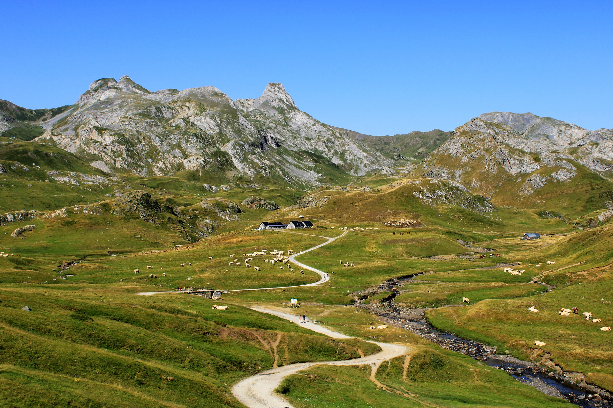
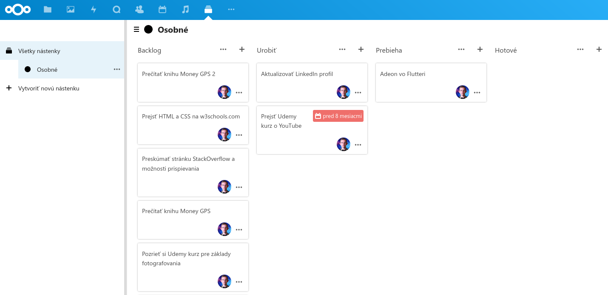
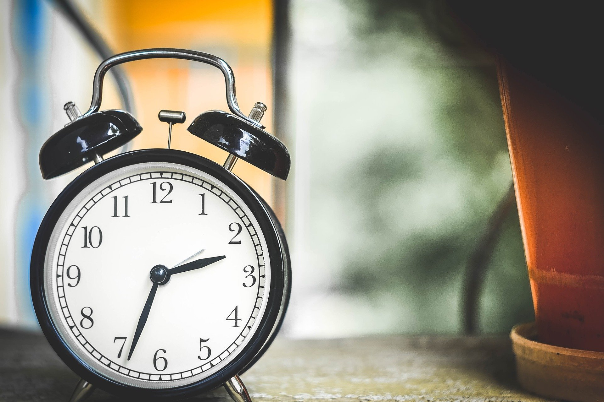

Jazdíte na bicykli? Ja som len prednedávnom opäť začal. Jedného dňa sme sa spolu s bratom rozhodli, že k rodičom na vidiek nepôjdeme autom, ale bicyklami. Kým sme boli v meste, užívali sme si to. Chodili sme po vyhradených cyklistických chodníkoch, fúkal príjemný vietor, nikam sme sa neponáhľali a cesta nám ubiehala. Keď sme však opustili mesto, všetko bolo zrazu inak. Okolo nás rýchlym tempom prechádzali desiatky áut. Všade bol cítiť benzín, z áut sálalo teplo a nám prudko stúpal adrenalín.

Do toho prišiel prvý kopec. Prehodil som si najľahší prevod a pomaličky som začal stúpať. Kopec to bol menší, ale chýbal mi cvik. Mal som čo robiť. Potom prišla vytúžená rovinka a konečne som si mohol oddýchnuť. Keď tu zrazu prídeme k najobávanejšiemu kopcu na našej trase — [Župčianskemu kopcu][zupcany-hill]. Keď som sa pozrel hore, skoro som nevidel koniec. No nedalo sa nič robiť. Zaradil som si najľahší prevod a pomaličky som šiel.

Kopec však stále akoby nemal konca. Brat to ešte zvládal, ale ja som si povedal, že musím zastať. Chvíľu som šiel pešo a potom som sa pokúsil opäť nasadnúť na bicykel. Prešiel som však ďalších 300-400 metrov a musel som zosadnúť opäť. Bol som demotivovaný a vysilený. Videl som tú horu a s obdivom som spomínal na cyklistov, ktorí na Tour de France prekonávajú Pyreneje. Chvíľu to trvalo, ale nakoniec som dosiahol vrchol a cestu som zvládol asi za dve a pol hodiny. Spotený a unavený, ale šťastný, že to mám za sebou.

Asi pred týždňom som videl [jedno video][mtbike-climbing] ako zvládať kopce na bicykli. A viete, čo je základ? Nepozerajte na vrchol toho kopca, ktorý sa zdá byť nekonečne vzdialený. Namiesto toho si kopec rozdeľte na úseky. Pozrite sa pred seba a nájdite si styčný bod, napríklad najbližšiu zákrutu. Keď k nej prídete, nájdite si ďalší úsek. Takýmto spôsobom sa stále posúvate vpred a vaša psychika trpí oveľa menej.

  
  <figcaption>Pyreneje. Zdroj: armennano, Pixabay</figcaption>

Viete, prečo novoročné predsavzatia nefungujú? Pretože ľudia si stanovujú veľké, častokrát nereálne ciele. A keďže nevedia ako ich splniť, rýchlo to vzdajú. Veľký cieľ je pritom ako ten kopec. Aby ste ho zdolali, potrebujete si ho najprv rozdeliť na menšie úseky — splniteľné úlohy. A zrazu ani neviete ako a ste hore.

Ešte horšie ako stanoviť si nereálny cieľ je nemať žiadny. V mojom okolí mám mnoho priateľov, ktorí nevedia, čo chcú, a prešľapujú na mieste.

Jeden z nich, volajme ho Peter, pochádza z dobre zabezpečenej rodiny. Peter sa nepravidelne raz za týždeň-dva stretával s jeho kamarátom Martinom. Objednali si kávičku a diskutovali spolu, aké prekážky vidia na ich ceste za osobnostným rastom. Raz k sebe pozvali aj mňa. Keď som ich tak počúval, prišlo mi, že je to len nekončiaca debata pri kávičke, ktorá nikam nevedie. Ani jeden z nich totiž nemal konkrétny, merateľný cieľ, kam sa chce posunúť. Preto, keď sa ma spýtali na môj názor, poďakoval som im za pozvanie a povedal som, že takéto debaty nie sú pre mňa. To, že som to považoval pre mňa za stratu času, som už nespomenul. Koniec-koncov, pokiaľ to stretávanie im dvom niečo dáva, nech v tom pokojne pokračujú. Ja však presne viem, kam smerujem, a takéto stretávanie sa ma na mojej ceste brzdí.

S Petrom sa stretávam pravidelne a mám pocit, že sa už ani nesnaží vystupovať zo svojej komfortnej zóny. Je finančne zabezpečený, nemá nôž pod krkom a svoj čas trávi rozjímaním, čo vlastne chce. Niekedy v auguste minulého roka sa rozhodol, že prestane pracovať v rodinnej firme a že sa presťahuje natrvalo do Bratislavy, kde si nájde prácu. Je jún, on je ešte stále v Košiciach a hľadá si prácu.

Moja druhá kamarátka, volajme ju Monika, vyštudovala umelú inteligenciu na miestnej univerzite, pracuje v IT a medzi jej veľkú záľubu patrí pečenie zákuskov. Podobne ako Peter ešte nevie, čo chce. Avšak vidím na nej obrovskú snahu zistiť to. Neustále navštevuje množstvo meetupov, workshopov a školení, nedávno začala písať blog a vidím na nej, že sa nebojí experimentovať. Medzičasom sa rozhodla zlepšiť svoje praktické znalosti sociálnych sietí, ktoré sa jej zídu bez ohľadu na to, čo si vyberie. Avšak, pokiaľ navštevuje meetupy zamerané na umelú inteligenciu aj pečenie, jej posun je oveľa pomalší. Taký meetup trvá aspoň dve hodiny. Čas, ktorý mohla stráviť študovaním nejakej techniky pečenia. Prajem jej, nech sa už čoskoro rozhodne a nech ide za svojím cieľom.

> Nie je dôležitý cieľ, ale cesta, ktorá nás k nemu dovedie.

Neviem, ako vy, ale ja by som sa nechcel jedného dňa prebudiť ako milionár a mať zrazu splnené všetky svoje ciele. Chcem si úspech postupne vybudovať. Práve tá cesta je to, čo ma baví. Niekde som to už spomínal: budovanie úspechu beriem ako počítačovú hru. Hru, ktorá nemá konca a len na našej šikovnosti záleží, ako ďaleko sa dostaneme.

Známi mi často vravia ako ma obdivujú, keď vidia, aký mám jasný cieľ. Ale ešte pred takými dvomi rokmi som bol tam, kde Monika. Chodil som do práce a po večeroch som chodil na meetupy zamerané na softvérový vývoj, umelú inteligenciu, dizajn používateľského prostredia, vývoj vstavaných systémov, marketing a mnoho iného. Časovo to bolo náročné, avšak vedel som jedno: je lepšie nejaký čas prešľapovať na mieste a hľadať sa, ako ísť nesprávnou cestou a neskôr si to uvedomiť. Na druhej strane, hľadať sa príliš dlho, ako to robí Peter, je druhý extrém.

V mojom prípade som si doprial čas na premýšľanie asi pol roka. Môj problém je, že čohokoľvek sa chytím, som v tom dostatočne dobrý na to, aby som sa tým živil. Tým sa moje možnosti ešte zväčšujú. Baví ma programovanie, ale ako zisťujem, už aj písanie, tvorba videí, či vedenie ľudí. Zároveň som sa za tie roky doteraz nešpecializoval a rád by som svoje komplexné znalosti z mnohých odvetví využil čo najlepšie. Logicky som prišiel k záveru, že práca, kde využijem všetky svoje vedomosti, neexistuje, a musím si ju vytvoriť.

Startupy som s obľubou sledoval už dlhšie, ale neuvažoval som, že by som sa do nejakého pustil. Ale práve tam vidím príležitosť využiť všetok svoj talent. Hlavne v začiatkoch, keď je v tíme málo ľudí, záleží úspech celého projektu práve na zakladateľoch. Keď som sa teda konečne rozhodol, že chcem mať startup, už som mal svoj dlhodobý cieľ. A všetko ostatné už smeruje k tomu, aby som svoj cieľ zhmotnil.

## Ako si stanoviť svoje dlhodobé ciele?
Úplne vám neporadím, ale základom je spomaliť a premýšľať o sebe. Zoberte si pero, papier, vypnite mobil, počítač a píšte si, čo vám napadne. Čo radi robíte? Máte niečo, čím sa chcete presláviť? Píšte a hlavne premýšľajte... Vaše ciele nemusíte napísať na jedno posedenie, doprajte si čas. Ja som na svojich cieľoch pracoval v priebehu niekoľkých týždňov.

Toto sú niektoré z mojich dlhodobých cieľov (viac ako 5 rokov). Všimnite si, že mnohé sú ešte relatívne abstraktné a nemám pri nich stanovený termín:
- Byť finančne nezávislý. Mať dostatok peňazí, aby som nemusel riešiť, koľko ich míňam
- Diverzifikovať príjmy a nebyť závislý len od jedného zdroja
- Založiť aspoň jeden úspešný open-source projekt
- Robiť to, čo ma baví, bez kompromisov
- Naučiť sa hrať na klavír

Keď už však máte takto stanovené ciele a viete, kam sa chcete dostať, pomôže vám to určiť si strednodobé (2-5 rokov) a krátkodobé ciele (menej ako rok) a tie rozbiť na ešte menšie. Všimnite si, že kým strednodobé ciele sú ešte stále abstraktné, tie krátkodobé sú už konkrétne a sú merateľné. Všetky ciele si zároveň ešte rozdeľujem do oblastí ako práca, financie či hobby. Pozrime sa na niektoré z nich.

Strednodobé ciele:
- Vedieť spraviť prieskum trhu a dať dokopy solídny podnikateľský plán
- Networkovať a budovať sieť kontaktov, primárne cez sociálne siete
- Naučiť sa rýchlo čítať a techniky na zlepšenie pamäti
- Nájsť si mentora (softvérový vývoj/osobnostný rast)

Krátkodobé ciele:
- Prečítať aspoň jednu odbornú knihu v oblasti podnikania a marketingu mesačne
- Do konca roka 2020 mať na platforme Medium aspoň 500 odberateľov
- Prispieť do ľubovoľného open-source projektu aspoň jednou featurou/bugfixom týždenne
- Do konca septembra sa naučiť základy ReactJS a JavaScriptu

Tieto moje ciele nie sú vytesané do kameňa. Priebežne ich aktualizujem podľa okolností. Ak napríklad zistím, že ovládam rýchločítanie na dostatočnej úrovni, dokážem prečítať nie jednu knihu o marketingu mesačne, ale rovno päť. Zároveň iné veci môžu trvať dlhšie ako ste si mysleli. Podstatné je stále mať plán a udržiavať ho aktuálny.

## Ako začať ciele napĺňať?
Rozdiel oproti všeobecným cieľom, ako napríklad že chcete schudnúť, je pri týchto v tom, že vychádzajú z vášho vnútra a máte preto motiváciu ich napĺňať. Odkedy som si stanovil tieto svoje ciele, nepotrebujem žiadne techniky na manažment času, aby som sa dokopal k práci. Prirodzene na svojich cieľoch pracujem, pretože už mám víziu, kam smerujem.

Svoje krátkodobé ciele si rozdeľujem na úlohy, ktoré priebežne plním a kontrolujem si ich asi raz mesačne. Ak poznáte [Kanban tabuľku][kanban-board], tak viete, čo mám na mysli. Kedysi som na ľudí, ktorí používajú Kanban tabuľku na osobné plánovanie, pozeral s údivom, ale musím uznať, že je to efektívna technika. Raz za mesiac si tam nahodíte úlohy a priebežne ich presúvate medzi stĺpcami Urobiť, Práve robím a Skončené. Na prvý pohľad viete, ako vaše úlohy napredujú a to je základ — mať informácie pokope.

  
  <figcaption>Kanban tabuľka s mojimi úlohami</figcaption>

Veľmi sa mi osvedčilo, keď som si tieto úlohy rozdelil do niekoľkých oblastí a tým som vo svojom kalendári vyhradil časové okno. Takže napríklad medzi ôsmou až desiatou večer sa venujem písaniu. Aj keď nie každý deň sa mi podarí všetky úlohy dodržať, aktívne sa o to snažím a celkovo napredujem. Z kalendára mi navyše chodia notifikácie, takže mi neustále pripomína, čo je na programe.

Plnenie cieľov s obľubou prirovnávam k jednej scéne z filmu Apollo 13. Keď už sa posádka neúspešnej misie blížila k Zemi, museli spraviť korekciu dráhy. A keďže počítač bol vypnutý, manéver spravili ručne.

  <YouTube videoId="Wm628c3sgt8" />
  <figcaption>Apollo 13: ručný zážih</figcaption>

Zem bola ich cieľ, ktorý videli vo svojom okienku a na jednu minútu zapli motory. Ich loď sa metala na všetky strany, ale svoj cieľ nestrácali z dohľadu. Nakoniec, ako vieme, úspešne pristáli. To, ako sa loď vychyľuje striedavo do strán, by som prirovnal k plneniu krátkodobých cieľov. Avšak stále sa blížite k tej vašej „Zemi‟ a keď sa po roku obzriete späť, uvidíte aký kus cesty ste prešli. Vidím to na sebe.

## A čo ak nemám čas?
Túto výhovorku počúvam často. Ľudia mi vravia, že nemajú čas a potom vidím, ako sa každý deň chodia niekam zabaviť alebo pozerajú Netflix. Pokojne si spravte analýzu a rozdeľte si vašu činnosť počas dňa na dve skupiny — veci, ktoré vás k cieľu približujú a tie ostatné. Garantujem vám, že každý má množstvo aktivít, ktoré dokáže obmedziť. Nepoviem rovno zrušiť, pretože správna rovnováha medzi prácou a zábavou je dôležitá.

  
  <figcaption>Zdroj: obpia30, Pixabay</figcaption>

Keď prišla koronakríza, aktivoval som si načas Netflix a uvedomil som si, že je tam veľmi kvalitný obsah. Rozpozeral som dokument o [Formule 1][netflix-formula], neskôr ďalší o [cyklistike][netflix-movistar], do toho som si pozrel [fínsku kriminálku][netflix-sorjonen] a v konečnom dôsledku som prišiel na to, že pozeraním televízie trávim priveľa času a že môj pokrok stagnuje. Viem, že keby som mal Netflix aktivovaný, bude to pre mňa lákadlo a preto som ho zrušil. Opäť si ho aktivujem za odmenu napríklad o pol roka na jeden mesiac a potom ho opäť zruším.

Takisto som sa naučil hovoriť nie. Neraz ma známi pozývajú na rôzne podujatia a občas na niektoré zavítam, ale ako som už spomenul vyššie, zaradzujem si ich do škatuľky. Posunie ma účasť na podujatí bližšie k môjmu cieľu? Alebo ma naopak od cieľa vzdiali tým, že som ten čas mohol stráviť štúdiom a prácou na svojej vízii?

Už som zistil na vlastnej koži, že výroky slávnych majú mnoho spoločného. Úspech v hocičom vám nespadne z neba. Skoro každý si ho musel poctivo odmakať. Ja som sa rozhodol skúsiť to a dať do toho všetko. Takto o päť rokov to prehodnotím, ale už teraz viem, že by ma mrzelo, keby som do toho nešiel.

## Je čas pracovať, je čas oddychovať
Áno, čítate správne. Keby ste teraz zoškrtali všetku zábavu, fungovali by ste veľmi efektívne, ale hrozilo by vám vyhorenie. Plnenie dlhodobých cieľov je maratón. Musíte nájsť rozumnú rovnováhu medzi tým, aby ste napredovali a medzi oddychom.

Ak to s oddychom preženiete, prokrastinujete a po mesiaci neuvidíte žiadny pokrok. Na druhej strane, z vlastnej skúsenosti viem, že ak pracujem naplno, vydrží mi to len dva-tri dni. Aj ja potrebujem občas vypnúť.

Osobne vám veľmi odporučujem prechádzky vonku. Mozog funguje zvláštne. Keď chodíte, zapájajú sa do pohybu obe mozgové hemisféry a ich zvýšená aktivita zapája vašu logickú a kreatívnu stránku dokopy. Na mnoho nápadov som prišiel vďaka behu či prechádzke, pričom som sa ničím nerozptyľoval. Skúste niekedy počúvať váš vnútorný hlas v hlave.

## Budujeme udržateľný systém
Začať systematicky pracovať na vašich cieľoch chce prípravu. Nestačí o nich vedieť, ale musíte ich aj realizovať. Inými slovami, musíte si vytvoriť rutinu, kedy vám bude pripadať práca na nich ako niečo prirodzené.

Zo štúdií vieme, že vybudovať návyk trvá aspoň [60 dní][habit-study]. Prvé dni sú najťažšie, k práci sa musíte doslova dokopať. Priznám sa, občas aj ja podľahnem a poviem si, že pre dnešok to balím. Ale na ďalší deň to skúšam opäť. Inšpirujte sa profesionálnymi športovcami. Ich príprava na olympijské hry začína deň po skončení tých posledných. Makajú skoro štyri roky kvôli pár minútam pred zrakmi miliónov divákov.

Dodržujte disciplínu a sústreďte sa viac na plnenie úloh ako na plnenie konkrétneho termínu. Už viackrát sa mi stalo, že som termín nedodržal, ale napriek tomu som pokračoval a stanovil som si nový. Niekedy sa zase ukáže, že isté úlohy potrebujete riešiť s vyššou prioritou, tak sa im tých pár dní venujte. Nebojte sa prioritizovať. Vydržte a časom vám budú tieto veci pripadať prirodzenejšie.

## Cukor a bič
Už z čias praveku sme si zvykli, že po ťažkej práci prichádza sladká odmena. Avšak chcem vás upozorniť, že sa musíte mentálne pripraviť, že odmena dlho prichádzať nebude. Prvý rok-dva budete mať pocit, že všetko, čo robíte, nemá cenu. Vaša sladká odmena neprichádza. A práve v tomto sa líšia tí úspešní od tých priemerných.

Každý raz narazí na hranice svojich možností. Ak sa v tejto chvíli vzdáte, ostanete navždy priemerní. No ak však vytrváte, postupne a pomaly túto hranicu začnete posúvať ďalej a časom sa úspech dostaví.

> Mentálne nastavenie je polovica úspechu.

Aktívne bloggujem asi rok. Toto je môj dvadsiatydruhý článok. Moje prvé články nečítal skoro nikto, ale nevzdal som to. Zistil som totiž, ako mi písanie pomáha utvárať si myšlienky na rôzne témy a aj moja angličtina sa zlepšuje.

Niekedy okolo Vianoc minulého roka som napísal svoj [článok][niche-market-post] o tom, prečo má zmysel sústrediť sa na niche market a zrazu som dosiahol svoj prvý úspech. Tento článok v čítanosti vyletel vysoko nad ostatné. Nadšený som pokračoval v písaní, ale ďalšie články si opäť skoro nikto nevšímal. No ako vidíte, skúšam to ďalej. Mentálne sa pripravte na to, že úspech nemusí dlho prichádzať, ale napriek tomu vytrvajte.

  
  <figcaption>Zdroj: StockSnap, Pixabay</figcaption>

Tak čo? Už viete, čo chcete v živote robiť? Ešte stále sa bojíte vykročiť z tieňa?

Je to jednoduché: zistite vaše vnútorné ciele, tie vás motivujú prekonávať prekážky. Vypracujte si systém a začnite plniť úlohy, ktoré vás k cieľom začnú posúvať. Práve som vám dal nástroje a povedal, ako ich máte použiť. Ozaj, viete, čo sa stane, keď sa dostanete na vrchol vášho cieľa? Obzriete sa naokolo a uvidíte okolité kopce, na ktoré sa môžete vydať. Cesty vedú všetkými smermi a je na vás, ktorú si vyberiete. Prajem vám veľa úspechov.

[//]: # (Used references)
[mtbike-climbing]: https://youtu.be/Qk4aEMbr9LM
[kanban-board]: https://en.wikipedia.org/wiki/Kanban_board
[netflix-formula]: https://www.imdb.com/title/tt8289930/
[netflix-movistar]: https://www.imdb.com/title/tt12048124/
[netflix-sorjonen]: https://www.imdb.com/title/tt4937942
[habit-study]: https://jamesclear.com/new-habit
[niche-market-post]: https://www.zahradnik.io/uspesny-startup-zamerajte-sa-na-niche-trh!
[zupcany-hill]: https://www.google.com/maps/@49.0055112,21.1665083,3a,75y,259.59h,74.79t/data=!3m6!1e1!3m4!1sEDFINascV1TjUus776m3mw!2e0!7i13312!8i6656