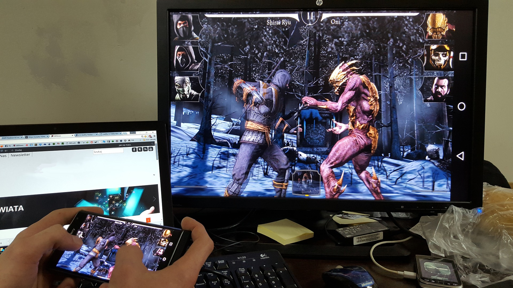

I just finished reading a new book by Richard Cooper called [The Unplugged Alpha][the-unplugged-alpha]. It reveals certain core principles on which we built our society. Also, it gives us a guide on how to better navigate through our lives. I was particularly intrigued by one chapter, which the author called "Manage the fucks you give." So what's the gist of it?

The author explains this with a simple example. As a young man, he played the computer game Mortal Kombat with friends.

  
  <figcaption>Image by ArtificialOG from Pixabay</figcaption>

In this game, two opponents fight against each other. Each fighter has a life bar in the corner of the screen. As they fight, both fighters gradually lose their power. Ultimately, one warrior loses all of it. One warrior dies while the other celebrates victory.

Let's apply this concept to our world. It's eight o'clock in the morning, and you've got up full of energy. You brush your teeth, make coffee, drive to work, do your daily job, etc. Every time you pay attention to something, you waste a tiny fraction of your daily energy. The amount you have is not infinite. On the contrary, it is *extremely limited*, and therefore you should think very carefully about what you will spend your energy on. Imagine that you have a similar energy bar like the fighters in the game. When the power runs out, you are only able to go to bed and get some sleep.

> Let's learn to control our energy.

Especially when you have big goals, you can't be distracted by the little things. Here are some examples:

## Example 1: A BMW asshole
You drive to work on the highway when an asshole with a BMW suddenly cuts you off, and you have to brake hard. What you're probably feeling right now are the bursts of anger. You have two options:
- Let the anger out. You start chasing the guy, and when you are next to him, you show him your middle finger through the window
- Calm yourself down

In the first case, you have wasted your energy unnecessarily. In the latter, you saved it for an activity that makes more sense.

## Example 2: Discussion on social networks
You've posted a new post, and as the topic was hot, many negative comments start to pile up, while the commenters start insulting you. Again, you have two options: join the discussion, waste time and energy, or leave it be.

## Example 3: An energy vampire
You are at a family party, and your mother-in-law is sitting next to you. She runs an unending monologue about things that you do not give a crap. While at it, she keeps no attention to the people around her. Just by listening to her, you're wasting your precious energy. Again, you have two options:
- Keep listening to her or
- Go away

There is even a third option. You can leave the party and focus on your things. Is that socially inappropriate? *I don't care!*

## Example 4: Persuading people
As a final example, I will give a true story from my surroundings. Since the COVID crisis began, my friend has started compiling information from various sources, formulate it into a simple form, and inform people around him. Like me, he perceives that censorship is on the rise, our elects break our constitutional rights, and we're getting closer to totalitarianism while people are not acting.

My friend even printed various leaflets and distributed them to random people on the street. The result is that nothing has changed. We don't know if any of them read his work at all. However, we know from conversations with his family that although his relatives often heard him out and sometimes nodded, after an official order came from our government, everyone eventually obeyed the orders.

## I don't give a fuck
Simply put, in each situation, you have two options — "to give a fuck" or "don't give a fuck" (or "give zero fucks"). Thus the "Zero Fucks Given" approach.

  
<iframe src="https://giphy.com/embed/l0HlzKskb3WbpWsKc" width="100%" height="100%" style="position:absolute" frameBorder="0" class="giphy-embed" allowFullScreen></iframe>

<a href="https://giphy.com/gifs/season-3-trailer-amc-3ohze2m5cNyumzUMp2">via GIPHY</a>

My friend and I went even further in the analysis. If our energy is extremely limited, we should define a base unit and the number of units per day.

We thought like this: We defined *1 fuck* as the base unit. We sleep for eight hours, so we have about 16 hours left. Let's determine that 1 fuck will correspond to a time of half an hour. Why so much? Well, this is not an exact science. The point is, even if someone cuts you on the highway, it will mess you out, and you'll be processing it for a while. Half an hour came to us as a reasonable compromise.

We had a blast with this debate; it was prolific and creative.

Soon, we started giving more and more examples. Is this worth a "fuck" or not? We laughed more and more.

But what is vital, despite the light form, I think it is a powerful approach. Our time on Earth is heavily limited. I don't know about you, but I'd like to make the most of it. As they say, "I would like to make a dent in the universe." I am motivated, but at the same time looking for ways to help me achieve my goals.

Yes, we often hear that the rich "have learned to say NO." But even that is an abstract idea. When you determine that you have 32 fucks a day, you think differently: Is this worth one "fuck" or not?

  <YouTube videoId="p8aulstjbV8" />
  <figcaption>Thomas Benjamin Wild Esq: I've No More F***s To Give (Unplugged Ukulele)</figcaption>

## Better self-control
The things I write about seem simple on paper, but it's harder to apply them in real life. You have to learn to control your anger. I believe that your self-confidence will gradually increase, and you will become more balanced over time. There are many books on this topic. Just search the net.

## Conclusion
The "Zero Fucks Given" approach is so simple that it's astonishing that I didn't figure it out myself. But that's why we have books or posts like this. I gave you instructions, the next steps are up to you.

[//]: # (Used references)
[the-unplugged-alpha]: https://www.goodreads.com/book/show/56048522-the-unplugged-alpha