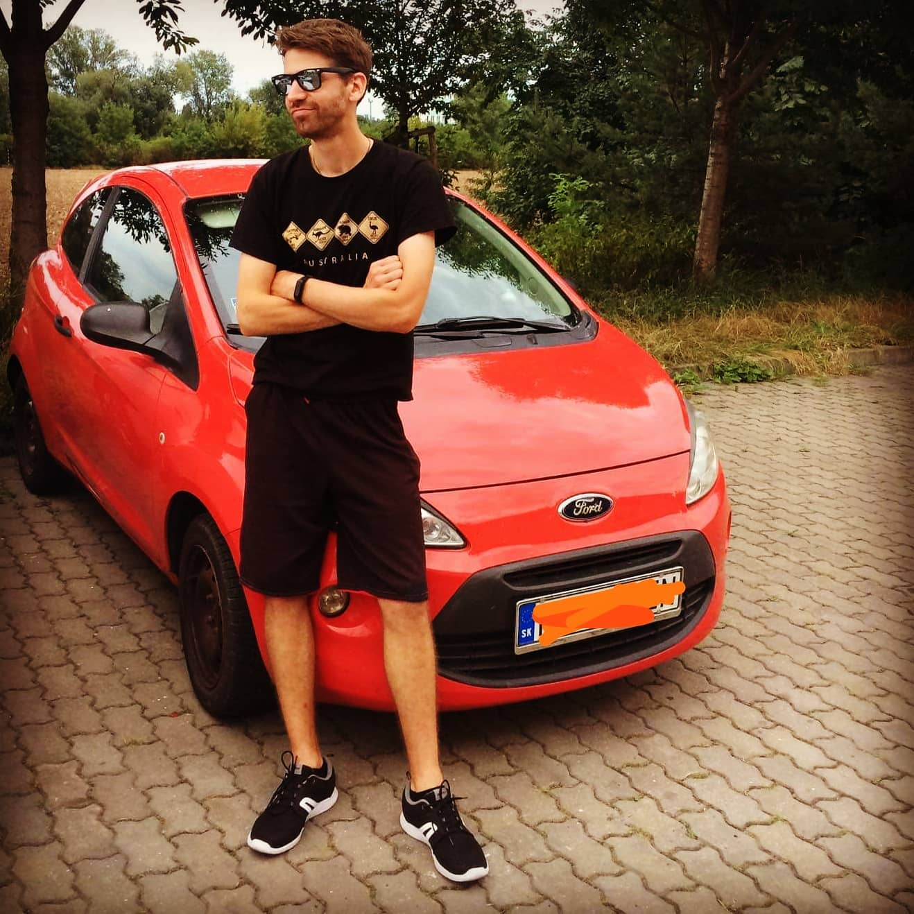
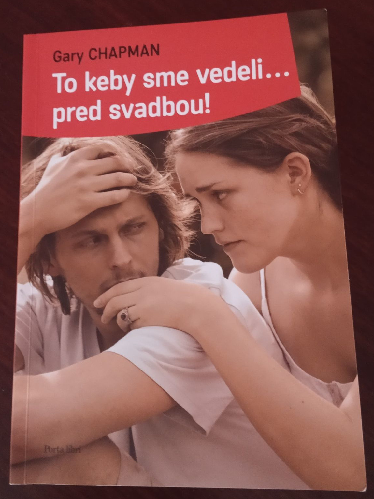

V januári som sa nečakane rozišiel s priateľkou. O tom, čo som vtedy prežíval, som napísal v príspevku [Zblíženie][come-closer-post]. Tam však náš príbeh ani zďaleka nekončí. Chcete vedieť, čo sa dialo ďalej? Pripravte si kávu alebo čaj, pohodlne sa usaďte, začíname...

## Čo bolo ďalej?
Po rozchode sme sa dohodli, že ostaneme aj naďalej blízkymi priateľmi. Nely mi stála za to a ja jej tiež. Síce som na ňu neustále myslel, ale bral som to ako niečo, čím po rozchode prechádza asi každý. Aj keď spočiatku naša komunikácia tak trochu viazla, netrvalo dlho a my sme si písali, ako keby sa medzi nami nič nestalo. Tú našu nezhodu, ktorá spôsobila rozchod, sme si vysvetlili a chvíľu to vyzeralo, že sa dáme opäť dokopy.

## Videovizitky
Jedného dňa mi Nely poslala krátke video. Začínalo: „Ahoj, Vlado...“ a vnímal som z neho, že ho Nely nahrala niekomu, na kom jej skutočne záleží — mne. Dostal som nápad. Čo keby sme si namiesto písania posielali krátke videá? Obaja sa zdokonalíme v ich tvorbe, navzájom si budeme dávať spätné väzby a zároveň videá pôsobia osobnejšie ako text. Tak začali naše videovizitky. Posielali sme si ich nepravidelne zhruba raz za deň-dva.

  <YouTube videoId="0HBl8k7V36c" />
  <figcaption>O hre na akordeón (videovizitka #7)</figcaption>

Bol piatok večer, pozeral som film a popri tom sme si spolu s Nely písali. Cítil som sa príjemne. V tom sa ma Nely spýtala jednu vec a keď sme sa začali o tom rozprávať, zase sme prudko narazili. Prestali sme komunikovať a v nedeľu, keď som sa vrátil z prechádzky, som si našiel od Nely nie veľmi príjemnú správu. Na ňu som zareagoval ešte horšou a po pár takýchto správach bol opäť koniec.

Už som si myslel, že ten náš januárový rozchod bol spôsobený obyčajným nedorozumením. A tu zrazu neprešli ani dva týždne a prišlo ďalšie... Dá sa takto fungovať? Ako chceme budovať vzťah, keď najprv fungujeme ako nerozluční kamaráti, smejeme sa, debatujeme, a po istom čase zase padneme na hubu?

## Nešťastná komunikácia
Po tejto druhej nezhode som si už povedal, že „tretíkrát do tej istej rieky už nevkročím.“ Aj som chvíľu premýšľal, že to takto napíšem aj Nely. Dnes som rád, že som sa ovládol. Napísal som jej, že s ňou na niekoľko mesiacov potrebujem prerušiť kontakt. Nech mi nepíše nič, čo nesúvisí s Toastmasters (sme obaja vo vedení). Zároveň som jej povedal, nech si hľadá nového mentora, pretože už si na ňu nechcem míňať energiu. Po pár mesiacoch buď spolu komunikovať pomaličky začneme, alebo nie...

  
  <figcaption>Zdroj: Free-Photos, Pixabay</figcaption>

Nely mi odpísala. Stále vravela, že chce so mnou byť kamarátka. Dvere sú u nej kedykoľvek otvorené. Na záver sa podpísala ako „(stále zaľúbená) Nely.“ To ma rozhodilo do nepríčetnosti. „Naznačuje mi tým snáď niečo? Dúfa, že teraz na všetko zabudnem a začnem o ňu bojovať? Je to nejaký test?“

V tejto zlosti som jej napísal ďalšiu správu, ktorú dnes ľutujem. Stálo v nej: „Ty ma miluješ? Nie, ty miluješ len nejakú zidealizovanú predstavu mňa. Podvedome túžiš po tom, aby som s Tebou pravidelne chodil do kostola, držal poslušne hubu a krok a bol katolík ako ty. Nely, prajem Ti, aby si sa raz stretla s realitou a našla si niekoho, s kým sa dá budovať vzťah na pevných základoch.“

## Neviem ju dostať z hlavy von
Odvtedy som s Nely prerušil takmer všetku komunikáciu. Keď mi niečo napísala, cítil som sa zvláštne. Mal som taký ten pocit, ako keď komunikujete s niekým preto, že musíte a obaja by ste sa najradšej tejto komunikácii vyhli.

Asi týždeň som sa z toho všetkého spamätával. Či už som bol doma, alebo niekde vonku s kamarátmi na debate, stále som myslel len na Nely. A nie len vo svojej hlave. Neustále som veci okolo nej vyťahoval do debát a snažil som sa pochopiť, čím som to práve prešiel. Teraz si uvedomujem, že to bol pre mňa spôsob, ako zo seba dostať tú bolesť a začať nejako normálne fungovať.

## Čas lieči
Po dvoch týždňoch som už vyfučal. Na Nely som už nemyslel tak často a dokázal som sa opäť sústrediť na prácu a ako-tak normálne fungovať. Nely mi okrem iného dávala cenné spätné väzby, aj k mojim textom. Povedal som si, že by bola škoda úplne sa odstrihnúť a nevyužiť pomoc, ktorú mi vie poskytnúť.

Napísal som jej: „Ahoj Nely, už ma to prešlo. Keď chceš, môžeme sa opäť začať baviť aj o iných veciach ako Toastmasters.“ Smajlík v jej odpovedi ma potešil, asi sa to dá ešte nejako urovnať.

Napriek tomu som cítil, že jej komunikácia so mnou je rezervovaná. Nely komunikovala nezvyčajne stručne a písala málo. Myslím si, že sa úmyselne krotila.

Raz som jej len tak medzi rečou napísal, že ten náš druhý problém sa vyriešil sám. „Mimochodom, už tie veci, o ktorých sme sa vtedy bavili nerobím. Prečítal som si jednu knihu, a dospel som k názoru, že si treba vyberať bitky, do ktorých sa pustím. Vidíš? Výsledok je rovnaký, akurát som na to prišiel ja sám. Nebolo to, ako keď si sa ma Ty snažila zmeniť.“

Nely mi po čase odpísala: „Vlado, ani nevieš, ako ma hreje pri srdci, keď toto čítam. Mala som o Tebe správne tušenie a nesklamala som sa v Tebe. Nechcela som Ťa meniť. Len som Ti chcela vysvetliť môj postoj.“

## Raketový rozbeh
Ten rozhovor prebehol, pretože sme už obaja vychladli a dokázali sme sa vecne porozprávať. Vyplynul len tak mimochodom z debaty. Ale tých pár viet malo obrovský zmysel. Ja som si po celý čas myslel, že Nely sa ma pomaly snaží pretvárať na jej obraz. Kúsok po kúsku. Ona zasa mala pocit, že nedokážem riešiť problémy.

Samozrejme, že problémy riešiť dokážem. Ale keď niekto začne zasahovať do mojich zásad a pokúša sa ich meniť, tvrdo u mňa narazí. Preto, keď som si myslel, že Nely chce meniť to, kým som, ani som sa nepokúsil riešiť to. Ju ani nenapadlo, že za tým bolo toto a myslela si len, že sa veciam vyhýbam.

Odkedy sme si však toto vyjasnili, veci začali naberať raketovú rýchlosť. Opäť sme komunikovali ako veľmi blízki priatelia a rozprávali sme sa o hocičom. Dokonca sme spolu občas mali aj hodinový videohovor, ktorý mal častokrát aj hodinu a pol. Takto sme fungovali až do minulého utorka.

## Oneskorený Valentín
Dostali sme sa opäť do stavu, keď sme sa začali baviť o tom, že to spolu ešte skúsime. K Nely som mal opäť dôveru a ona ku mne tiež. Niekedy okolo Valentína z Nely vypadlo, že najradšej by ma mala vedľa seba.

Obaja sme teraz v čase lockdownu zavretí v iných okresoch. Medzi okresmi sa nesmie cestovať len tak a aj preto sme nič neriešili. Je čudná doba, ktorá nám skrátka nepraje. Nateraz bude lepšie, ak ostaneme len priatelia. Aspoň tak sme si vraveli...

Minulý týždeň v utorok k nám prišiel na otočku môj bratranec Danek z Brna. Priviezol auto, ktoré sme mu dlhodobo zapožičali, kým si nezoženie vlastné.

  
  <figcaption>Ford Ka, alias „Kečup.“ Foto: Daniel Černý (Hrbolka)</figcaption>

Naspäť mal ísť vlakom a ja som ho mal odviesť do Košíc. Nely som už dlhšie chcel zapožičať môj starší iPhone. Už má môj mikrofón a chcel som, aby na sebe pracovala a skúšala s týmto telefónom točiť videá. Telefón, ktorý má, jej nestačil a na ten môj len sadal prach. Chcel som jej ho požičať už dávnejšie, ale počas lockdownu sa mi do Košíc nechcelo. Tentokrát som tam ísť musel. Povedal som si, že Nely prekvapím.

Keď som bratranca vysadil pri železničnej stanici v Košiciach, na parkovisku som zavolal Nely: „Ahoj Nely, som v Košiciach, mohol by som sa zastaviť na čaj?“ Nely povedala áno a tak som za štvrť hodinky už zvonil pri jej dverách.

Ešte deň vopred mi písala, že najradšej by ma mala pri sebe. V utorok sme si spolu mali volať len takto na diaľku cez Internet. No namiesto toho sedím u nej v obývačke a obaja sa usmievame od ucha k uchu.

— „Vlado, ty si ma dnes naozaj prekvapil.“

— „Nuž, mal som cestu okolo, tak som si povedal, že sa zastavím.“

— „Urobil si to najlepšie, čo si mohol.“

Debatovali sme asi hodinku a pol a prišlo mi, akoby sa medzi nami vôbec nič nestalo. Odišiel som len preto, že som mal aj nejakú prácu, ktorá na mňa čakala. Táto moja návšteva však odštartovala sled udalostí až do dnešných dní.

Na ďalší deň, na Popolcovú stredu, sme mali s Nely opäť videohovor. Ešte predtým som o nás premýšľal v posteli. Nely povedala jasne: „Vlado, ak pôjdeme opäť do vzťahu, už to nechcem len skúšať. Nepoužívaj to slovo.“ No a ja som jej v túto stredu povedal: „Nely, už som si u Teba ujasnil všetko, čo som potreboval. Poďme do toho naplno. Vieš si predstaviť, že by sme sa takto za pár mesiacov zobrali?“ Nely sa usmievala a povedala „áno, viem si to predstaviť.“

Veci sa odvtedy dejú veľmi rýchlo, ale vlastne sa tak dejú odkedy s Nely chodím. Ani sa mi nechce veriť, že sme sa začali spoznávať koncom novembra a už sa rozprávame o svadbe. Asi sme obaja rovnako strelení. Je až neuveriteľné, ako sme sa našli.

## Zoznámka zvaná Toastmasters Košice
V našom klube je taká nepísaná tradícia, že ten, kto v klube robí prezidenta, má do roka svadbu. Za tých asi osem rokov, čo klub funguje, sa v ňom zoznámilo niekoľko manželských párov. Naposledy pred rokom sa zobrali naši bývalí prezidenti Lukáš Bičuš a Janka Kolesárová. Tú tradíciu berieme v klube všetci s humorom. O nás dvoch s Nely však doteraz netuší takmer nikto.

V pondelok sme mali dvesté stretnutie klubu. Nely predniesla motivačný prejav o tom, čo jej Toastmasters dal: *„Dá sa mať vďaka Toastmasters aj vzťah? Ja som ho získala [...] Obaja sme zavretí v inom okrese a premýšľame, ako to vyriešiť. Viac vám nateraz neprezradím. Dám vám však dve indície. Tá prvá je [Zblíženie][come-closer-post] (pozn. šlo o môj prvý blog k tejto téme) a pre teba, Kasi, mám ešte jednu, Dvaja z troch o tom vedeli (Šlo o improvizovanú poradu po jednom našom nevydarenom stretnutí. Boli sme tam ja, Nely a Vlado Kasarda, náš prezident. Nejako došlo aj k debate o Nelyinom vzťahu. My dvaja s Nely sme samozrejme vedeli, kto ten tajomný človek je, no boli sme ticho. Užívali sme si túto situáciu).“*

## Occamova britva
Odvtedy prešlo pár dní a viem, že viacerí sú zvedaví, kto je ten Nelyin nápadník. A viete čo je na tom krásne? Asi by aj vedeli, ale podľa mňa tú najjednoduchšiu a najpravdepodobnejšiu možnosť rovno vylúčili.

„Vlado, Nelyin mentor, tým priateľom určite nebude. Veď sú úplne rozdielni a hlavne Nely je predsa alergická na jeho direktívny komunikačný štýl.“ Takto nejako si predstavujem ich uvažovanie vo svojej hlave.

## To keby sme vedeli... pred svadbou!
Lenže ja jej priateľom naozaj som. Mohlo by sa zdať, že sme rozdielni, ale je to len zdanie. Pozeráme iné filmy, počúvame úplne inú hudbu, ja som pomaly do kostola nevkročil, ona chodí na omše aj každý deň... Ale v tých podstatných veciach nachádzame takmer úplnú zhodu. Oboch nás to prekvapilo.

Už asi týždeň si takto na diaľku čítame z knihy „To keby sme vedeli... pred svadbou!“ Manželia častokrát vstupujú do manželstva s ružovými okuliarmi a po svadbe to pomaly začne škrípať. Táto kniha sa tejto situácii snaží predísť tým, že hovorí, čo by si mali budúci manželia vopred ujasniť.

  
  <figcaption>Gary Chapman: To keby sme vedeli... pred svadbou! Foto: Nely Hudáková</figcaption>

Každý deň si prechádzame jednu až dve kapitoly a rozprávame sa, ako by sme riešili takú či hentakú situáciu. U väčšiny z nich sa však úplne zhodneme.

Naše životné priority sú zdá sa úplne rovnaké. Ja napríklad vnímam peniaze ako „kúpený čas.“ Peniaze mi umožňujú nejaký čas pracovať len na tom, čo chcem skutočne robiť, a prepočítavam peniaze na počet mesiacov, koľko dokážem vďaka nim fungovať. Nely to má rovnako. Zhodneme sa aj v iných veciach — je pre nás dôležitejšie byť spolu, hoci aj v skromných podmienkach, ako ísť na drahé dovolenky. Takisto sa zhodneme aj vo financiách. Ani ona, ani ja, nechceme kupovať veci na dlh a už vôbec nie niečo, čo vlastne ani nepotrebujeme. Ďalšia zhoda je prístup k životu. Snažím sa už dlhšie fungovať nelineárne. Nechcem, aby bol každý deň rovnaký — prídem do práce, pracujem, idem domov, večera, telka, a môžem ísť spať. Už pár rokov mám svoje dni veľmi pestré, nikdy presne neviem, čo budem robiť, a do tohto sveta som vtiahol aj Nely. Aj preto máme obaja pocit, akoby prešiel aj celý rok, pričom v skutočnosti ubehli len dva mesiace. V tomto chceme obaja pokračovať aj naďalej. Tých prienikov nachádzame každým dňom viac a viac.

## Budovanie mostov
Včera mi Nely napísala: „Odkiaľ sa v Tebe berú všetky tie pekné slová: rád Ťa budem spoznávať; každým dňom sa mi páčiš viac; to o modrých očiach (myslela som si, že to v Tebe nie je)? Toto sú slová, ktorými medzi nami buduješ mosty a získavaš si moju dôveru.“

Odpovedal som jej: „Vždy vo mne boli. Asi len tým, že Ťa lepšie poznám, už nemám žiadne zábrany a hovorím všetko, čo mi napadne.“

Nely na to: „Tak predsa nám chýbala dôvera.“

## Poučenia na záver
Náš vzťah s Nely je v mnohom zvláštny. Keď ma však poznáte, viete, že ja všednosť nehľadám. Popísal som jej ho nedávno takto: „Vyleteli sme rýchlo a príliš vysoko ako Ikarus, takže sme spadli na dno. No vstali sme a teraz mám konečne pocit, že stojíme na pevných základoch.“

Naučili sme sa s Nely niekoľko cenných lekcií. Možno sa zídu aj vám ostatným.

V prvom rade vám už viem s istotou povedať, že počas koronakrízy môže vzniknúť vzťah na celý život. Takže ak ľudia bedákajú, že sú zavretí u seba doma, len nerobia dosť na to, aby svoju situáciu riešili.

Ďalšia cenná lekcia pre nás je, že textové správy môžu význam a vnímanie informácie skresliť. Som presvedčený, že keby sme si nepísali, ale zhovárali by sme sa tvárou v tvár, pravdepodobne by sme sa vôbec neboli rozišli. Keď si píšete, vidíte len text. Stráca sa tam vnímanie emócií — písala to vážne? S humorom? Ako to myslela? Preto si dvaja ľudia môžu vysvetliť ten istý text úplne inak, po svojom a nesprávne. Odteraz máme s Nely dohodu. Keď najbližšie niečo také nastane, namiesto toho, aby sme unáhlene reagovali a situáciu ešte viac zhoršili, si napíšeme: „Nely, potrebujem si s Tebou niečo ujasniť. Môžeme si zajtra naplánovať videohovor?“ Myslím si, že takto vyriešime takmer všetky potenciálne problémy ešte v zárodku.

Tretia vec, ktorú si uvedomujem, je, že sa možno vezmeme po pár mesiacoch známosti. Dnes sa bežne páry spoznávajú aj niekoľko rokov. Potom prídu zásnuby a oni ešte rok chystajú svadbu. U nás mám pocit, že sme zásnuby rovno preskočili. Veď ja som ešte nestretol ani jej mamu a brata. Ale nebojím sa, že sa tou návštevou niečo zmení.

Kým kedysi sa ľudia brali po dvoch-troch mesiacoch úplne bežne, dnes je to považované za niečo šialené, neuvážené. Myslím si, že sa zmenila len doba a tak trochu aj ľudia okolo nás. Stále sú tu však takí ako my dvaja. Istú rolu asi hraje aj to, že pred vzťahom sme sa už poznali ako priatelia, ale to intenzívne spoznávanie sa začalo naozaj za taký krátky čas.

Na záver ešte jeden postreh: Nely nesmiem stavať do polohy: buď A alebo B. Vtedy to môže dopadnúť zle. Namiesto toho si radšej problémy vydiskutujeme z každej strany a dospejeme k nejakému spoločnému riešeniu.

V Nely som našiel ženu svojho života a ona si našla mňa. Vždy som sníval, že moja žena bude iná ako ja. Chodila mi po rozume učiteľka slovenčiny, ktorú zaujíma jazyk, hranie sa s ním, a nevie nič o matematike a počítačoch. Nely učiteľkou nie je, ale inak to platí do bodky. Tieto naše rozdiely vytvárajú harmóniu a dodávajú nášmu životu pestrosť. Po tých pár dňoch, čo s Nely intenzívne komunikujem, mám pocit, akoby bola v mojej hlave a ja v tej jej.

Do vzťahov sa mi nikdy veľmi nechcelo. Chcem, aby veci, čo robím, dávali zmysel. A chodiť na nekonečne veľa rande, spoznávať ženy a skúšať pár mesiacov až rokov, kým si budem istý, že som našiel tú pravú, sa mi nikdy nechcelo. Šiel som na to inak. Ak chcem nájsť ženu, ktorá má podobné záujmy ako ja, stretnem ju na tých istých podujatiach, kam by som šiel ja sám. A rečnícky klub Toastmasters je tak akýsi prirodzený filter. Všetci v ňom máme aspoň niekoľko vecí spoločných — nebojíme sa prijímať spätnú väzbu a pracovať na zlepšeniach, učíme sa počúvať tých druhých a komunikovať s nimi, všetkých nás baví prekonávať svoju konfortnú zónu a sme zvyknutí riešiť problémy. Ten môj prístup hľadania priateľky zjavne zafungoval, až ma prekvapuje, že som uspel hneď na prvý pokus.

Našli ste sa v tom poslednom odstavci? Tak sa k nám niekedy príďte pozrieť na stretnutie. Možno aj vy takto spoznáte ženu svojho života alebo budúceho manžela. Určite však stretnete skvelých a jedinečných ľudí, ktorých mám tú česť poznať už skoro tri roky.

[//]: # (Used references)
[come-closer-post]: https://www.zahradnik.io/zblizenie
