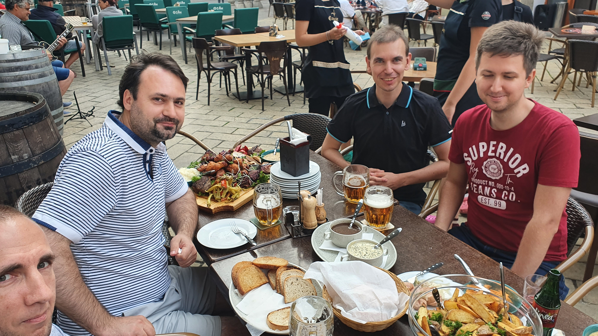

Dnes mám obrovskou radost a důvod k oslavě. Proč? Čtěte dál.

Jak už asi víte, začal jsem na kontrakt spolupracovat s firmou Ness a dnes měl náš tým teambuilding.

Neznal jsem tam nikoho, možná trochu mého šéfa, i to jen zběžně. Vždyť pracujeme z domu ...

Řekl jsem si, že dnes se zabavím a setkání s úplně cizími pro mě bude opět dobrá zkušenost a možná částečně i vystoupení z komfortní zóny. Z té však vystupuji už tak často, že mi to už ani nepřijde nepříjemné.

Přišel jsem do podniku, spatřil manažera a hned na úvod jsem zjistil, že přišla asi třetina lidí z týmu. Nic to, zařídím se...

Přisedl jsem si na kraj stolu a začal konverzaci. Ano, já. Dozvěděl jsem se, že můj šéf je původem z Hrabkova. Co by kamenem dohodil od Chmiňan, mé rodné vísky, kde dosud trávím víkendy. Poté však nějak z debaty vyplynulo, že jsem evangelík. Toho se chytila další slečna, Janka. Když se ukázalo, že jsem chodil na Evangelické kolegiální gymnázium v Prešově, zeptala se, jestli tam byl ředitelem jistý Damankoš. Řekl jsem, že ne... Za mých časů to byl můj třídní. Ona je prý jeho spolužačka — svět je malý.

  
  <figcaption>Další usmívavá fotka</figcaption>

Po těchto debatách jsem se zvedl a přesunul na druhý konec stolu. Jistý Jozef tam vášnivě vyprávěl jeho cykloturistické příhody. Vyzvídal jsem, kam to všude leze s kamarády a hledal jsem inspiraci. Považuje se za trampa, tak jsem se zeptal jestli neposlouchá Nohavici. Bum! Trefa do černého. Odtud jsme probrali Nedvědy, Spirituál kvintet, Landu i muzikály. A později počítačové historky, aby se nezapomnělo, že jsme informatici.

Přísedící Dominika zase miluje Beatles a byla v Paříži. Tak jsem o mém srdcovém městě řekl pár pikošek.

S dalším klukem, evidentně extrovertem, jsem mluvil o jeho několikaletých služebkách v cizině, hlavně o jeho sedmi letech v Berlíně. Řekl mi například, že potkal Daniela Brühla, toho herce z Good Bye Lenin! Prý byl úplný sympaťák a skromný.

Svou pouť jsem zakončil uprostřed stolu a debatu jsem vedl já.

Dnes jsem si uvědomil, jakou cestu jsem prošel. Od tichého chlapce až po někoho, kdo byl dnes úplný suverén, uvolněný a kdo sám vedl zábavu. A byl jsem jediný, kdo se aktivně zvedal a střídal místa, abych si popovídat se všemi.

Jediná černá tečka na dnešním setkání byla ta, že jsem se naobědval již doma. Netušil jsem, že budeme mít takovou hostinu, jakou jsme měli. Ušla se mi alespoň výslužka.

  
  <figcaption>Hostina v podniku Camelot v Košicích</figcaption>

Jsem na sebe hrdý. Už teď jsem dál než mnozí, kteří byli přede mnou. A moje cesta stále ještě neskončila.

## Dovětek, 28.6.2021
Tato moje příjemná epizoda ještě neskončila. Dnes je pondělí, od setkání uplynuly tři dny. Ráno jsem napsal třem lidem, s nimiž jsem měl nejlepší debatu.

Každému jsem napsal osobní zprávu, že rád bych v debatě pokračoval a připojil jsem tam něco, aby věděli, že je to zpráva jen pro ně... Například jsem se zeptal, jaký album od Beatles má Dominika nejraději. Dva ze tří se chytli a už si píšeme.

Uplatňuji věci, které fungují. Podobně i na konferencích někoho potkáte poprvé a pak se připomenete po pár dnech a následně udržujete kontakt. Nikdy nevíte, co z toho bude.

Networkovat jsem se naučil i díky [Toastmasters Košice][tmke]. Můj vzdělávací program se jmenuje [Strategické vztahy][strategic-relationships] a je to přesně o tom, jak efektivně navazovat kontakty. Víte to uplatnit v podnikatelském prostředí, ale i v osobním životě.

Život je jedno obrovské hřiště. Nebojte se zkoušet a experimentovat. Krok do neznáma je často nejrychlejší způsob jak na sobě pracovat.

[//]: # (Used references)
[tmke]: https://www.toastmasterskosice.sk/
[strategic-relationships]: https://www.toastmasters.org/pathways-overview/pathways-strategic-relationships-path