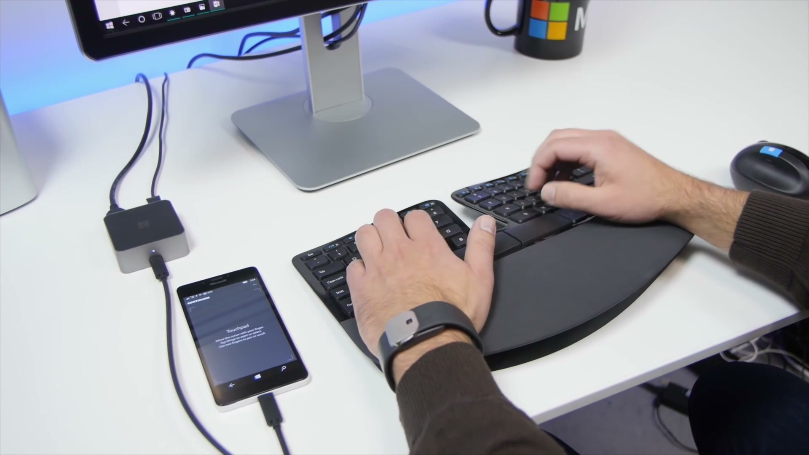
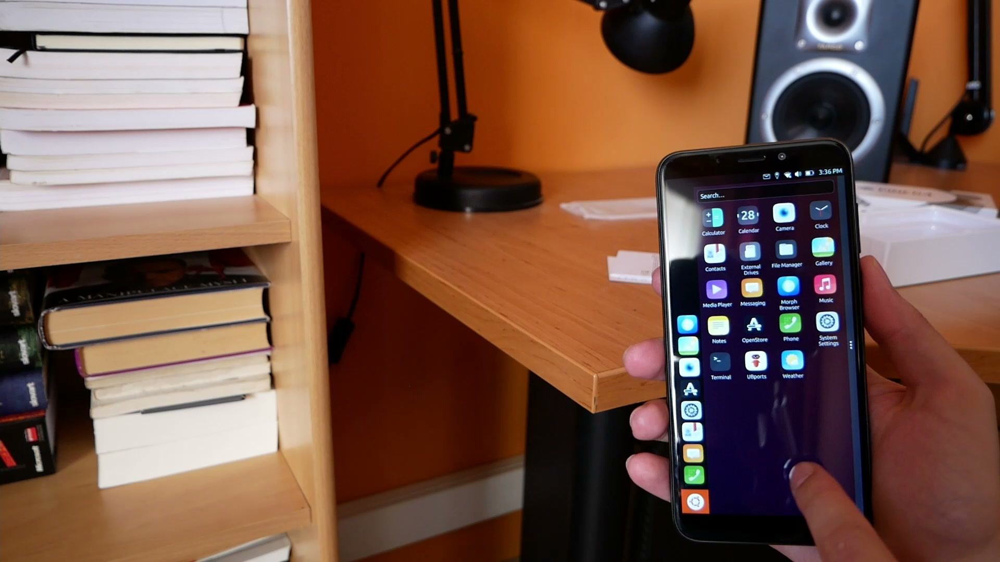
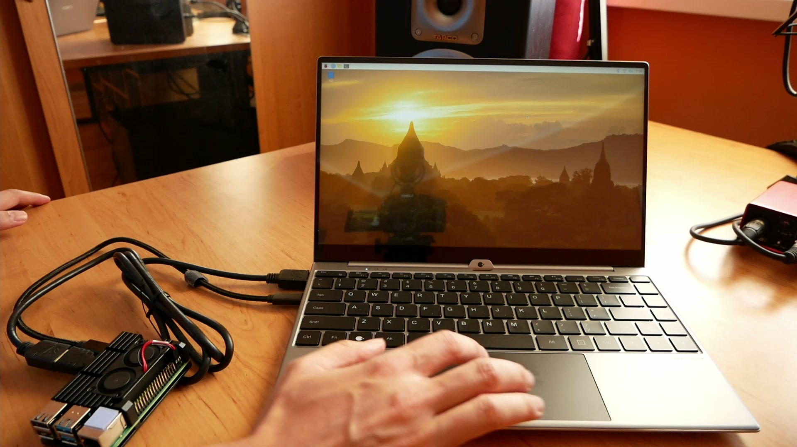

Mám sen — dlouhotrvající sen, že chci používat můj mobil jako linuxový notebook. Takže kamkoli půjdu, jen vložím svůj telefon do docku, a veškerou svou práci mám po celou dobu s sebou. Nechci používat více zařízení. S projekty jako [UBPorts][ubports] se můj sen pomalu stává realitou, ale před námi je ještě dlouhá cesta. Dnes vám ukážu [NexDock][nexdock], což je notebook poháněný vaším smartphonem nebo Raspberry Pi.

## Cesta ke kunvergenci
Firmy jako Microsoft a Canonical pracovali na [konvergenci][convergence] dlouhou dobu. Funguje to tak, že když připojíte k telefonu velkou obrazovku, uživatelské prostředí se změní na desktopové.

V roce 2015 jsem si koupil Lumii 950. Byl to telefon od Microsoftu, který měl také dock, do kterého jste mohli připojit externí displej, klávesnici a myš, a který nabízel s určitými omezeními prostředí, které připomínalo to z plnohodnotných Windows.

<div className="Image__Large">
  
  <figcaption>Lumia 950 připojena k docku</figcaption>
</div>

Byl to krok správným směrem, ale ten zážitek z používání nebyl velmi dobrý. Canonical, tvůrce linuxové distribuce Ubuntu, měl podobnou vizi. Chtěli přizpůsobit Ubuntu na mobily a přeměnit je po připojení k docku na plnohodnotné počítače.

<div className="Image__Large">
  
  <figcaption>Ubuntu Touch na mém Pine Phone</figcaption>
</div>

Nakonec od téhle myšlenky upustili, ale projekt stále žije díky komunitě a lidem z UBPorts. A také existují jiné skupiny, které se snaží o něco podobného, například taková [Plasma Mobile][plasma-mobile].

V roce 2018, 3 roky po vydání Lumie 950, přišel Samsung s jejich řešením, které nazval [DeX][samsung-dex]. Pro tu původní verzi jste si museli zakoupit speciální příslušenství. Později vám stačila obyčejná redukce z USB-C na HDMI. Nějaký čas dokonce Samsung dával k dispozici možnost spouštět na vašich telefonech Linux. Bohužel toto řešení přestaly podporovat v říjnu 2019.

Samsung DEX může představovat schopné řešení, ale funguje pouze se Samsung zařízeními. Nicméně v současnosti dokáží všechny moderní Android smartphony zajistit HDMI výstup přes USB-C. Android 10 přišel se [skrytým desktopovým režimem][android-desktop-mode], který přinesl tuto možnost na pár telefonů mimo Samsungu. V té době byl tento režim vysoce experimentální. Dokázali jste ho zapnout pouze přes Možnosti pro vývojáře. Tento režim však dostává pozornost a časem budou nadcházející mobily přinášet slušnou podporu přímo od výroby.

A tady se dostáváme k NexDocku. Jde o displej s klávesnicí, touchpadem a vlastní baterií. Všechno toto je zabaleno do hliníkového šasi, které připomíná ultrabooky. Bohužel můj telefon, OnePlus 6T, HDMI výstup nepodporuje, takže zkušenosti s tímto desktopovým režimem nemám. Možná si někteří myslíte, že mi slouží NexDock jako těžítko, ale mýlíte se. NexDock podporuje i minipočítače Raspberry Pi, a těch mám naštěstí dostatek. Pojďme se podívat, jak to celé funguje.

## Spoznejte NexDock
Koupil jsem si model NexDock Touch. Aktuálně je vyprodán, ale můžete si předobjednat [NexDock 360][nexdock-360]. NexDock v mnohém připomíná ultrabook. Na levé straně najdete pár USB-C portů a jeden HDMI port. Ten využijete v případě, že vaše zařízení neumí posílat obraz přes USB.

<div className="Image__Medium">
  
  <figcaption>NexDock Touch - porty na levé straně</figcaption>
</div>

Na pravé straně je jeden USB-A port a sluchátkový jack. Příjemně mě překvapila klávesnice, která je velmi pohodlná a tlačítka jsou dost velká.

<div className="Image__Medium">
  
  <figcaption>Klávesnice NexDock Touch</figcaption>
</div>

Součástí balení je nabíječka, potřebné kabely a redukce. Zkrátka vše potřebné, abyste zapojili vaše zařízení.

Podle toho, jaké zařízení máte, se zapojení trochu liší. NexDock poskytuje přehlednou brožuru a na jejich webu najdete rovněž [seznam podporovaných zařízení][nexdock-support]. Raspberry Pi 4 se zapojuje [celkově dvěma kabely][nexdock-rpi4], přičemž ten jeden je rozdvojka ve tvaru Y. Pokud však přidáte do konfiguračního souboru jeden řádek, víte místo této redukce použít standardní USB-C kabel. Jenom upravte soubor `/boot/config.txt`. Když znáte minipočítače Raspberry Pi, víte, co je třeba udělat.

```
# USB Type-C Host
dtoverlay=dwc2,dr_mode=host
```

Jak asi víte, Raspberry Pi má microHDMI výstup, takže potřebujete mít i redukci na plnohodnotné HDMI. I tu NexDock dodává v příslušenství.

Na Raspberry jsem nainstaloval nejnovější [Raspberry Pi OS][raspberry-pi-os]. Stejně dobře vám bude fungovat i Ubuntu, dokonce i [Windows 10 pro ARM][rpi-win10] zařízení. Otestované to ovšem nemám.

NexDock v této chvíli využívám hlavně jako přenosný monitor pro Raspberry Pi. Pro tento účel funguje dokonale.

<div className="Image__Large">
  
  <figcaption>Raspberry Pi 4 připojené k NexDocku Touch</figcaption>
</div>

Kdybyste neviděli připojené Raspberry Pi, skutečně byste měli pocit, že máte v ruce notebook. Fungují Fn klávesy, nastavení jasu, hlasitosti. Vše, na co jste zvyklí. Hlavně, když jste embedded vývojář jako já, takové řešení vám šetří čas. Nemusíte totiž odpojovat obrazovku, klávesnici a myš od počítače. Je to otrava.

## Nic není dokonalé
Překvapení! NexDock není dokonalý. Ačkoli většinou funguje bez problémů, našel jsem pár případů, kdy mě zklamal. Chtěl jsem použít svůj NexDock jako monitor, který dokážu zapojit k mému digitálnímu fotoaparátu. Vstupní HDMI port je dost vybíravý, takže se mi podařilo NexDock rozběhat s mým fotoaparátem pouze jednou. Rovněž tehdy, když je připojeno jen HDMI, nemůžete používat ovládání hlasitosti, protože nefunguje, alespoň na mém modelu. Redukce z microHDMI na HDMI je v dost špatné kvalitě. Rozlomila se mi už po pár použitích. Naštěstí jsou tyto adaptéry levné a snadno je umíte najít. Tyto chyby zamrzí, ale stále si myslím, že jde o hodnotné zařízení pro jistou cílovku.

## Závěr
Používat mobil jako počítač mi dává smysl. Dnešní výkon již dostačuje na běžnou práci. NexDock je kvalitní kus hardwaru a může být slušný doplněk na pracovní cesty.

Co si myslíte o konvergenci? Dává vám smysl používat váš telefon namísto notebooku? Dejte mi vědět v komentářích níže. Rovněž si můžete prohlédnout moje video na stejné téma. Díky a vidíme se!

<div class="Image__Medium">
  <YouTube videoId="SW3AZZxTsAk" />
</div>

[//]: # (Used references)
[ubports]: https://ubports.com/
[nexdock]: https://nexdock.com/
[convergence]: https://ubports.com/convergence
[plasma-mobile]: https://www.plasma-mobile.org/
[samsung-dex]: https://www.samsung.com/us/explore/dex/
[android-desktop-mode]: https://www.xda-developers.com/make-android-10-desktop-mode-useful/
[nexdock-360]: https://nexdock.com/360-touch/
[nexdock-support]: https://nexdock.com/support/
[nexdock-rpi4]: https://nexdock.com/support-touch-2/raspberrypi-4/
[raspberry-pi-os]: https://www.raspberrypi.org/software/
[rpi-win10]: https://www.worproject.ml/