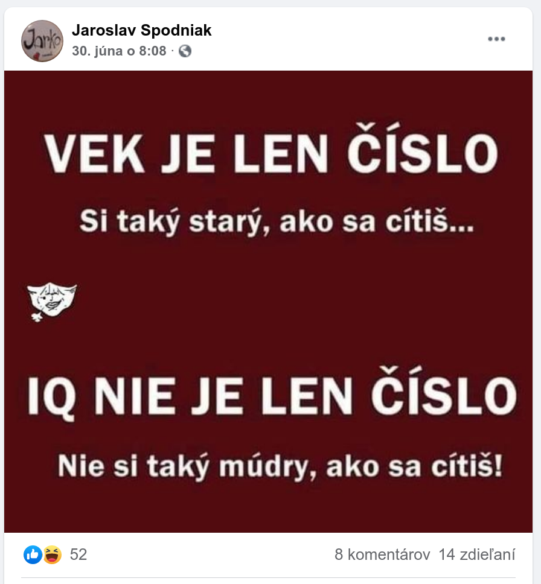

Asi pred tromi týždňami jeden môj známy zverejnil na Facebooku [príspevok][spodniak-post], v ktorom píše, že „Vek je len číslo. Si taký starý, ako sa cítiš...“ A bol tam ešte jeden výrok ohľadom inteligencie. Vtedy som mu napísal, že mu viem ľahko vyvrátiť obe jeho tvrdenia.

  
  <figcaption>Vek je len číslo</figcaption>

Môj kamarát Havran to vidí podobne, citujem: „Vek je len číslo, iba v určitých prípadoch. Ale vo väčšine na ňom záleží. Ak by bol vek iba číslo, pedofília by nebola nelegálna.“

## Prírodu neoklameme
Vedeli ste, že počas života sa nám [niekoľkokrát vymenia][human-cells-recovery] takmer všetky bunky ľudského tela? Avšak pri tvorbe nových buniek dochádza k chybám, drobným mutáciám. A práve tie vnímame ako starnutie. Náš imunitný systém sleduje, čo sa v nás deje a keď nájde zhluk nadmerne poškodených buniek, zasiahne. Ak je však oslabený a nevšimne si ich, tieto poškodené bunky sa môžu nekontrolovane šíriť a vznikne rakovina.

Existujú však aj bunky, ktoré počas celého nášho života postupne vymierajú a majú [obmedzené schopnosti obnovovať sa][neuro-cells-wiki], naše mozgové bunky. Keď som sa ako malý dozvedel tento fakt a že alkoholom svoje bunky zabíjam, trvalo mi možno 10 rokov, kým som si dal pohár vína. V tele ženy existujú ešte jedny bunky, ktoré sa neobnovujú — vajíčka. Jeden zaujímavý fakt: vedeli ste, že vajíčka sú [jednou z najväčších ľudských buniek][egg-cell-wiki], ktorú uvidíte aj voľným okom bez mikroskopu?

Na vajíčkach ma fascinuje, že vznikajú ešte vtedy, keď sa tvorí plod budúcej ženy. Inými slovami, už v tele matky vznikajú zárodky jej budúcich vnúčat. Tieto vajíčka prirodzene starnú a každý mesiac sa ich počet počas menštruácie znižuje. Kým po narodení má žena zhruba [6 miliónov vajíčok][woman-eggs], po 37. roku života má už iba približne [5 percent vajíčok, 25 000][woman-eggs]. Šanca na oplodnenie teda prudko klesá. A nejde len o zníženie množstva vajíčok.

Tehotenstvo a pôrod predstavujú asi najväčšiu záťaž pre organizmus, akú môže žena vo svojom živote zažiť. Ideálne by sa preto mala snažiť o potomstvo, keď je v najlepšej forme, zhruba medzi 20-tym až 25-tym rokom života. Zároveň sú jej vajíčka stále mladé a je menšia šanca, že sa dieťa narodí s nejakými vrodenými chybami. Naopak, žena okolo 40-tky môže mať problém vôbec otehotnieť. Ak sa jej to aj podarí, zrejme podstúpi rizikové tehotenstvo a hrozí jej spontánny potrat. A ak sa jej aj podarí dieťa úspešne donosiť, stále je tu vyššia šanca na vrodené chyby. Len preto, že čakala.

U mužov to príroda zariadila inak. Jediný faktor na kvalitu ich potomstva majú ich spermie. Avšak na rozdiel od vajíčok u ženy sa u muža neustále tvoria nové spermie. Vplyvom prostredia a životosprávy sa ich kvalita a množstvo zhoršujú (existuje množstvo [štúdií][low-sperm-count-study]), avšak vďaka tomu, že sa neustále tvoria nové, je tu väčší manévrovací priestor ako zabezpečiť, že budeme mať zdravého potomka. Napríklad muž začne cvičiť, zdravšie jesť alebo nosiť voľnejšiu spodnú bielizeň. Aj preto môže aj taký sedemdesiatnik počať úplne zdravého potomka, aj keď bežné to nie je.

Ak by sme aj dali bokom biológiu, vek stále nie len iba číslo. Ja som si kedysi povedal, že ak sa mi nepodarí mať rodinu do 40-tky, asi sa už o ňu ani pokúšať nebudem. Nie preto, že by som nemohol, ale myslím si, že deti by mali mať žijúcich rodičov. Ak by som mal povedzme syna v 40-tke, v čase dospelosti už budem mať 58 rokov. To sa ešte dá... Ak by som ho však mal v 70-tke, času jeho dospelosti sa už ani nemusím dožiť. Mne by to už asi mohlo byť jedno, ale to dieťa tu stále bude, bez otca.

Keď som sa narodil, môj otec bol o rok mladší ako ja teraz. Toto bol pre mňa taký spúšťač, vďaka ktorému som začal riešiť založenie rodiny oveľa intenzívnejšie. Viem si totiž predstaviť, asi aký starý budem, keď bude syn v mojom veku. Viem, že teraz, kým mám zhruba 33-38 rokov, to je ešte v pohode. Neskôr už to vnímam ako problém.

Karel Gott sa na sklonku života vyjadril, že ľutuje, že [založenie rodiny tak dlho odkladal][gott-family]. Teraz tu po ňom žijú dve dospievajúce dcéry, už však iba s matkou. Karel si však vzal za manželku ženu, ktorá bola oveľa mladšia ako on. Predstavte si, že bude mať dieťa 50-ročný muž a 45-ročná žena. Ak sa im to aj podarí, na to dieťa to bude mať obrovský vplyv. Nehovoriac o tom, že to dieťa stratí rodičov pravdepodobne v mladom veku. Ovplyvní to aj jeho výchovu... Bude to, akoby bolo to dieťa vychovávané starými rodičmi. Keď ste starší, už nemáte toľko energie ako za mlada, utvrdzuje sa vaša [neuroplasticita][neuroplasticity], vaše názory a postoje sú ako z kameňa. Ste menej flexibilní, bojíte sa riskovať, ba čo viac, bojíte sa o toho vášho potomka, ktorý prišiel na svet po niekoľkých rokoch snaženia. Čo z neho môže vyrásť? Možno sú moje obavy zbytočné, ale myslím si, že takéto dieťa môže takouto výchovou utrpieť oproti iným deťom, ktoré boli vychovávané mladými rodičmi.

## Život nie je fér
Občas, keď si pozriem nejaké zahraničné videá na tému vzťahov a randenia, vyskočí tam pojem [SMV alebo „sexual market value.“][entrepreneur-smv] O čo ide?

  <YouTube videoId="y8micvx79Vw" />

Našu hodnotu pre potenciálneho partnera určujú tri veci: peniaze, sociálne postavenie (+vplyv) a vzhľad (+vek). Platí to rovnako pre mužov aj ženy. Avšak je veľký rozdiel v tom, akú váhu prisudzujeme jednotlivým zložkám. Ženy hľadajú v mužoch iné veci ako muži v ženách.

Pozrime sa najprv na mužov. Povedzme, že som škaredý ako Mick Jagger alebo Václav Klaus mladší. Svoju hodnotu však dokážem zvýšiť napríklad vyšším majetkom alebo sociálnym postavením. To signalizuje mojej partnerke, že sa dokážem o jej potomstvo dobre postarať. Čo sa týka vzhľadu, starnutie nikto z nás neoklame, avšak vieme to aspoň kompenzovať cvičením. Nie je náhoda, že muži s veľkým majetkom a vplyvom majú za partnerky mladé dvadsiatničky. A čím sú bohatší a vplyvnejší, tým to majú jednoduchšie. Vek a staroba tam hrajú oveľa menšiu rolu.

  
  <figcaption>Václav Klaus mladší. Zdroj: Seznam Zprávy</figcaption>

Ak ste žena, možno si poviete, že „to je hlúposť, ja takto nepremýšľam.“ Beriem, každý sme iný, ale skúste sa nad tým aspoň zamyslieť. Nehľadáte v mužoch oporu a stabilitu? Kto vám vie dať lepšiu stabilitu ako nejaký milionár, ktorý vás dokáže dobre zabezpečiť aj v čase krízy, keď iní nemajú ani na jedlo?

A teraz sa pozrime na ženy. Muži v ženách nekladú takmer žiadny dôraz na peniaze a sociálne postavenie. Najdôležitejšie je pre nich zdravie a vek. Chcú mladú, krásnu partnerku, s ktorou majú najlepšie vyhliadky na založenie zdravej rodiny. Tieto rozhodnutia sú v nás vrodené, myslím si, že väčšinou sa nad tým ani nezamýšľame.

Žena, ktorá si buduje počas jej najlepších rokov kariéru, si často ani neuvedomuje, že prichádza o to najcennejšie. Teda za predpokladu, že chce raz mať manžela a rodinu. Mať vedľa seba vzdelanú ženu, ktorú môžem obdivovať za to, čo dokázala, je určite lákavé. Ale pokiaľ má táto žena 35 a viac rokov, mnohí muži uprednostnia mladšie, hoci menej vzdelané ženy. Nepotrebujú k sebe ženu s kariérou a majetkom. Nehľadajú v žene to, čo si vedia zabezpečiť sami. Je to fér? Nie je! Ale život je raz taký. Jediné, čo môžeme spraviť, je prispôsobiť sa.

## Stratégia pre náš život
Ak vieme, že ženy hľadajú v mužoch stabilitu, finančnú bezpečnosť a ochranu, my, muži, by sme sa mali snažiť o to, aby sme pracovali na svojom vzdelaní, a postupne sme nadobudli majetok a vplyv. Tým dokážeme kompenzovať neistoty, ktoré prinesie budúcnosť. A osobne ešte dodám aj ten horný vek do 40 rokov, aby deti nemali otca, ktorý je vlastne dedo.

Ak by som bol žena, ktorá chce mať raz rodinu, fungoval by som inak. Snažil by som sa o založenie rodiny, keď by som mal 20-25 rokov. Žena v takomto veku nemá problém nájsť si dobrého partnera, v ktorom nájde stabilitu a verím, že aj šťastie. Naopak, vzdelanie na založenie rodiny takmer nepotrebuje. Netvrdím tým, že by študovať nemala, ale myslím si, že za ideálnych okolností by to mohla robiť popri deťoch. Založením rodiny život nekončí, práve naopak. Tým, že rodinu založí v jej najlepších rokoch, bude mať zdravé deti a môže sa venovať kariére a iným veciam, ale už bez strachu, že jej ujde vlak a začnú jej tykať biologické hodiny.

Keď sa pozriete do zahraničia, nájdete množstvo článkov a [blogov][medium-relationships-after-30], kde sa postaršie ženy sťažujú, že si nevedia nájsť partnera. Budovali si kariéry a pracovali, aby boli „najlepšie verzie samých seba“ a štve ich, že muži si vyberajú mladšie. Nedošlo im, že na „najlepšej verzii samých seba“ mohli pracovať aj popri rodine. A teraz im je ľúto, že sú samy. Berme tieto ženy ako memento toho, čomu sa vyhnúť. Môžu si nahovárať, že majú šťastný život, ale u mnohých to nie je pravda a hlboko vnútri to vedia.

  <YouTube videoId="yG_jmhjMm-Q" />

Nedávno som o tom debatoval s kamarátkou. Má po tridsiatke a povedala mi, že ešte stále necíti ten materinský inštinkt. Povedal som jej: „Ani ja necítim ten otcovský. Je možné, že to príde, až keď sa dieťa narodí.“ Na jej mieste by som strávil nejaký čas premýšľaním. Síce sa teraz na materstvo necíti, ale keď sa cítiť začne, môže už byť neskoro. Ja som strávil nejaký čas premýšľaním, čo chcem. Viem, že chcem rodinu a ideálne aspoň tri deti. Vlastné, nie adoptované. A preto veci riešim tak, aby sa mi moje túžby splnili. Nečakám len preto, že teraz sa necítim byť otcom.

Všimol som si, že ľudia v mojom okolí odkladajú založenie rodín. Buď si chcú čo najdlhšie užívať s partnermi bezstarostný život plný cestovania, budovať si kariéry alebo založenie rodiny (alebo počatie druhého, tretieho dieťaťa) odkladajú preto, že nemajú dosť peňazí. Pritom si neuvedomujú, že prichádzajú o to najcennejšie — možnosť mať zdravé deti, prípadne možnosť vôbec mať deti. Financie, práca alebo naša pohodlnosť by nikdy nemali byť nadradené rodine a deťom. Teda, ak rodinu raz chceme mať, samozrejme. Všetko ostatné sú veci, ktoré vieme riešiť za pochodu. Veď na príchod dieťaťa máme deväť mesiacov. To je dostatok času niečo vymyslieť, napríklad nájsť si lepšie platenú prácu alebo ak sa to nepodarí, môžeme sa aj uskromniť. Kto povedal, že potrebujeme stále chodiť na dovolenky a stále niečo kupovať? Ja som vyrastal v skromnom prostredí s dvomi bratmi a myslím si, že naše vzťahy to utužilo.

## A čo ja?
Posledné dva dni som intenzívne premýšľal nad tým, či by som šiel opäť do vzťahu so ženou staršou odo mňa. A odpoveď je: „Asi skôr nie.“ Vysvetlím, prečo to zaváhanie. Kamarát Havran mi nedávno povedal, že mám zvláštny vkus. Keď som mu hovoril, aké ženy sa mi páčia, úplne to nechápal. Mne je to však už jasné. Hľadám predovšetkým ženu, ktorá ma zaujme tým, čo má v hlave, ako premýšľa. Všetky, ktoré ma doteraz niečím zaujali, ma zaujali najprv kvôli ich inteligencii a až potom som si začal všímať vzhľad a ostatné veci. Vek som však vždy bral ako faktor. Do vzťahu s Nely som šiel s rizikom, že možno nebudeme mať vlastné deti alebo že sa nám narodia postihnuté deti. Ale keď si s niekým rozumiem a ľúbim ho, neopustím ho len preto, že je tam vyššie riziko, že deti nebudeme mať.

Do vzťahu sa snažím ísť naplno. Avšak keď ešte nie som v stave zaľúbenia a ešte nie som na priateľku príliš naviazaný, je otázka, či vstúpiť druhýkrát do tej istej rieky a byť vo vzťahu so staršou ako som ja. Jasnú odpoveď nemám ani po dvoch dňoch premýšľania. Každý kamarát, s ktorým som túto otázku riešil, mi povedal: „Nájdi si mladšiu. Ideálne o 9-10 rokov mladšiu od teba. Vieš ju ešte tvarovať podľa seba a budeš mať zdravé deti.“ Uvedomujem si, že aj keď sa to ťažko priznáva, majú pravdu. Chcel by som k sebe rovesníčku, ženu okolo 33 rokov, ale týmto mojím premýšľaním vlastne vedome potláčam šance na čo najzdravšie potomstvo. Keby mala aj 34 rokov, asi by som šiel do vzťahu tiež. Ak totiž budeme mať problémy počať, aspoň sme v tom spolu a sme rovesníci. Ale ak je ešte staršia odo mňa, pričom po tridsiatke už na každom roku navyše záleží, to už je naozaj na zamyslenie.

Myslím si, že by som do vzťahu so staršou ešte šiel. Ale je tam jedno veľké „ALE.“ Nely si veľmi dobre uvedomovala svoj vek a riziká s tým spojené. Nie je náhoda, že sme sa chceli zobrať po pár mesiacoch známosti. Vedel som, že ak chcem aspoň šancu mať vlastné dieťa, aspoň jedno, každý mesiac rozhoduje. S priateľkou, ktorá by sa na to pozerala rovnako triezvo a uvedomovala si, že nemôžeme založenie rodiny dlho odkladať, si asi viem vzťah ešte predstaviť. Avšak musela by to byť žena, ktorá svoj vyšší vek vykompenzuje inými kvalitami, ktoré ďaleko prevyšujú toto fyzické obmedzenie.

## Záver
Svet nie je jednoduchý a neexistuje jediné správne riešenie. Kým niekto nechce mať vlastnú rodinu a deti, iní sa o ňu snažia a nedarí sa im. Dnes som sa na tento problém pozrel z pohľadu biológie. Myslím si, že každý z nás si z toho vie zobrať niečo pre seba. Ak som vás týmto článkom primäl premýšľať o tom, splnil som svoj účel. Bol by som rád, keby ste sa dobre zamysleli, čo chcete zo života. Teraz, v tomto okamihu. Aby ste raz neskončili nešťastní a sami. Ak už ste v tom vyššom veku a ste nešťastní, ani vtedy nie je všetko stratené. Svoj život viete vždy zmeniť, ak to naozaj chcete. Ale pozerajte sa život taký, aký je. Nesnívajte, že stretnete pána Dokonalého alebo slečnu Dokonalú, pretože neexistujú. Avšak ak sa uskromníte a triezvo sa pozriete na to, kým ste, verím, že aj vy máte šancu zmeniť to, čo vám bráni v dosiahnutiu šťastia.

[//]: # (Used references)
[spodniak-post]: https://www.facebook.com/photo?fbid=10208992427404144&set=a.1054462898065
[human-cells-recovery]: https://science.howstuffworks.com/life/cellular-microscopic/does-body-really-replace-seven-years.htm
[neuro-cells-wiki]: https://en.wikipedia.org/wiki/Endogenous_regeneration
[egg-cell-wiki]: https://en.wikipedia.org/wiki/Egg_cell
[woman-eggs]: https://www.healthline.com/health/womens-health/how-many-eggs-does-a-woman-have
[low-sperm-count-study]: https://www.theatlantic.com/family/archive/2018/10/sperm-counts-continue-to-fall/572794/
[gott-family]: https://www.blesk.cz/clanek/celebrity-ceske-celebrity/580385/gott-priznal-vycitky-kvuli-manzelce-ivane-ceho-nejvic-lituje.html
[neuroplasticity]: https://en.wikipedia.org/wiki/Neuroplasticity
[entrepreneur-smv]: https://www.youtube.com/watch?v=y8micvx79Vw
[medium-relationships-after-30]: https://medium.com/@expertghostwriter/men-dont-want-a-relationship-with-women-over-30-520fe4b2bcf6